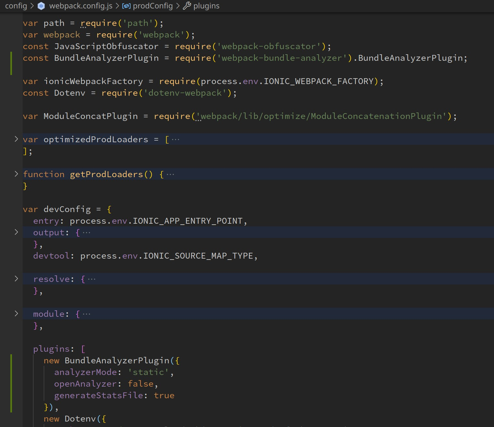

# wallet


### Общие данные

 * [Bitpay Wallet (formerly Copay) is a secure Bitcoin, Bitcoin Cash, Ethereum and ERC20 wallet platform for both desktop and mobile devices](https://github.com/bitpay/wallet)
 * в README есть ошибки, в `package.json` нет команды `npm run apply:wallet`. Корректная команда запуска проекта
	```bash
		nvm i 11
		npm i
		npm run apply:bitpay
		npm run build:desktop
	```

## Точки анализа

* первая точка:
	* `DEV: Ср 27 июл 2022 10:31:19 #ec93459d1 Merge pull request #12052 from cmgustavo/release/v12.12.2`
	* https://github.com/bitpay/wallet/tree/ec93459d1d181b2f500f78a25ccc367a4bf2374b
* вторая точка(год назад):
	* `DEV: Пт 30 июл 2021 14:56:52 #0a5213620 fix`
	* https://github.com/bitpay/wallet/tree/0a521362089dc4d938a4753cedbc0c5308ab1172

## Размер проекта

 * 101514 строк всего, прирост +8,78%/8192
 * 11769 строк в 167 html файлах, прирост +12,74%/1330 строк
 * 14241 строк в 178 scss файлах, прирост +7,44%/987 строк
 * 75504 строк в 366 ts файлах, прирост +8,43%/5875 строк
 * [size.sh](https://github.com/bskydive/code_quality_js/blob/master/scripts/linter_folder/size.sh)
 * ```bash
	grep --include=\*\.{less,scss,css,ts,html} -R '' src/ | wc -l
	grep --include=\*\.{less,scss,css,ts,html} -Rl '' src/ | wc -l
	grep --include=\*.html -R '' src/ | wc -l
	grep --include=\*.html -Rl '' src/ | wc -l
	grep --include=\*\.{less,scss,css} -R '' src/ | wc -l
	grep --include=\*\.{less,scss,css} -Rl '' src/ | wc -l
	grep --include=\*.ts -R '' src/ | wc -l
	grep --include=\*.ts -Rl '' src/ | wc -l
	```

## Зависимости

 * размер библиотек
	* Чтобы запустить webpack-bundle-analyzer пришлось поправить конфиг `config/webpack.config.js` и выполнить:
		```bash
			npm run apply:bitpay
			npm run build:desktop
		```
	* 
	* 
	* [stats.json](log/stats.json)
	* [report.html](log/report.html)
 * TODO Граф зависимостей
	* 
	* Циклические зависимости
		* 16,6% файлов - 61 из 366 `*.ts` файлов, прирост +1.6%/1 файл
		* [eslint.cycle](log/eslint.cycle.log)
		* [eslint.cycle.files](log/eslint.cycle.files.log)
		* ```bash
			grep -ef log/eslint.rules.important.log | wc -l
			cat log/eslint.important.log | awk -F'(' '{print $1}' | sort | uniq | wc -l
		```
 * Самые старые библиотеки
	* 2017 - angular 5
		* https://github.com/angular/angular/blob/c0194e0115e723cf418f9cf8635790c621c47b31/CHANGELOG.md#500-pentagonal-donut-2017-11-01
		* https://github.com/angular/angular/tree/5225fdbc0ef3df4cc5434cab0c82f20c8c92b14f
	* node v11
		* `npm i` [не работает](https://github.com/nodejs/node-gyp/issues/1733) на версиях выше 11
		* 2019 - вложенная зависимость в `package-lock.json`: [@angular-devkit/build-angular 0.12.4](https://www.npmjs.com/package/@angular-devkit/build-angular/v/0.12.4)-->[node-sass 4.10.0](https://github.com/sass/node-sass/releases/tag/v4.10.0)
	* 2019 - ionic 4.10.4
		* https://github.com/ionic-team/ionic-framework/blob/main/CHANGELOG.md#4103-2019-10-09
	* 2020 - cordova 10.0.0
		* https://www.npmjs.com/package/cordova/v/10.0.0
	* 2021 - electron 9.4.2
		* https://www.electronjs.org/releases/stable?version=9#9.4.2
	* 2021 - lodash 4.17.21
		* https://github.com/lodash/lodash/wiki/Changelog
 * неочевидные зависимости
	* electron-builder@22.9.1 - `"build:electron": "npm install electron-builder@22.9.1 --save-dev; node ./electron/build-electron.js",`
	* cordova-android-googlepay-issuer-ng@1.0.4 - `"build:android-release": "npm run env:prod && ionic cordova plugin add cordova-android-googlepay-issuer-ng@1.0.4 && ionic cordova build android --release --aot true --environment prod --output-hashing all --sourcemaps false --extract-css true --named-chunks false --build-optimizer true",`

### Ядро

 * angular 5.2.11: animations, common, compiler, compiler, core, forms, http, platform-browser, platform-browser-dynamic
	* @angular/tsc-wrapped 4.4.6
	* @angular/cli 7.1.4
	* @angular-devkit/build-angular 0.12.4
 * ionic 4.10.4
	* @ionic-native 4.14.0: clipboard, core, device, file, fingerprint-aio, launch-review, qr-scanner, screen-orientation, social-sharing, splash-screen, status-bar, toast, user-agent, vibration
	* @ionic-native-mocks 2.0.12: file, fingerprint-aio, qr-scanner
	* @ionic/storage 2.1.3
	* @ionic/app-scripts 3.2.3
	* ionic-angular 3.9.10
	* ionic-image-loader 6.3.2
	* ionicons 3.0.0
	* ionic-mocks 1.2.1
 * electron 9.4.2
 * cordova 10.0.0
	* cordova: android, apple-wallet-ng, clipboard, custom-config, ios, launch-review, support-android-plugin
	* cordova-plugin: add-swift-support, advanced-http, compat, customurlscheme-ng, device, dialogs, fcm-ng, file, fingerprint-aio, globalization, idfa, inappbrowser, ionic-keyboard, qrscanner, screen-orientation, spinner-dialog, splashscreen, statusbar, theme-detection, useragent, vibration, wkwebview-engine, x-socialsharing, x-toast, androidx-adapter
	* [appboy-cordova-sdk-ng](https//github.com/JohnathanWhite/appboy-cordova-sdk#master)

### Библиотеки

 * rxjs 5.5.12
 * es6-promise-plugin 4.2.2
 * lodash 4.17.21

### Тестирование

 * jasmine-core 2.99.1
 * karma 3.1.3

### Анализ кода

 * prettier 2.1.2
 * tslint 5.8.0
 * tslint-config-prettier 1.18.0
 * codecov 3.7.2
 * karma-coverage-istanbul-reporter 1.4.1

### Сборка

 * typescript 2.6.2
 * webpack 3.12.0

### Визуализация

 * apexcharts 3.24.0
 * chart.js 2.9.4
 * ngx-barcode 0.2.4
 * ngx-markdown 1.5.2
 * ngx-qrcode2 0.1.0
 * ngx-text-overflow-clamp 0.0.1
 * web-animations-js 2.3.1
 * qr-code-component-ng 0.0.4

### Дата/локализация

 * @ngx-translate/core 9.1.1
 * countries-list 2.5.5
 * angular2-moment 1.7.1
 * @biesbjerg/ngx-translate-extract 2.3.4

### Разное

 * papaparse 5.3.0
 * text-encoding 0.6.4
 * text-mask-core 5.1.2
 * abi-decoder 2.3.0
 * adm-zip 0.4.13
 * core-js 2.6.10
 * fs-extra 9.0.1
 * macos-release 2.5.0
 * mini-css-extract-plugin 0.8.0
 * shelljs 0.8.1
 * @walletconnect/client 1.6.5
 * apple-wallet-ng 1.1.1
 * base64-js 1.3.0
 * bitcore-wallet-client 8.25.27
 * buffer-compare 1.1.1
 * eth-sig-util 3.0.1
 * fcm-ng 2.1.0
 * gettext-parser 1.3.0

### уязвимости пакетов

 * 280 уязвимостей, прирост +00%
 * [npm.sh](https://github.com/bskydive/code_quality_js/blob/master/scripts/project_folder/npm.sh)
 * ```bash
	grep -iE 'Path|Low|Moderate|High|Critical' log/audit.log | less
	grep -iE 'Path|Low|Moderate|High|Critical' log/audit.log > log/audit.parsed.log
	```

## Комментарии

 * 446 `TODO|FIXME` в 120 html|css|ts файлах, прирост +00%/26 комментариев
	* ```bash
		grep --include=\*.{less,scss,css,ts,html} -RiEl 'TODO|FIX' src/ | wc -l
	```
 * 1930 `comment|JSDOC` в 296 html|css|ts файлах, прирост +00%/102 комментариев
	* [comments](log/comments.log)
	* ```bash
		grep --include=\*.{less,scss,css,ts,html} -RiE '/\*|//' src/ | wc -l
		grep --include=\*.{less,scss,css,ts,html} -RilE '/\*|//' src/ | wc -l
		grep --include=\*.{less,scss,css,ts,html} -RiE '/\**' src/ | wc -l
		grep --include=\*.{less,scss,css,ts,html} -RilE '/\**' src/ | wc -l
	```

## Эксперты

* автор, количество коммитов
	* ```bash
		git shortlog --summary --numbered --email

		5996  Gustavo Maximiliano Cortez <cmgustavo83@gmail.com>
		3172  Matias Alejo Garcia <ematiu@gmail.com>
		1608  Gabriel Bazán <gabrielbazan7@hotmail.com>
		1092  Gabriel Edgardo Bazán <gabrielbazan7@hotmail.com>
		827  Gabriel Masclef <gabrielmasclef@hotmail.com>
		702  Marty Alcala <marty@bitpay.com>
		514  Juan Pablo Abuin <juanpabloabuin@gmail.com>
		510  Javier <javier@bitpay.com>
		484  johnathan White <jwhite@bitpay.com>
		443  Manuel Araoz <manuelaraoz@gmail.com>
		415  Jason Dreyzehner <jason@dreyzehner.com>
		359  bechi <bechilandia@gmail.com>
		255  Gabriel <gabrielmasclef@hotmail.com>
		234  Ivan Socolsky <jungans@gmail.com>
		205  Mario Colque <colquemario@gmail.com>
		204  JDonadio <tanojaja@gmail.com>
		201  Jamal Jackson <jamal@bitpay.com>
		197  Yemel Jardi <angel.jardi@gmail.com>
		192  Christopher Jeffrey <chjjeffrey@gmail.com>
		183  Justin Kook <jkook@bitpay.com>
		177  Matias Pando <mpando@bitpay.com>
		176  Javier Donadío <tanojaja@gmail.com>
		174  Gustavo Cortez <cmgustavo83@gmail.com>
		160  Ryan X. Charles <ryan@bitpay.com>
		132  Gonzalo Leon <gonzalomleon@gmail.com>
		110  Gabriel <gabrielbazan89@gmail.com>
		101  Bernard Snowden <bsnowden@bitpay.com>
			99  Andy Phillipson <andy@bitpay.com>
			98  Manuel Aráoz <manuelaraoz@gmail.com>
			88  Esteban Ordano <eordano@gmail.com>
			71  Johnathan White <jwhite@bitpay.com>
			68  dabura667 <matsuringo667@gmail.com>
			61  Kirvx <Kirvx@tutanota.com>
			56  rastajpa <juanpabloabuin@gmail.com>
			48  Bechi <bechilandia@gmail.com>
			44  ematiu <ematiu@gmail.com>
			38  Ivan Socolsky <ivan@argencoders.com>
			38  Matias Pando <matiaspando@gmail.com>
			37  Will Hay Jr <willhayjr@gmail.com>
			36  L S <lshivananda@bitpay.com>
			31  Gregg Zigler <gregg@bitpay.com>
			27  ssotomayor <sansoto2003@yahoo.com.ar>
			26  Mariano Rodriguez <marianorod@gmail.com>
			24  Kosta Korenkov <7r0ggy@gmail.com>
			22  Kirvx <Kirvx@gmx.com>
			22  Marty Alcala <msalcala11@gmail.com>
			22  Nick Cardin <nick@cardin.email>
			21  Juan Ignacio Sosa Lopez <bechilandia@gmail.com>
			19  Darren Nelsen <darren@bitpay.com>
			16  Rich Morgan <ionux@users.noreply.github.com>
			15  Gordon Hall <gordon@bitpay.com>
	```

## Возраст проекта

 * первые коммиты
	* ```bash
		git log --reverse --pretty=oneline --format='DEV: %cd #%h %s' --date=format:'%c' | head -10
	```
 * 20,078 коммитов всего, прирост +00%/00 коммитов

## TODO Ошибки компиляции
 * ошибки связывания данных в шаблонах `fullTemplateTypeCheck="true"`
 * 00% - 00 ошибок сборки в 00 из 00 `*.html|ts` файлов, +00% прирост за год
 * [errors](log/build.errors.log)
 * [errors.files](log/build.errors.files.log)
 * [ts-numbers](log/build.ts-numbers.ts)

## Статический анализ

 * Использованы наборы правил ESLint
	* standard
	* plugin:@angular-eslint/recommended
	* plugin:@typescript-eslint/recommended
	* plugin:import/errors
	* plugin:import/warnings
	* plugin:import/typescript
	* plugin:promise/recommended
	* [plugin:prettier/recommended](https://www.npmjs.com/package/eslint-plugin-prettier)
	* plugin:functional/recommended
 * [eslint.sh](https://github.com/bskydive/code_quality_js/blob/master/scripts/linter_folder/eslint.sh)
 * Все типы ошибок
	* 100% файлов - 27302 ошибок(82 типа) в 366 из 366 `*.ts` файлов, прирост +7.8%/2127 ошибок
	* [all issues](./log/eslint.log)
	* [files](./log/eslint.files.log)
	* [issues](./log/eslint.issues.log)
	* [rules](./log/eslint.rules.log)
	* ```bash
		tail -n1 log/eslint.log
		cat log/eslint.log | awk -F'(' '{print $1}' | sort | uniq | wc -l
		cat log/eslint.log | awk -F':' '{print $3}' | sort | uniq | wc -l
		cat log/eslint.log | awk -F':' '{print $2}' | sort | uniq | wc -l
		```
 * Большая длинна и сложность
	* много строк в функциях и файлах:
		* 32,79% файлов - 344 ошибок в 120 из 366 `*.ts` файлов, прирост +12,8%/7 ошибок
		* [max-lines](log/eslint.max-lines.log)
		* [max-lines.files](log/eslint.max-lines.files.log)
		* ```bash
			cat log/eslint.log | grep -i max-lines > log/eslint.max-lines.log
			wc -l log/eslint.max-lines.log
			cat log/eslint.max-lines.log | awk -F'(' '{print $1}' | sort | uniq > log/eslint.max-lines.files.log
			wc -l log/eslint.max-lines.files.log
		```
	* высокая сложность функций:
		* 12,02% файлов - 68 ошибок в 44 из 366 `*.ts` файлов, прирост +20,6%/14 ошибок
		* [complexity](log/eslint.complexity.log)
		* [complexity.files](log/eslint.complexity.files.log)
		* ```bash
			cat log/eslint.log | grep -i complexity > log/eslint.complexity.log
			wc -l log/eslint.complexity.log
			cat log/eslint.complexity.log | awk -F'(' '{print $1}' | sort | uniq > log/eslint.complexity.files.log
			wc -l log/eslint.complexity.files.log
			```
		* [src/app/app.component.ts(521,24)](https://github.com/bitpay/wallet/blob/3bcfae555c6aa33de6b3e2cf23f07d82c84d112c/src/app/app.component.ts#L521): warning complexity : Method 'openLockModal' has a complexity of 11. Maximum allowed is 10.
		* [src/app/app.component.ts(647,7)](https://github.com/bitpay/wallet/blob/3bcfae555c6aa33de6b3e2cf23f07d82c84d112c/src/app/app.component.ts#L647): warning complexity : Async arrow function has a complexity of 35. Maximum allowed is 10.
		* [src/components/chart-component/chart-component.ts(53,24)](): warning complexity : Method 'createElement' has a complexity of 22. Maximum allowed is 10.
 * Покрытие типами данных
	* 88,25% файлов - 7778 ошибок в 323 из 366 `*.ts` файлов, прирост +7.6%/589 ошибок
	* [type-sig](log/eslint.type-sig.log)
	* [type-sig.files](log/eslint.type-sig.files.log)
	* ```bash
		cat log/eslint.log | grep -iE 'typedef|signature' | wc -l
		cat log/eslint.type-sig.log | awk -F'(' '{print $1}' | wc -l
		```

### TODO Важные ошибки

 * необходимо отредактировать `eslint.rules.important.log`
 * 00% - 00 ошибок в 00 из 00 `*.ts` файлов, прирост +00%/00 ошибок
 * [all issues](log/eslint.important.log)
 * [files](log/eslint.important.files.log)
 * [issues](log/eslint.important.issues.log)
 * [rules](log/eslint.important.rules.log)
 * [eslint.important.sh](https://github.com/bskydive/code_quality_js/blob/master/scripts/linter_folder/eslint.important.sh)
 * ```bash
	tail -n1 log/eslint.important.log
	grep -ef log/eslint.rules.important.log log/eslint.log | wc -l
	cat log/eslint.important.log | awk -F'(' '{print $1}' | sort | uniq | wc -l
	cat log/eslint.important.log | awk -F':' '{print $2}' | sort | uniq | wc -l
	```

## Стили

 * 91,62%(файлы) - 6068 ошибок в 164 из 179 `*.css` файлов, прирост +7,9%/482 ошибки
 * [css](log/css.log)
 * [css.rules.uniq](log/css.rules.uniq.log)
 * [css.short.uniq](log/css.short.uniq.log)
 * [css.files](log/css.files.log)
 * [styles.sh](https://github.com/bskydive/code_quality_js/blob/master/scripts/linter_folder/styles.sh)
 * ```bash
	cat log/css.log | grep '(' | awk -F'(' '{print $2}' |grep -E ')$'|tr -d ')'|sort|uniq | wc -l
	cat log/css.log | awk -F' - ' '{print $2}' | sort | uniq | wc -l
	cat log/css.log | grep ':' | awk -F':' '{print $1}' |sort|uniq | wc -l
	```

### TODO Важные ошибки стилей

 * необходимо отредактировать `log/styles.rules.important.log`
 * [styles.important.log](log/styles.important.log)
 * [styles.important.short.log](log/styles.important.short.log)
 * [styles.important.files.log](log/styles.important.files.log)
 * [styles.important.sh](https://github.com/bskydive/code_quality_js/blob/master/scripts/linter_folder/styles.important.sh)
 * ```bash
	grep -f log/styles.rules.important.log log/styles.log | sort | uniq
	cat log/styles.important.log | awk -F' - ' '{print $2}' | sort | uniq
	cat log/styles.important.log | grep ':' | awk -F':' '{print $1}' | sort | uniq
	```

## Покрытие тестами

 * 1.79% файлов - 3 теста выключено в 1 из 56 `*spec.ts` файлов, прирост +66,7%/2 теста
 * 15,3% файлов - 56 из 366 `ts` файлов покрыты `spec.ts` файлами, прирост +0%/0 файлов
 * 16,07% строк - 12134 из 75504 строк `ts` покрыто в `spec` файлах грубо, прирост +0,19%/23 строк
 * 28.27% строк покрыто в 246 `*spec.ts` файлах [CodeCov](https://app.codecov.io/gh/bitpay/wallet)
 * [test.disabled.log](log/test.disabled.log)
 * [test.group.disabled.log](log/test.group.disabled.log)
 * [test.assert.disabled.log](log/test.assert.disabled.log)
 * [tests.sh](https://github.com/bskydive/code_quality_js/blob/master/scripts/linter_folder/tests.sh)
 * ```bash
	grep --include=\*spec.ts -R '' src/ | wc -l
	grep --include=\*spec.ts -Rl '' src/ | wc -l
	grep --include=\*spec.ts -RiEn 'xit\(|xdescribe\(' src/ | wc -l
	```

## Фреймворк Angular

 * 100% - 180 из 180 компоненты без OnPush, прирост +0%/0 компонентов
	* ```bash
		grep --include=\*.ts -RiE '@component\(' src/ | wc -l
		grep --include=\*.ts -RiE '@component\(' src/ | grep -iE '\.onpush' | wc -l
		```
 * 100% - 366 из 366 `ts` файлов без постфиксов, прирост +0%/0 файлов
 * [angular.components.files.log](log/angular.components.files.log)
 * [angular.components.duplicated.files.log](log/angular.components.duplicated.files.log)
 * [angular.components.onpush.files.log](log/angular.components.onpush.files.log)
 * [angular.named.files.log](log/angular.named.files.log)
 * [angular.sh](https://github.com/bskydive/code_quality_js/blob/master/scripts/linter_folder/angular.sh)
 * ```bash
	grep --include=\*.ts -RiE '@component\(' src/ | wc -l
	grep --include=\*.ts -RiE '@component\(' src/ | sort | uniq -d | wc -l
	grep --include=\*.ts -RiE '@component\(' src/ | grep -iE '\.onpush' | wc -l
	grep --include=\*.{component,pipe,directive,spec,model,module,type,interface,guard,interceptor} -R src/ | sort | uniq | wc -l
	```
## Дублирование кода

 * 9,51% строк HTML: 86 клонов, 1103 одинаковых строк в 193 файлах, прирост +31,82%/351 строк
  	* [report](log/jscpd-html/jscpd-report.md)
 * 8.15% строк CSS: 32 клона, 890 одинаковых строк, прирост +20,34%/181 строк
  	* [report](log/jscpd-css/jscpd-report.md)
 * 6,34% строк TS: 200 клонов, 3277 одинаковых строк в 332 файлах, прирост +10,86%/356 строк
  	* [report](log/jscpd-ts/jscpd-report.md)
 * [duplicates.sh](https://github.com/bskydive/code_quality_js/blob/master/scripts/linter_folder/duplicates.sh)

## Правописание

 * 14,59% - 362 ошибок в 95 из 651 js|ts файлах, прирост +3,04%/11 ошибок
 * [словарь исключений](.cspell-dict-exclude.txt)
 * [spell-excluded](log/spell-excluded.log)
 * [spell-excluded.words](log/spell-excluded.words.log)
 * [spell-excluded.uniq-files](log/spell-excluded.uniq-files.log)
 * ```bash
	tail -n 1 log/spell.summary.log
	cat log/spell.log | tail -n +4 | grep -v '^[[:blank:]]*$' | wc -l
	cat log/spell.issues.log | grep -i word | awk -F'(' '{print$2}' | awk -F')' '{print $1}' | sort | uniq | wc -l
	cat log/spell.log | grep -i word | awk -F':' '{print$1}' | sort | uniq | wc -l
	```
### TODO Важные ошибки правописания

 * необходимо отредактировать `log/spell.words.important.log`
 * [spell.important.sh](https://github.com/bskydive/code_quality_js/blob/master/scripts/linter_folder/spell.important.sh)
 * ```bash
	cat log/spell.words.important.log
	wc -l log/spell.words.important.log
	```


