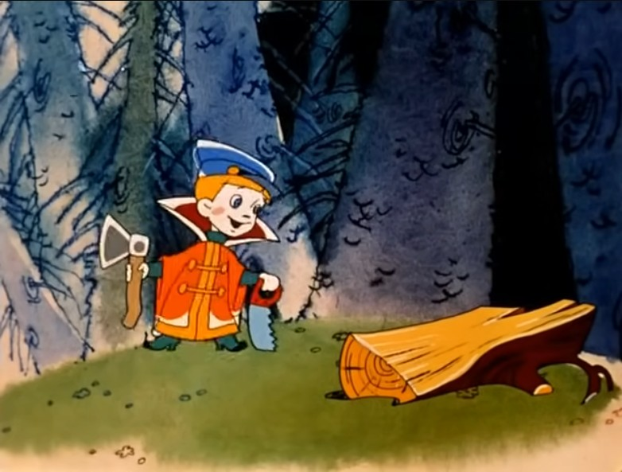

# Как выжить создателю курсов

* Часть 1 [почему большинство студентов не заканчивает онлайн-курсы](./почему_большинство_студентов_не_заканчивает_онлайн-курсы.md)
* Часть 2 [как выжить на онлайн курсах](./как_выжить_на_онлайн_курсах.md)

 * 
	* Кадр из мультфильма ["Вовка в тридевятом царстве"](https://www.youtube.com/watch?v=Iu0bmqHdeIg)

 * в предыдущей части мы прыгнули в окопы студентов, теперь двигаемся в окопы организаторов онлайн курсов
 * речь про наиболее сложный вариант онлайн обучения - многомесячные курсы, совмещаемые с работой/учёбой/семьёй

## Сложный скучный рецепт

 * Если вы создали один хороший, проходимый курс, значит у вас хорошие шансы создать другие курсы хорошего качества.
* Выдерживаете единую тему и повествовательную линию, делаете курс для подготовки к решению реальных практических проблем
* Пишите понятными, одинаковыми словами-терминами, которые можно свести в словарь или опорный конспект
* разделяете виды материалов, пишете текст-конспект, рассказываете-показываете вживую как применять теорию на практике, делаете посильные для новичков, и не скучные для старичков домашние задания
* делитесь со студентами дополнительными материалами, это поможет понять как готовилась лекция, даст дополнительный контекст для толкования спорных моментов, увлечёт рвачей-отличников пока отстающие будут навёрстывать их успехи
* регулярно общаетесь со студентами во время прохождения курса, узнаёте об их озарениях, помогаете преодолеть трудности сразу после их возникновения
* перед началом групповой работы обучаете студентов использованию инструментов групповой работы, вовлекаете в совместное решение проблем, помогаете наладить планирование в личных и групповых календарях
* перед тем, как добавить студента на курс - проведите с ним собеседование, поймите способен ли он на дополнительные нагрузки помимо текущей работы/семьи/учёбы, будет ли он душнить, будет ли ему слишком сложно/слишком легко.
* организуйте сообщество выпускников для взаимопомощи в трудоустройстве, регулярные онлайн/оффлайн встречи для сбора и обсуждения реального практического опыта, направлений для улучшения курса

## Лёгкие весёлые "вредные советы"

* делайте курс быстро, он должен возвращать инвестиции, и тестировать гипотезы об извлечении прибыли из студентов
* чтобы сделать курс ещё быстрее, делайте его по кусочкам, просто добавляйте материалы от разных преподавателей и разных версий курса, менторы разберутся с вопросами
* привлекайте как можно больше разных экспертов для создания материалов. Чем больше студийных фото и крутых подписей к ним на посадочных - тем больше клиентов. Не мешайте им творить, не отвлекайтесь на унификацию материалов - это убьёт креативность.
* много и часто собирайте обратную связь, фильтруйте её через специально обученных и нанятых людей, чтобы отсеивать то, что неприятно или невозможно исправить
* нельзя взять, и просто так поменять материал курса. Это всех запутает, и не даст собрать полный набор метрик для обоснования изменений в следующем наборе.
* если текст лекции оказался непонятен, не надо его переделывать, запишите видео с приятной говорящей головой, которая зачитывает его мягким, выразительным голосом.
* если и видео не помогает - добавьте онлайн встречу с ответами на вопросы
* добавьте всех в чат, просто сделайте это, студенты сами умеют им пользоваться. 
* не надо вкладываться в организацию групповой работы. Если студент не умеет самостоятельно вести календарь и не применяет тайм-менеджмент - его бесполезно чему-либо учить, он пришёл на курс, чтобы его слить
* ваша целевая аудитория - 10-15% лучших, которые способны пройти курсы любого качества. Привлекайте их скидками, зовите на совместные мероприятия, записывайте с ними интервью об успехе. 
* Остальные - полезный балласт, мешающий другим студентам получать знания, но приносящий прибыль на разнице между стоимостью не пройденного курса и возвратными деньгами. Обязательно составьте об этом хороший договор, чтобы снизить судебные издержки.
* Чем больше группа - тем лучше для прибыли и рекламы. Активных студентов всё равно мало, кто успел - тот и съел. А через несколько не заданных или не отвеченных вопросов, желающих отвлекать преподавателей поубавится.
* начинайте курс 1 сентября, в день знаний. Во время суматохи подготовки к началу учебного года примерно у всей страны. Ну или чуть попозже, в октябре, как раз перед пиком сезонной заболеваемости и предновогодней авральности. Делай как все.

