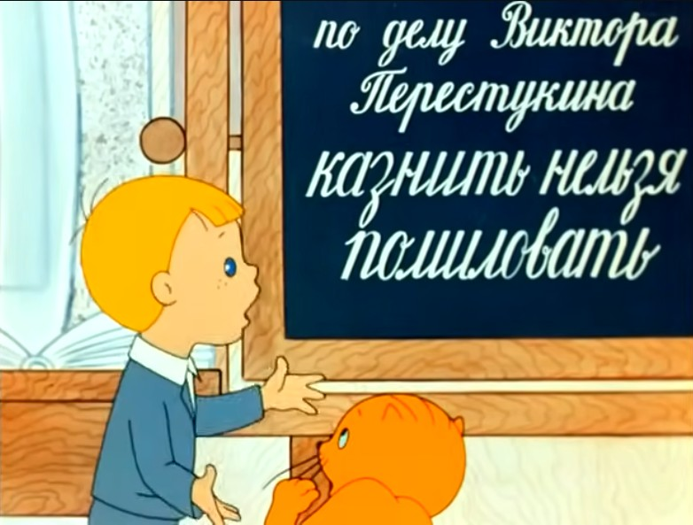

# как выжить на онлайн курсах

 * Часть 1 [почему большинство студентов не заканчивает онлайн-курсы](./почему_большинство_студентов_не_заканчивает_онлайн-курсы.md)
 * Часть 3 [как выжить создателю курсов](./как_выжить_создателю_курсов.md)

 * 
	* Кадр из [запрещённого](https://www.youtube.com/watch?v=r8_U68YXuqc) в РФ мультфильма ["В стране невыученных уроков"](https://www.youtube.com/watch?v=urN_xv6jIS4)

 * в предыдущей части мы посмотрели на картину в онлайн образовании целиком, теперь двигаемся в окопы студентов
 * речь про наиболее сложный вариант онлайн обучения - многомесячные курсы, совмещаемые с работой/учёбой/семьёй

## покупка

 * это место, где сосредоточены 190% усилий организаторов курса.
 * Именно тут вы, уставший и не выспавшийся будете обласканы и доведены до состояния "а нафига я это купил?" и "блин, придётся проходить, иначе вернут только 40% оплаты".
 * Впрочем, есть и хорошие новости. Курсы можно выбрать по их составу и продолжительности. По стоимости они примерно равны, однако по составу могут отличаться. Есть полные курсы на полгода-год, к ним могут быть прицеплены скидками поддерживающие/расширяющие.
 * самое лучшее время поступления на курсы - весна. Потому что пик сложностей придётся на лето - время расслабона на работе, главный перерыв между сезонными авралами.
 * стелим соломку:
    * узнаём про доступность материалов, когда и что открывается/закрывается, в какой момент
    * узнаём сколько конкретно нам вернут денег в случае отказа от курса на 1/3 дистанции

## команда молодости нашей, команда, без которой мне не жить

 * Критически относитесь к рекомендациям добрых курсоводов. Думайте своей головой, не надейтесь на то, что вам все бросятся помогать.
 * работа в группе может помочь в очень редких случаях. Командообразование и групповая работа - одно из самых сложных направлений работы менеджеров. Этому учатся на кактусах и собаках не один год, прежде чем результат работы менеджера становится более-менее прогнозируемым, осознаваемым и узнаваемым. Шансы на то, что вас немедленно погрузят в классную, заряжающую энтузиазмом атмосферу крайне малы.
 * По-умолчанию любой коллектив - это ждуны распоряжений. Причём таких, которые делают им приятно, а не наоборот. Первое исключение из этого правила - "продающие" курсы, где за счёт командообразования держится "пирамида продаж". Там этого будет через край, в ущерб всему остальному.
 * хороший минимум в командной работе - регулярные короткие созвоны раз в неделю для лёгкого общения, обмена своими достижениями и трудностями. Если у вас получилось заряжаться позитивом от таких встреч, то их можно расширять. Если же возникает напряг/уныние/раздражение - с ними лучше завязывать, вам и без того будет хватать напрягов.

## планирование

 * первая задача - прикинуть свои силы хотя бы на 2 недели вперёд, далее - на пару месяцев.
 * Закинуть в ваш календарь все активности, посмотреть на их продолжительность и сложность. Редкий артефакт, который может сильно сэкономить время на исследования - честный ответ организаторов курса на вопрос: "с какого момента отваливается большинство студентов".
 * Смотрим на промежутки между активностями/заданиями, их заявленную продолжительность и общее количество в месяц. Обращаем внимание на даты завершения модулей. Именно там, скорее всего, будет завал.
 * используйте один календарь для видов активностей, которые пересекаются. Вам необходимо видеть всю картину дня/недели/месяца целиком.
 * Если календари слишком плотно забиты активностями, их можно разделить. Например, работа+учёба/дом или дом+работа/учёба.
 * В секретно-рабочем календаре делаем и экспортируем заглушки по 8 часов на работу, планируем встречи и перерыв на обед, двигаем заглушки на размер авралов, делаем заглушки невидимыми.
 * В календаре дом+учёба импортируем заглушки из рабочего календаря, планируем транспорт до работы и обратно, учебные активности, сон, быт, работу с детьми и отдых.
 * главный плюс онлайн календарей - активности можно легко двигать вправо)

## мотивация

 * чтобы ваше планирование перешло в результат необходима психологическая подготовка.
 * большой объём опыта по этому вопросу собирает [товарищ Дорофеев](https://www.youtube.com/watch?v=0qHffEravwY)
 * большая новая активность будет проверять на прочность настроение/желания, толкать в пропасть прокрастинации.
 * Хороший путь - создание и поддержка привычек. Это могут быть навыки
    * договариваться с окружающими, чтобы вас не трогали в определённое время
    * система эмоциональных поощрений
    * регулярный режим отдых-работа-учёба
    * отдельное место для каждого вида активности, особенно для отдыха и прокрастинации
    * полезные занятия, замещающие прокрастинацию
 * главная база - это регулярный качественный продолжительный сон в тихом и уютном месте
 * первое дополнение к базе - бёрпи по утрам и гимнастика для позвоночника вечером перед сном

## работа с материалом

 * если материал не понятен, можно обратиться к преподавателю, коллегам-студентам, поискать в интернет или спросить у в чатботах нейросетей. Как спрашивать - это отдельный навык, смотрите где лучше получается, и привыкайте регулярно ходить в эту сторону.
 * Быстрее всего помогают статьи в интернет. Преподаватели могут достаточно быстро подтвердить, что выделенный кусок текста не содержит ошибок и подходит к вашему онлайн-курсу. Да, бывает много верных ответов на один и тот же вопрос, зачастую противоречащих друг другу.
 * Главная задача - построить "критический путь" достижения понимания: как делать обязательные(для прохождения курса) задания. Как только он построен и пройден, можно посмотреть на планирование/даты и двинуться глубже/шире в тему.

## осознание

 * хороший путь к осознанию материала - написать конспект или применить знания на практике. Однако, конспектирование может затянуть в пучину авралов, а практика завести в ступор сложности. Это - минное поле, двигайтесь постепенно, маленькими шажками.
 * Идеальный конспект учитывает лично ваш опыт и знания, помогает быстро найти ответы на вопросы при подготовке к собесу или выполнению ДЗ, но стоит удвоения затрачиваемых времени и сил.
 * Идеальные практические задания должны быть разбиты на короткие этапы, [минут по 20-30](https://vc.ru/life/263628-pomodoro-vse-sekrety-odnoy-iz-samyh-prostyh-tehnik-povysheniya-produktivnosti), с пояснениями и отсылками в справочные материалы, содержать не только примеры выполнения, но и схемы/карты/последовательности шагов.

## практика

 * итак, вы добрались до вашей итоговой домашней работы, до условного "диплома". Это длинная активность, которая делается для вашего портфолио, т.е. для будущего собеса с работодателем.
 * Тема диплома может помочь повысить размер зарплаты во время переговоров с работодателем. Например, если меняете профессию, и вам необходимо опереться на смежный опыт работы, связать его с новой областью. Даже если не получится сделать что-то крутое, у вас будет готовый шаблон и некоторые навыки в конкретной области будущей работы.
 * пирамида затрат времени на выполнение практики
    * понять где искать исходные данные для работы, поиск бесплатных общедоступных, качественных данных, шаблонов
    * понять что делать в первую очередь, приступить к работе и заполнению шаблона
    * петля:
		* поиск данных-расчёт-корректировка шаблона
		* озарение-уныние-выгорание
    * стыковка разных частей работы, выкидывание лишнего
    * оформление для удобства чтения и проверки преподавателем(навешивание комментариев онлайн)
		* [miro](https://vc.ru/marketing/384014-est-li-zamena-miro-obzor-interaktivnyh-dosok-rossiyskoy-razrabotki)
		* [*docs](https://ichip.ru/podborki/programmy-prilozheniya/vmesto-google-docs-5-servisov-dlya-sovmestnoj-raboty-s-dokumentami-830882)

