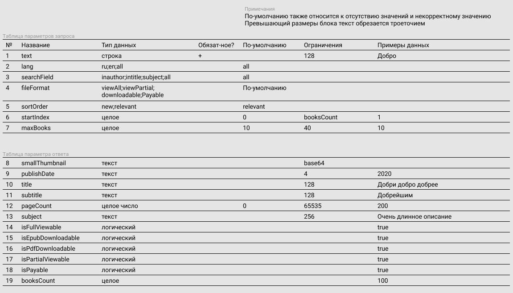
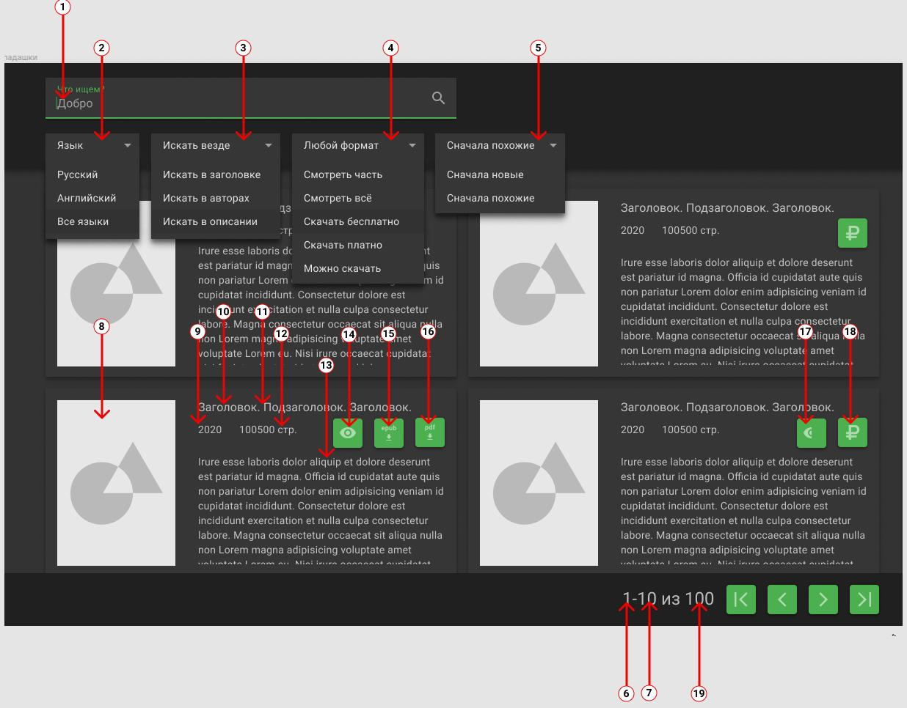
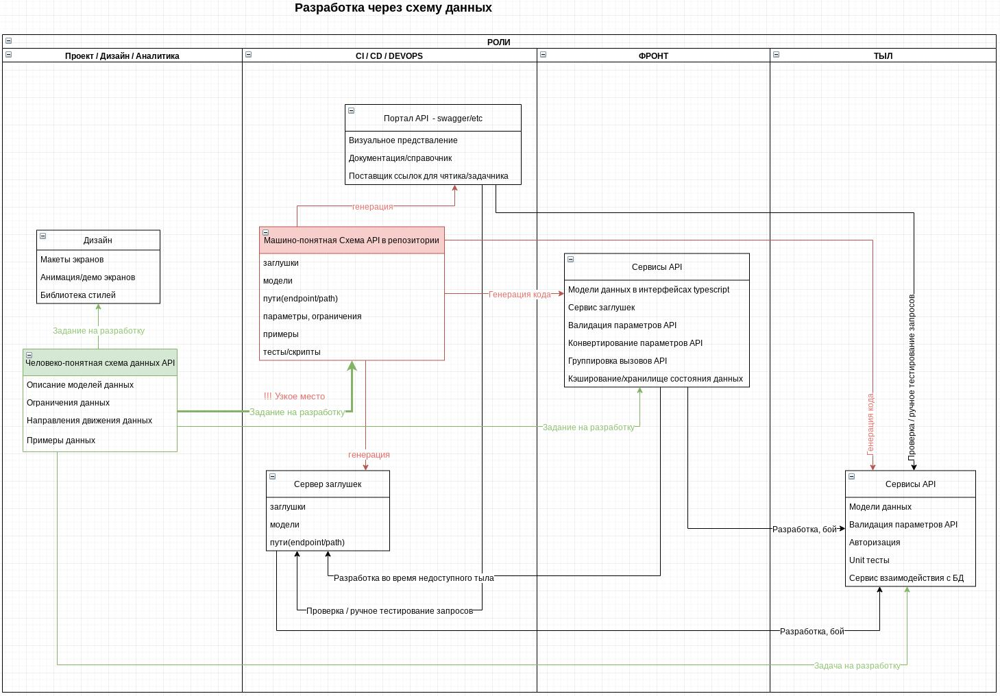
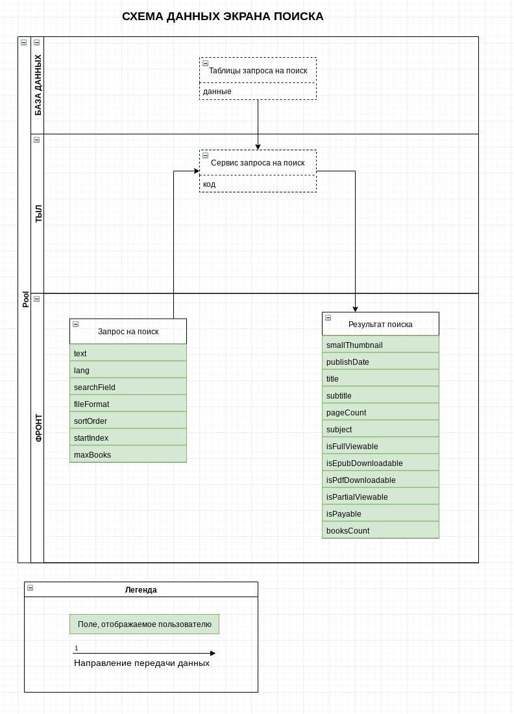
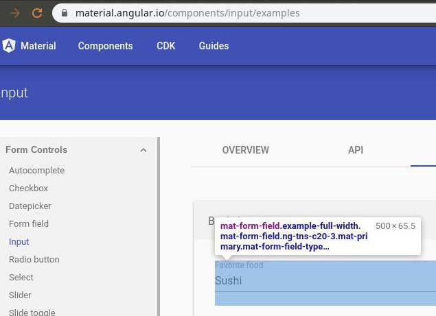
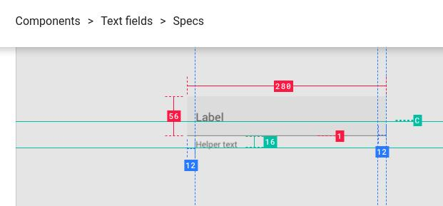
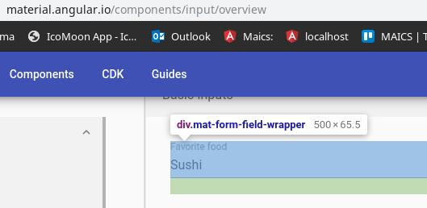

# От дизайна до кода без совещаний. Страшная сила красоты.
# Трудно быть стартапом. Часть 3.

* 
* Демонстрация красоты и богатства на Арканарский манер. Кадр из фильма "Трудно быть богом" по рассказу братьев Стругацких

## введение

* О чём: О процессах и инструментах веб-разработки в стартапах с фронтом(frontend) на Angular.
* Для кого: для тех кому интересно повышать личную и командную скорость работы: для разработчиков фронта(frontend) и тыла(backend), аналитиков, лидов, дизайнеров.
* Зачем: чтобы переписать свои заметки в чистовик, поделиться опытом со страждущими.
* В чём особенность: охват "на 360", много ссылок и примеров в коде/макетах
* [Где поддержать(похлопать)](https://medium.com/@stepanovv.ru/strashnaya-sila-krasoti-adfdf86c73f)
* [Ещё статьи](/articles/index.md)

Учимся автоматизировать и ускорять совместную работу над:
* [дизайном/макетом](https://www.youtube.com/playlist?list=PLM2Q6lcZo4MexclJrYxA0Is42qWBBuHpB)
* [разработкой](https://drive.google.com/file/d/1pzX_z1zasMKX8ZKJ90BpsI0curb2ka-a/view?usp=sharing) макета, фронта(frontend) и тыла(backend) через [макет](https://www.figma.com/file/xzyZ3aWHP3t0Sh4hW2Psvm/gbook-dark-green?node-id=83131%3A0) или [схему](https://drive.google.com/file/d/126bf-4MQwgwjX-jLlTpnCQ0ZIvsr-Dm-/view?usp=sharing)
* [генерацией кода](https://github.com/OpenAPITools/OpenAPI-generator/tree/master/samples/client/petstore) сервисов API через [спецификацию](https://github.com/raml-org/raml-spec/blob/master/versions/raml-10/raml-10.md/) и [специальные IDE](https://learning.getpostman.com/docs/postman/launching_postman/installation_and_updates).

Статья получилась очень длинной и сборной из нескольких тем: дизайн, проектирование, API. Эти темы крепко, но неочевидно связаны, т.к. их связь построена через несколько, обычно последовательных, ролей. Объёма также добавило то, что по ходу написания я руками делаю примеры реализации.

Рассматривая их в одной статье я даю больше поводов к комбинации и поиску идей, которые подойдут в конкретном проекте. Проекты разные, в первую очередь, из-за различий между возможностями людей в проекте. Потому для маленьких и молодых команд в стартапах важно уметь собирать, ремонтировать и ездить на велосипедах.

Признаться, я также отгрузил сюда многовато ссылок на статьи и инструменты из своей базы знаний. Заливать их в каждом новом проекте в отдельную базу знаний - тот ещё подвиг Геракла. А тут, сдобренные красивыми словесами и картинками, они зайдут намного лучше.

По-хорошему также надо затронуть тему совместного управления задачами в trello/bitbucket, т.к. к удобным инструментам совместной работы вроде редактирования в реальном времени и заметок требуются не менее удобные и асинхронные редакторы задач. Так, чтобы задачи можно было удобно редактировать и передавать, формируя персональные списки с приоритетами. Но я решил пожалеть {username} и {authorname}.

Более основательным товарищам предлагаю заварить себе чашечку чая, и взять побольше французских булочек, прежде чем продолжить чтение.

## в поисках идеального интерфейса: ценитель красоты

Предположим, что мы делаем приложение для пользователей. Как же заставить пользователей рассказать какое приложение им нужно? Ну то есть поговорить-то можно, однако нельзя на выходе разговора получить технический документ. А ещё более нельзя получить документ, который продержится хотя бы месяц после составления без правок. С одной стороны, пользователи не могут быть поголовно аналитиками, чтобы писать понятно для разработчиков, с другой - психологами, чтобы осознавать свои потребности, с третьей - экономистами, чтобы прогнозировать ограничения своих потребностей хотя бы на год вперёд.

Между пользователем и разработчиком обычно пролегает пропасть. Потому и выстраивается длинная цепочка из специалистов в виде живого моста через неё. В пространстве моста играется игра "испорченный телефон", во времени - [сказка о его потере](https://www.youtube.com/watch?v=rmyF-XTrHeU). Возникает понятный соблазн разрубить этот гордиев узел волевым решением. Посмотреть на соседский огород, подтянуть здравый смысл, сделать продукт удобным и красивым.

Именно с красоты проще всего начать проектирование. Она понятна, не требует специальных знаний, и выпытывания требований из "бизнеса". Необходимость думать можно заменить на "у всех так" и "ну очевидно же". Вот тут появляются менеджеры/владельцы/лиды, которые и берут на себя бремя принятия решений. А проще говоря угадывают, рискуют предположить как будет хорошо и пользователям, и команде разработки. Как сделать нечто полезное, и не слишком сложное в реализации, чтобы успеть в срок.

Отсюда вытекает простое следствие. Аксиома: дизайн должен нравиться тем кто берёт на себя роль ценителя красоты. И второе мгновенное озарение: если потребности пользователя могут внезапно меняться, то дизайн тоже должен подвергаться изменениям. Смирившись с этим, нам остаётся лишь найти способ как генерировать дизайн, который сразу нравится рисковым ценителям.

С чего же начать? Ну, есть много вариантов готового дизайна, а ещё лучше - дизайн систем. Можно просто ткнуть пальцем в любой вариант потолще. Однако, придётся за него заплатить, и немного вникнуть в лицензионный договор на предмет коммерческого использования и правок.

 * [библиотека дизайна на основе material, с библиотекой компонентов Angular](http://demo.oxygenna.com/portal)
 * [подборка шаблонов/библиотек 1](https://elements.envato.com/ru/web-templates/admin-templates)
 * [подборка шаблонов/библиотек 2](https://themeforest.net/)
 * [пример большой библиотеки дизайна](https://wonw.xyz/iotask/#all-pages)
 * [бесплатный пример реализации тёмной темы с разбором от material.io](https://material.io/design/color/dark-theme.html#implementation)
 * [бесплатный готовый конфигурируемый figma пример библиотеки дизайна material](https://www.figma.com/blog/material-design-figma-styles/)
 * [бесплатный большой набор компонентов material для sketch/figma](https://www.sketchappsources.com/free-source/597-google-material-design-ui-sketch-app.html)

Это - действительно хороший старт, который экономит месяцы поиска "специалиста по UX", которые на моей практике заканчивались нахождением "ну хотя бы по UI", а в итоге - дорисовыванием одного из популярных шаблонов. И ладно бы заканчивалось. Со временем оказывается, что шаблон не нравится, дизайнер занят бесконечным переделыванием деталей, а разработчики помогают разгонять эту весёлую карусель. До тех пор, пока внезапно не заканчиваются деньги.

Чтобы сделать следующие после выбора шаблона/дизайн-системы шаги не напрасными, необходимо договориться о подходе, признаках, которые можно легко выделить "на глаз" из любого варианта дизайна. Без согласований и споров. Можно выбрать несколько похожих шаблонов, которые нравятся ценителю красоты, и на их основе организовать процесс формализации требований: плотно/воздушно, светло/темно/контрастно, горизонтально/вертикально, мобильно/десктопно.

Дизайнеры также практикуют набор и согласование визуальных образцов, которые нравятся в отдельный [mood board](https://studio.everypixel.com/ru/blog/tips-for-creating-mood-boards/) / [inspiration board](https://blog.mann-ivanov-ferber.ru/2018/01/03/mudbord-sozdayom-plany-na-budushhee/).

Можно пойти от обратного - сначала найти дизайнера, но сосредоточиться не на магических навыках-аббревиатурах и толщине портфолио, а на том, что относится к конкретному проекту. Искать дизайнера без готовых требований, значит искать себе приключения с дизайном, который не нравится. И тут возникает проблема с исполнением роли аналитика. Как и кому писать эти требования?

## универсальный диалект: схема данных

Если двинуться дальше по мосту из мягких тел, от дизайна к разработке, то можно прийти к удивительному выводу. Изменения в дизайне напрямую влияют на API. Т.е. подвигав кнопочки вы загрузите работой не только фронтальную, но и тыловую часть. Т.е. буквально всех. Может возникнуть потребность поменять архитектуру или инфраструктуру, докупить серверов, нанять ещё разработчиков. А самое плохое, что это всё происходит не внезапным всеобщим озарением, а постепенно, по цепочке, спустя дни, недели, месяцы.

Не хочу вдаваться в подробности конкретных примеров, потому давайте примем за рабочую гипотезу, что "так бывает", и подумаем в каком месте пути "дизайн--фронт(frontend)--API--тыл(backend)--инфраструктура" можно срезать углы. Сразу подскажу, что позвать всех на совещание - это так себе вариант. Слишком велика разница в языках разных ролей разработки. Их нужно уравнять в понимании, сделать универсальный диалект.

Самый простой и понятный - это картинки. Совсем картинки показывать нельзя, ведь их информационная ёмкость/скорость небольшая. А вот картинки с текстом - самое то. А конкретнее - схема. Схема того, что одинаково и в картинках дизайнера, и в контрактах API. Это описание данных, их типов, ограничений, направления. Тогда можно не грузить менеджеров и дизайнеров программированием, а программистов и админов дизайном. Каждая роль увидит один и тот же минимум - поставку данных между сервером и пользователем.

Я пробовал организовать поверх графического макета стрелочки-циферки(булавочки), которые указывают какие конкретно данные нужно выводить в поля. Не взлетело.

* 
* 
* [указатели типов данных на макете](https://www.figma.com/file/xzyZ3aWHP3t0Sh4hW2Psvm/gbook-dark-green?node-id=83131%3A0)

Лучший вариант - это подобие спецификации, когда согласованную схему отправляют как задание на разработку дизайна, компонентов, API. Отправляют асинхронно(т.е. всем), что может теоретически в несколько раз ускорить выдачу кода/картинок.

* 
* [Схема процессов разработки через схему данных](https://drive.google.com/file/d/1pzX_z1zasMKX8ZKJ90BpsI0curb2ka-a/view?usp=sharing)

Если немного отвлечься от темы, то можно вспомнить о саботажниках. Они найдут как слить всю накопленную экономию. Борьба с саботажем входит в процесс обучения команды совместной работе:

* В первую очередь делаем задачи тормозящие работу коллег, т.е. весь проект.
* Ищем компромисс, уступаем, договариваемся, держим слово.
* Интересуемся проблемами коллег, помогаем, облегчаем и автоматизируем повторяющиеся взаимодействия.

Итак, вернёмся обратно к нашей цепочке разработчиков. Разорвать цепь, т.е. сделать работу асинхронной поможет диалект "схема данных": схемы для связывания полей ввода/вывода в интерфейсе, типов данных на фронте(frontend), параметров/контрактов API.

Делаем список количества, типов, ограничений данных с разбивкой по экранам, при необходимости обрисовываем их рамочками, соединяем стрелочками. В итоге согласуется значительно быстрее картинок макетирования, т.к. модель могут сходу понять и/или сделать любые роли в проекте.

Самый простой инструмент для одновременной совместной работы над такой моделью - [draw.io из Google docs](https://chrome.google.com/webstore/detail/drawio-diagrams/onlkggianjhjenigcpigpjehhpplldkc). Работает в любом Chrome/Firefox.

* 
* [Схема данных в Google docs / draw.io](https://drive.google.com/file/d/126bf-4MQwgwjX-jLlTpnCQ0ZIvsr-Dm-/view?usp=sharing)


Полноценный, упитанный и шелковистый процесс проектирования, конечно должен включать в себя сценарии(use case) работы пользователя, функциональные и не очень требования, ограничения, и много чего ещё. Много месяцев работы команды аналитиков перед тем, как писать первую строчку кода. Тут подразумевается промышленное/коммерческое приложение, не влезающее в "коробочные" решения магазинов и парикмахерских. Ну а самый навороченный вариант, откуда можно бесконечно черпать идеи велосипедостроения - это инструменты проектирования предметной области, например, [Alloy](https://habr.com/ru/company/yandex/blog/457810/).

В более простом варианте необходимо выдать хоть что-то согласованное с ключевыми ролями проекта для реализации дизайна/фронта(frontend)/тыла(backend). И главное: нельзя приступать к проектированию интерфейса, а тем более нанимать дизайнера без доступного эксперта в предметной области, готовых описаний сценариев и модели данных. Что-то одно должно быть обязательно, иначе будет потеряно много времени. Потому что через некоторое время после явления чудных картинок начнут прилетать внезапные "а вот это мы не сможем".

Неочевидное преимущество. Использование готовых дизайн систем и моделей данных позволяет, за счёт упрощения, ускорить и затолкать процессы в гибкую методологию. Становится легче делать короткие итерации с готовым решением на выходе. Иначе эволюция дизайна не успевает за реализацией компонентов, и проект превращается в разнородную массу.

## инструмент творца: figma

Итак, у нас есть годное описание задачи, можно приступать к творчеству. Давайте же поищем подходящие для творца инструменты. Ну и поскольку мы имеем в виду стартап/прототип, то инструменты должны быть соответствующие: бесплатные, групповые, кроссплатформенные/облачные.

Из подходящих флагман - [figma](https://help.figma.com/category/9-getting-started). Также можно посмотреть на [Google sketch](https://www.sketch.com/docs/prototyping/).

Единственное существенное её ограничение, с которым мне пришлось бороться - это [отсутствующие шрифты](https://help.figma.com/article/355-manage-missing-fonts). В макетах от креаклов иногда прилетают специфические для Mac/Win/Lin экземпляры, и их необходимо руками доустанавливать. Есть плагин для [поиска](https://www.figma.com/c/plugin/745394880974490845/Missing-Font-Selector) и [замены](https://www.figma.com/c/plugin/738840446766071906/Font-Replacer) таких шрифтов. Есть ещё облачное приложение-компаньон - zeplin, но он не позволяет редактировать макет.

Редактор прожорлив, потому стоит проверить [настройки браузера](https://help.figma.com/article/11-configuring-your-browser)

Относительно недавно у неё появилась и бурно развивается система плагинов. Вот некоторые, которые мне пригодились или понравились:
 * выбор элементов с одинаковыми атрибутами [similayer](https://www.figma.com/c/plugin/735733267883397781/Similayer). Для изменения, например, цвета. Я использовал для замены захардкоженых цветов на [библиотечные](https://www.figma.com/blog/component-styles-and-shared-library-best-practices/#style-tips).
 * [поиск](https://www.figma.com/c/plugin/739978920241977182/Find-%26-Focus)
 * [замена](https://www.figma.com/c/plugin/735072959812183643/Find-and-Replace)
 * [проверка контраста](https://www.figma.com/c/plugin/733159460536249875/Color-Contrast-Checker)
 * [выбор разрешений экрана](https://www.figma.com/c/plugin/732240841094697441/%E2%9A%A1%EF%B8%8F-Viewports)
 * [переименование объектов по шаблону](https://www.figma.com/c/plugin/731271836271143349/Rename-It) - для наведения порядка в пространстве имён

Отмечу также пару важных приёмов:
 * результат работы дизайнера желательно делать [интерактивным](https://help.figma.com/article/199-getting-started-with-prototyping), т.е. содержать переходы между меню и экранами, смену состояний.
 * [выравнивание группы объектов](https://help.figma.com/article/102-alignment-and-distribution)
 * [импорт Google sketch](https://help.figma.com/article/322-importing-sketch-files) - таких файлов много, ищутся [тут](https://www.sketchappsources.com/)
 * [сетка](https://help.figma.com/article/55-layout-grids)
 * [синхронизация с гугло таблицами](https://www.figma.com/c/plugin/735770583268406934). Это позволяет передать любому члену команды роль наполнения контентом макетов.

И пару хороших статей:
 * [Правила подготовки макетов в Figma](https://habr.com/ru/post/463061/)
 * [ограничения figma](https://habr.com/ru/post/463181/)
 * [лучшие практики figma](https://www.figma.com/blog/component-styles-and-shared-library-best-practices/)

Главная трудность, с которой я столкнулся - это нежелание осваивать figma технически подкованными людьми. Даже пришлось записывать скринкаст. Потому поискал и нашёл отличный [видеокурс по figma](https://www.youtube.com/playlist?list=PLM2Q6lcZo4MexclJrYxA0Is42qWBBuHpB).

Есть иной подход, когда макеты рисуются для поиска идей и экспериментов, но как финальный результат не используются. Сразу пишется/генерируется код вёрстки. Тогда [дизайнер может заменить верстальщика](https://www.youtube.com/watch?v=AJU9IyIC3cc) при помощи генератора вёрстки(дизайн системы) [whitepaper](https://whitepaper.tools/). Я не пошёл в эту сторону, т.к. там недостаточно развесистый стартовый комплект элементов, и недостаточно подробные по отношению к material наставления. Это оставляет открытыми риски неудачного/тупикового креатива в процессе согласования. Будет много переделок, и много потерянного времени. Этот инструмент привнёс ощутимые выгоды в крупных проектах. Но в стартапе, в виде +1 требования в вакансии дизайнера он добавляет в и без того переполненную корзину рисков. Впрочем, если дизайнера нет, а имеющийся верстальщик сможет его применить по делу, то это поможет сделать прототип чуть быстрее.

В том же направлении, но со стороны верстальщика копают в проекте [uibakery](https://app.uibakery.io/tools/yxS4wFMums/builder) - это визуальный редактор с генератором Angular проекта на выходе. Проект ещё мал, компоненты дорисовывают по требованию.

Оба подхода очень хорошо сочетается с концепцией разделения компонентов на тупые(DUMB/UI) и умные(SMART/LOGIC).

## дизайн система: наставления, макеты, библиотеки

В хорошей статье про разрешение конфликтов между [верстальщиком и дизайнером](https://habr.com/ru/post/464115/) компактно собраны лучшие практики. Центральный из них - это дизайн система. Она состоит из наборов: размеров экрана, компонентов, шрифтов, цветов, правил наименований, иконок, данных-заглушек, сеток, инструментов совместной работы. На выходе из системы вырастает набор макетов/экранов интерфейса пользователя.

Есть готовые бесплатные варианты реализации наставлений. Вместо крутых, но бесполезных для стартапа [наборов](http://www.designsystemsclub.ru/) мы рассмотрим вполне годные для скоротечного боя.

Начнём рассмотрение дизайн системы с самого простого - правил именования.

### пространство имён(таксономия)

Пространство имён формируют правила, а в итоге получается словарь предметной области. Словарь, ну или справочник, нужен, чтобы связать между собой бизнес-понятия, вёрстку, код, дизайн. Туда можно подсматривать не только для обучения, но и для сокращения времени на создание и поиск кода.

И благо здесь не только в том, что менеджеру не надо учить термины программистов, но и в том, например, что слова на английском банально пишутся без ошибок. Да, даже среди разработчиков мне встречались те, кто допускает много таких ошибок. И те, кто не хотел включать проверку орфографии, т.к. ноут подтормаживал.

В пространство имён(таксономию/taxonomy) можно добавить [названия цветов](https://www.colorhexa.com/color-names) на английском, которые сразу позволяют обозначать переменные в css. В идеале все подписи коммитов, компоненты, переменные, папки, классы должны содержать одинаковые слова для обозначения одинаковых или взаимосвязанных элементов. Чтобы менеджер, дизайнер, программист и тестировщик одинаково их понимали.

### UI - учимся делать красиво

Во время разработки мы коллективом состыковываем разные сущности: наставления material, картинки в figma, и код Angular. Это и ограничители фантазий ценителя красоты, и точка истины в спорах, и суровый бухгалтер, который не даст слить в пустоту драгоценное время разработчиков. Однако, они должны входить в прокрустово ложе ограничений и продукта, и команды.

Точка входа в эти ограничения - документация, а точнее - наставления(guides). Например, по [Google material design](https://material.io/).

Вот пара важных моментов, просто для обзора ширины и глубины этого произведения:
 * [общие правила применения состояний компонента](https://material.io/design/interaction/states.html#)
 * [спецификация состояний компонента поле ввода](https://material.io/design/components/text-fields.html#spec)

А вот и пример того, как не стыкуется вроде бы стыкуемое. Как умная маша ты изучаешь наставления. Потом скачиваешь [готовый конструктор](https://material.io/design/color/dark-theme.html#implementation) для дизайна. Рисуешь и согласуешь дизайн. Подключаешь в проект готовый набор компонентов. Начинаешь их верстать, и понимаешь, что одно с другим ну никак не сходится.

 * 
 * [в библиотеке кода](https://material.angular.io/components/input/overview)

 * 
 * [в наставлении](https://material.io/components/text-fields/#specs)

Верь глазам своим!

 * 
 * И подключай компоненты, подходящие под макет.

В нашем случае это - [material mdc web](https://material.io/develop/web/) с [каталогом](https://material-components.github.io/material-components-web-catalog/#/). И помни, что везде есть свои ограничения.

Например, material считают экосистемой, в первую очередь, для мобильных устройств. Слишком крупной для большого количества информации.

### размер экрана

Реализация макета начинается с выбора размера экрана. Например, экрана макбука заказчика. Но по-хорошему надо смотреть на [устройства пользователей](https://material.io/resources/devices/). Для этого есть удобный [плагин figma](https://www.figma.com/c/plugin/732240841094697441/%E2%9A%A1%EF%B8%8F-Viewports).

Также есть простой демонстратор готовых сайтов под [разными экранами](https://material.io/resources/resizer), а есть то же самое для [макетов в figma](https://www.figma.com/c/plugin/743654854885744527/Responsify-%E2%9A%A1%EF%B8%8F)

Выбрав размеры экрана, приступают к [сетке](https://habr.com/ru/post/344910/). В наставлениях [material сетка](https://material.io/design/layout/responsive-layout-grid.html#breakpoints) также описана достаточно полно. В итоге я [сделал](https://www.figma.com/file/xzyZ3aWHP3t0Sh4hW2Psvm/gbook-dark-green?node-id=83052%3A29795) базовую 4px, 12 колонок по центру 80px с канавкой(gutter) 16px, строки по 36px с канавкой 16px.

Тут есть нюанс - не все размеры экрана/подложки делятся нацело на шаг сетки. Необходимо округлить размер подложки до шага базовой сетки(4px), чтобы корректно работало выравнивание набора колонок сетки(модулей) по центру. Либо натянуть отдельный слой с сеткой, и увеличить его до ближайшего кратного шагу. Размер подложки не меняется, а выравнивание по центру попадает в сетку. Пример: подложка/экран 1366, слой с сеткой 1368, сетка 4пх + 12 столбцов 80пх по центру.

### цвета

Пожалуй, наименее болезненная в изменениях тема. Перекрасить что-то без боли можно даже в готовом приложении, а не только в макете.

К упрощению процесса перекрашивания также есть много вполне простых методик и инструментов.

Теория:
 * [наставление](https://material.io/design/color/the-color-system.html#color-usage-palettes)
 * [подробнее про расширенный набор из 12 категорий цвета](https://material.io/design/material-theming/implementing-your-theme.html)
 * [рекомендации по контрасту](https://material.io/design/usability/accessibility.html#color-contrast)

### типографика и шрифты

Самая смешная тема. Чтобы не доходило до "поиграйся со шрифтами", необходимо сразу опереться на крепкие принципы:
 * [наставление](https://material.io/guidelines/style/typography.html)
 * [подробнее про 13 категорий текста](https://material.io/design/material-theming/implementing-your-theme.html#typography)
 * генерировать пары: размер шрифта+высота строки+толщина, также можно добавить межсимвольные интервалы
 * прикинуть как они будут смотреться на трёх основных фонах: primary/secondary/accent, т.е. комбинация размер+толщина+цвет фона+межсимвольный интервал. Пока я не нашёл инструментов для расчёта таких контрастов.

### иконки

Иконки можно смело выделять в отдельную категорию. Они трансформируются в отдельный код - svg, с отдельными приёмами и редакторами. Впрочем, редактор svg уже взяли на борт все топовые инструменты, в том числе и figma. Открывать отдельно [inkscape](https://inkscape.org/) теперь требуется для более тонких работ: оптимизации и доводки.

Базовый набор советов по оптимизации процессов редактирования иконок можно взять из [хорошей статьи](https://habr.com/ru/company/sibirix/blog/428489/): попадайте  в pixel-grid, только целые значения position и size, не используйте для svg Rotate или Flip, переводите все контуры или шрифты для svg в единый контур, сводите слои.

Вот ещё [годная статья](https://blog.prototypr.io/align-svg-icons-to-text-and-say-goodbye-to-font-icons-d44b3d7b26b4) для тех, кто хочет перейти со шрифтов на svg. Лично я не против иконочных шрифтов, но они уже плохо вписываются в современные редакторы дизайн систем. И процессы их создания [весьма развесистые](https://stepanovv.ru/kbo/#/kb/conventions/less?id=Шрифты).

Добавлю ещё кое-чего, что очень хотел бы видеть в руках своих коллег:
 * Для лёгкого масштабирования иконки должны быть квадратными. Иначе мы добавляем себе проблем с [визуальным выравниванием](https://habr.com/ru/post/340258/)
 * если в проекте будет иконочный шрифт, можно почитать про его использование в [Google material icon font](http://google.github.io/material-design-icons/#icon-font-for-the-web)
 * иконки должны быть выложены в виде svg и вписаны в квадрат 32*32 или 64*64, с соблюдением центрирования по обеим осям. Иначе будет ад отступов при попытке их выровнять.
 * Svg - это текст. Минимальная структура svg:
	```xml
		<svg xmlns="http://www.w3.org/2000/svg" id="path1" viewBox="0 0 24 24">
			<path d="..."/>
		</svg>
	```
 * предпросмотр всех вариантов иконок. Для иконочных шрифтов есть старичок [icomoon](https://icomoon.io/app/), который генерирует [всё что надо](https://icomoon.io/docs.html).
 * названия иконок должны описывать иконки, а не их действия(привязку к месту использования), чтобы можно было их найти по названию или использовать в любом месте
 * Выбираем для иконок svg подключение по url, хранение в отдельных файлах, т.к. в спрайтах сложно понять что изменилось глядя в git.

### визуальные(UI) компоненты

Самая трудоёмкая часть системы - это макеты UI компонентов и код для них. Их много, очень много. Их количество смело умножается на 4 состояния: базовое, наведение(hover), нажато(pressed), выключено(disabled) или [даже на 7](https://material.io/design/interaction/states.html). Каждое состояние необходимо рисовать и кодить.

Можно схитрить, договориться, например, что выключено - это всегда затенение(opacity) на 15%. Но к этому необходимо подобрать достаточно яркие и контрастные базовые цвета текста, линий, иконок.

Для примера несколько статей про настройку библиотеки компонентов material.angular.io:
 * [настройка общих стилей цветов и шрифтов для конкретного компонента](https://material.angular.io/guide/theming-your-components)
 * [выбор преднастроенных общих стилей](https://material.angular.io/guide/theming)
 * [исходники преднастроенных общих стилей](https://github.com/angular/material2-builds/blob/master/core/theming/_theming.scss) - хороший пример и пособие по темизации с помощью scss
 * [создание палитры цветов для компонентов](http://blog.bogdancarpean.com/create-custom-color-theme-on-angular-material/)
 * [генератор палитры material на основе одного цвета](http://mcg.mbitson.com/#!?mcgpalette1=%2330c103&mcgpalette2=%23121212&mcgpalette3=%23000000&themename=gbook-palette)
 * [очень ограниченный инструмент для просмотра сгенерированных тем](https://material.io/tools/color/)
 * делаем тему на основе сгенерированной палитры(primary/secondary/accent). [полное руководство](https://blog.thoughtram.io/angular/2017/05/23/custom-themes-with-angular-material.html)
 * присваиваем на все стили [вручную из переменных палитры](https://stackoverflow.com/questions/47497743/how-to-create-a-custom-color-theme-with-angular5-and-angular-materials)
 * [переменные для настройки шрифтов](https://github.com/angular/material2-builds/blob/master/core/typography/_typography.scss)

Тут во весь рост задействуются возможности [scss](https://sass-lang.com/guide).

Также есть готовые реализации библиотек компонентов:
 * [ngx admin](https://www.akveo.com/ngx-admin/pages/dashboard)
 * [prime ng](https://www.primefaces.org/primeng/#/)
 * [oxygenna](http://demo.oxygenna.com/portal)

Перед использование готовых библиотек компонентов необходимо решить проблему рисования дизайн системы под неё. Либо взять готовый комплект: код и дизайн. Либо взять код свёрстанный под одну из популярных дизайн систем. Также важно помнить о лицензионных [ограничениях](https://github.com/akveo/ngx-admin/blob/master/LICENSE), и о том, что готовые библиотеки кода [зарабатывают](https://www.primefaces.org/primeng/#/support) на их доработках под нужды конкретного проекта.

### UX - удобство использования

Красота требует жертв. Обычно в жертву приносят удобство, а потом передумывают, и жертвуют красотой. А потом неожиданно выясняется, что пожертвовали ещё чем-то незапланированным. И так много раз по кругу.

Удобство - это самое загадочное, а оттого спорное, с чем приходится сталкиваться стартапу при проектировании интерфейса. Рискну предложить ряд приёмов для упрощения создания и сопровождения интерфейсов. Расскажу про то, что требовало неоднократно переделывать большие объёмы работы.

Кроме очевидного - регулирования удобства взаимодействия с пользователем, оно также всплывает в неочевидных местах. В частности, при сохранении и восстановлении состояний элементов и приложения целиком. Банальная перезагрузка страницы по требованию или после обрыва соединения порождает ворох проблем, которые прорастают как в код клиента, так и на сторону сервера.

Например, сохранять состояние элементов конкретного пользователя необходимо, как минимум, при перезагрузке страницы. Лучше всего в local storage, т.к. session storage бывает очень глючно править вручную при отладке. Url можно использовать для хранения весьма ограниченно, только для навигации, т.к. он автоматом [сливается](https://habr.com/ru/company/webasyst/blog/124968/) в облако подсказок Google/Яндекс через браузер или его плагины. Т.е. в url храним обезличенную информацию, и маршрут открытых/выделенных элементов, чтобы пользователь мог сохранить/поделиться ссылкой.

Добавлю, что это рецепт "на скорую руку". Вот тут более [подробный разбор](https://www.youtube.com/watch?v=q7NZ_VWcAEI) авторизации(authentication) со свежей конференции по Angular.

Ещё один неочевидный резерв для упрощения - обучение пользователя. Мало того, что интерфейс должен быть сразу понятным, но и давать представление о своих ограничениях/возможностях внедрения сервисов подсказок. Поэтому, например, предпочтительнее применять состояние "выключено" для компонентов, чем делать их исчезающими. Если подумать дальше, то можно сразу избегать блеклых тонов в палитре для элементов управления, чтобы их можно было затенять.

Вот ещё несколько приёмов, более сухо, ибо "рука бойца колоть устала":
 * при редактировании одного объекта необходимо затенять/блокировать изменение родительских/дочерних/смежных объектов
 * компоненты для редактирования информации нежелательно использовать для её отображения, т.к. у них потребуется делать специальный режим "только для чтения", который отличается от "редактирование заблокировано".
 * резервировать статическое место под появляющиеся кнопки. Всплывающая панель скроет контент, будет необходимо добавить пустое место. Если добавлять панель в текущем потоке динамически - прокрутка прыгнет. Самое надёжное место - справа от заголовка.
 * избегать второго уровня всплытия(модалок) при использовании всплывающих элементов. Проще заменить их на вкладки или новый экран.
 * всегда показывать состояние управляющих элементов. Скрывать его только в крайнем случае, т.к. это потребует дополнительно добавлять иконки/цвет/текст для отображения состояния в скрытом виде, например, фильтров или сортировки.
 * Явно сообщать пользователю где он находится и какую информацию читает/правит. В заголовке модалки, окна, вкладки.
 * делать интерфейс как можно более плоским и последовательным для исключения ошибок в логике взаимодействия. Меньше модалок, менюшек под иконкой. Если требуется изобретать новые цвета состояний - это уже тревожный звоночек.

И ещё раз напоследок акцентирую: красота, как и удобство очень сильно зависят от вкусов и предпочтений/ограничений конкретного человека.

## секретная развилка: генерация кода клиента и сервера

Как только отгремели согласования параметров графического макета, аналитики, и устоялся набор моделей/схем данных, можно приступать к реализации собственно дизайна макетов, фронта, и тыла. И тут нас поджидает самая секретная развилка, которую очень легко проскочить после напряжённых боёв за дизайн и архитектуру.

Секрет развилки простой: необходимо сделать машиночитаемую схему API, из которой может автоматически выйти безошибочно подходящий друг другу код одновременно для клиента и сервера. И к ней уже есть удобные инструменты для совместной работы, которые позволяют не только навалиться всей гурьбой, но и пнуть её мячиком в сторону самого горящего глазами или самого свободного руками бойца.

На входе у нас простенькая [схема данных](https://drive.google.com/file/d/126bf-4MQwgwjX-jLlTpnCQ0ZIvsr-Dm-/view?usp=sharing). Для фронта(frontend) и тыла(backend) маловато будет, поскольку в итоге нужна гораздо более развесистая спецификация.

Там не только про данные, но и про безопасность, состояния(коды возврата) и протоколы. Чтобы ускорить процесс необходимо подобрать инструмент, который поможет автоматизировать создание развесистых спек, конвертирование их в графический портал для просмотра всеми членами команды, ручных и автоматических тестов,код специфичный для языков/Фреймворков фронта(frontend) и тыла(backend).

Тогда можно будет удобно организовать совместную асинхронную работу над API. Можно назначить "основного" мастера API, который будет создавать первые версии, и "ведомого", который будет дополнять необходимыми с его стороны/Фреймворка прибамбасами. И самое главное - появится перспектива для менее болезненного роста сложности API, вплоть до микросервисов.

Также есть другие подходы, для более сложных/больших API. С применением [языка запросов](https://graphql.org/) на фронте(frontend) вместо статических контрактов.

* Лирическое отступление.
	В статье идёт речь не про рефакторинг, а про создание приложения с нуля. При создании приложения с нуля, как обычно, и команда создаётся также с нуля. Там не проще получать внезапные вводные от тыловиков(backend developer). Фронтовику(frontend developer) прилетает с двух сторон - со стороны дизайна/аналитики, а также со стороны тыла(backend). Вот, я сделал API, проверяй, удивляйся.

	Приходится на фронте(frontend) стыковать нестыкуемое. Аналитика не знает про ограничения тыла, тыл не смотрит в картинки и таблицы, и с обоих сторон идёт поток человеческих ошибок. Всё это умножает поток доработок в месте "стыка".

	Поток доработок не монолитен, он разбит на задачи, к которым добавляются случайные задержки: посмотрел, обсудил, проверил, исправил. Растущий поток доработок сдвигает сроки, толкая вроде бы коллег в позицию конфликта. Создаётся возможность и суровый соблазн/давление спихнуть часть работы на коллегу.

Возьмём для примера готовый [API Google books](https://developers.google.com/books/docs/v1/using#PerformingSearch). Я сделал на его основе [схему данных](https://drive.google.com/file/d/126bf-4MQwgwjX-jLlTpnCQ0ZIvsr-Dm-/view?usp=sharing) для простенького приложения поиска книг. В этом случае, когда API уже по сути создано, мне пришлось выбирать между самодокументируемостью кода, названий параметров, и совместимостью с существующим API.

Если написать `isForSale: boolean`вместо `saleability: "NOT_FOR_SALE" | "FOR_SALE" | "FREE";`, то сразу будет понятно о чём речь в любом куске кода фронта(frontend). Однако, это потребует написания кода парсера/конвертера значений, и, возможно, затруднит масштабирование параметров API на другие предметные области.

Впрочем, это эмулирует реальную боевую ситуацию, когда есть два варианта API - удобный для фронта(frontend), и удобный для тыла(backend). Ну и парсер между ними. Так сложилось, как говорится.

### Системы разработки и редактирования API

Я потрогал некоторые из топовых систем. В них, как правило, входят: редактор, линтер, тест-сервер с заглушками, генератор документации, редактор заглушек, тестирование сервера API. Зачастую функционал разбит на ряд утилит, а также имеется собственный язык для описания всего этого добрища. Также встречаются системы с полноценным мониторингом состояния сервера API, т.е. автоматика запуска и анализа результатов тестов. Это уже для больших и взрослых систем.

В редакторах есть разделы: авторизации, моделей/схем, путей, документации. Т.е. они похожи на полноценные IDE.

Меня более всего интересовало:
 * Конфигуратор API - то, что облегчает создание и рефакторинг кода: рубрикатор, подсветка, подстановка.
 * Экспорт и импорт. Возможность конвертирования формата в/из [OpenAPI 3.0](https://github.com/OAI/OpenAPI-Specification/blob/master/IMPLEMENTATIONS.md). Это самый популярный формат в облачных порталах и генераторах кода.

Показалось менее важным:
 * Возможность генерирования SDK - кода фронта(frontend)/тыла(backend), и возможность его использования после генерации без доработки. На все популярные Фреймворки/языки генераторы уже написаны, как минимум, из/в OpenAPI. Так что при наличии конвертера проблем возникнуть не должно. Однако конвертеры тяжело поддерживать. Поэтому, зачастую они уже [устарели](https://github.com/wing328/swagger-codegen/tree/2.3.0/samples/client/petstore/) по версиям [Фреймворка](https://docs.apimatic.io/changelog-by-platform/angularjs/).
 * Возможность формата API разбиваться на файлы, т.е. ссылки/импорты. Неважно, т.к. во всех популярных(OpenAPI/raml/blueprint) форматах есть возможность import/include для разбивки на файлы.
 * Ручное тестирование: отправил запрос, посмотрел результат. Часто необходимо при совместной работе над созданием API. Этот функционал может быть вынесен отдельно - в сервер заглушек(mock server) или в онлайн портал с интерактивной документацией типа локального сервера [swagger ui](https://swagger.io/tools/swagger-ui/), онлайн облачного [swagger hub](https://app.swaggerhub.com/sear) или [плагина VSCode](https://marketplace.visualstudio.com/items?itemName=Arjun.swagger-viewer).
 * Переменные окружения. Это важно для защиты информации, чтобы не оставить в репозитории ключи.

Также есть много отдельных генераторов кода, зачастую они есть в плагинах IDE:
 * [angular 6](https://github.com/cyclosproject/ng-OpenAPI-gen)
 * большой набор, включая [angular 8](https://github.com/OpenAPITools/OpenAPI-generator/tree/master/samples/client/petstore)
 * [OpenAPI/Swagger в typescript d.ts](https://github.com/horiuchi/dtsgenerator)
 * [ещё генераторы](https://apis.guru/awesome-OpenAPI3/category.html#sdk)

Конвертеры форматов API:
 * [онлайн во все популярные форматы](https://www.apimatic.io/transformer)
 * локальный cli для [онлайн во все популярные форматы](https://github.com/apimatic/apimatic-cli)
 * [онлайн Swagger 2.0 to OpenAPI 3.0.0](https://mermade.org.uk/OpenAPI-converter)
 * [пачка конвертеров 1](https://apis.guru/awesome-OpenAPI3/category.html#converters)
 * [пачка конвертеров 2](https://apiblueprint.org/tools.html#converters)

Отрезав от функционала самой сложной группы утилит - редакторов всё ненужное, можно приступить к их детальному рассмотрению и выбору.

### [VSCode](https://code.visualstudio.com/)

Самый простой вариант - без лишних плюшек, только код. Можно ожидать рубрикаторов/навигации, подсветки, подстановки кода(code snippets).

Имеются плагины для форматов:
 * [OpenAPI](https://marketplace.visualstudio.com/items?itemName=42Crunch.vscode-OpenAPI) - json/yaml
 * [raml](https://marketplace.visualstudio.com/items?itemName=blzjns.vscode-raml) - yaml
 * [blueprint](https://marketplace.visualstudio.com/items?itemName=vncz.vscode-apielements) - markdown+json/mson(markdown)

 А ещё есть приятная плюшечка - [аналог аннотаций jsdoc](http://apidocjs.com/).

### [postman](https://www.getpostman.com/)

Текущий флагман, за который я решил взяться первым. Уклон в сторону тестирования, есть свой язык автоматизации. Ориентирован на GUI и свой формат.

Напрягает:
 * Переусложнённый интерфейс. Лучше всего зашли уроки из интерактивного учебника [bootcamp](https://f1dc5e0a-73b7-4848-b796-ed8505670bc3.mock.pstmn.io)
 * нет встроенного предпросмотра json результата с подсчётом элементов массива и свёртыванием параметров
 * не хватает выбора значений параметров API из списка
 * нет подстановки адреса сервера: бой/тест/заглушки. На каждый маршрут отдельная копия.
 * нельзя просто выставить API в интернет без регистрации и смс

Функции:
 * [IDE](https://www.getpostman.com/downloads/) и [веб-версия](https://web.postman.co/) и коллекция шаблонов API.
 * [Примеры ответов](https://learning.getpostman.com/docs/postman/sending_api_requests/responses) - здесь они называются examples, и очень неудобны к просмотру, открываются только по отдельной кнопке в новой вкладке, хотя ничего не мешает им быть справа в окне response.
 * [экспорт в файл](https://learning.getpostman.com/docs/postman/collections/data_formats/#exporting-postman-data) своего формата
 * [переменные окружения](https://learning.getpostman.com/docs/postman/environments_and_globals/intro_to_environments_and_globals)
 * мониторинг
 * [qraphQl](https://stackoverflow.com/questions/33793629/postman-how-to-see-request-with-headers-and-body-data-with-variables-substitut)
 * Нужно открыть [консоль](https://stackoverflow.com/questions/33793629/postman-how-to-see-request-with-headers-and-body-data-with-variables-substitut), чтобы посмотреть только что отработавший запрос.
 * Может парсить [API из curl](https://stackoverflow.com/questions/33793629/postman-how-to-see-request-with-headers-and-body-data-with-variables-substitut)
 * [cli](https://www.npmjs.com/package/newman) для автоматизации CI
 * сделан в [chromium](https://learning.getpostman.com/docs/postman/sending_api_requests/debugging_and_logs), потому жрёт и подтормаживает.
 * есть бета режима, где главным будет язык [схемы API](https://learning.getpostman.com/docs/postman/design_and_develop_apis/introduction_to_apis), на выбор OpenAPI, raml, graphql.

### [blueprint](https://apiblueprint.org/tools.html#editors)

Ориентирован на формат [blueprint](https://apiblueprint.org/documentation/tutorial.html)
Внутри общего документа markdown вставки [json](https://apiblueprint.org/documentation/examples/real-world-api.html) или [mson](https://github.com/apiaryio/mson#example-1)

Функции:
 * [онлайн редактор apiary](https://app.apiary.io/) - неудобная раскладка, предпросмотр результатов без объектов, но с diff
 * [API workbench](http://apiworkbench.com/docs/) - плагин для [atom](https://atom.io/)
 * [оффлайн редактор](https://www.mulesoft.com/platform/api/anypoint-designer). Работает в браузере `localhost:3000`, ставится через npm. Нужно доставить пакет `require`. Бедный функционал.
 * есть ещё много [плагинов для IDE](https://apiblueprint.org/tools.html#editors)
 * привязка к github
 * [документация](https://apiblueprint.org/documentation/)

### [stoplight](https://stoplight.io/)

Ориентирован на json/yaml [OAS/OpenAPI/Swagger 2](https://github.com/OAI/OpenAPI-Specification/blob/master/versions/2.0.md)

 * [локальный клиент](https://stoplight.io/studio/). Chromium, подглючивает, но выручает полноценный chrome dev tools для исследования запросов
 * [веб клиент](https://stoplight.io/p/studio/gh/stoplightio/studio)
 * есть тёмная тема: шестерёнка слева внизу
 * можно демонстрировать публично API в редакторе, но требуется привязка к github
 * локальный сервер заглушек [prism](https://github.com/stoplightio/prism)
 * [документации](https://support.stoplight.io/hc/en-us/articles/360033381752-Working-with-Projects) пара страниц
 * можно выбирать сервера для запросов
 * экспорта нет, сразу пишутся файлы OpenAPI 2/3
 * импорт только из OpenAPI 2/3
 * есть [пример](https://help.stoplight.io/docs/continuous-integration/circle-ci) интеграции в [circleCI](https://circleci.com/)

### [apimatic](https://www.apimatic.io/)

Ориентирован на [RAML 1.0](https://github.com/raml-org/raml-spec/blob/master/versions/raml-10/raml-10.md/)
Внутри yaml 1.2

 * [конвертер форматов](https://www.apimatic.io/transformer)
 * [облачный портал](https://api-notebook.anypoint.mulesoft.com/#examples) для документации API

### [insomnia](https://github.com/getinsomnia/insomnia)

Ориентирован на собственный формат API.

 * Есть приспособы [для GraphQL](https://support.insomnia.rest/article/61-graphql)
 * [импорт](https://github.com/getinsomnia/insomnia/tree/develop/packages/insomnia-importers) форматов Insomnia 1/2, Postman v2, HAR, and Curl
 * [экспорт](https://support.insomnia.rest/article/52-importing-and-exporting-data) в HAR, Postman, OpenAPI, Curl.
 * бедная документация
 * облачная [синхронизация](https://support.insomnia.rest/article/47-insomnia-plus) за деньги
 * можно писать [плагины](https://support.insomnia.rest/article/26-plugins) на nodejs

### итого про редакторы

приблизительно так:
* postman - неудобный богатый GUI, флагман для QA спецов. Если apimatic прилёг, не сможете конвертировать в OpenAPI
* stoplight - Есть GUI и текст. Сразу OpenAPI. Глючный, но удобный.
* API workbench - Текстовый, любителям atom и raml.
* insomnia -  Есть GUI и текст. Маловато функционала. Можно писать плагины на nodejs

Вот хорошая [точка старта](https://stackshare.io/api-tools) для поисков утилит для API.

## послесловие

 * 

Помните о том, что хорошую команду связывают не только правила, но и тёплые, дружеские [отношения](https://habr.com/ru/company/mailru/blog/448956/).
