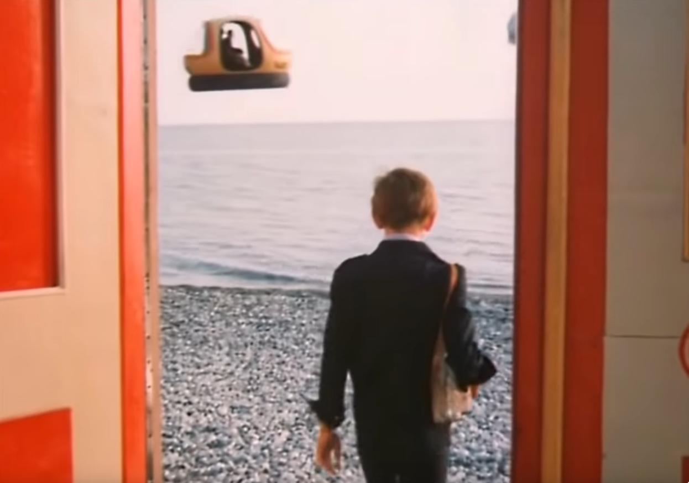

# Шаг в виртуальность

* 
* кадр из фильма [Гостья из будущего](https://www.youtube.com/watch?v=OtWGKZatqTU)

* О чём: об организации сообществ на удалёнке.
* Для кого: для тех кому интересно развивать навыки удалённой работы и дружбы.
* Зачем: чтобы переписать свои заметки в чистовик, поделиться опытом со страждущими.
* В чём особенность: хорошая подборка активностей и мотивация.
* [Где поддержать(похлопать)](https://medium.com/@stepanovv.ru/%D1%88%D0%B0%D0%B3-%D0%B2-%D0%B2%D0%B8%D1%80%D1%82%D1%83%D0%B0%D0%BB%D1%8C%D0%BD%D0%BE%D1%81%D1%82%D1%8C-909ffbaa0e7b)

## Текст объявления

Длительный карантин навсегда изменил наш мир, сделав его ещё чуть более виртуальным. Удалённая работа и удалённые работники растут ускоренными темпами, набирая своих сторонников, и вытягивая за собой виртуальные технологии на новый уровень. Настала пора подтянуть и наши с вами виртуальные навыки вслед за растущими возможностями и потребностями в виртуальном мире.

Предлагаем присоединиться к ряду новых активностей онлайн: завтрак, зарядка, игры, сообщества. Мы начинаем с онлайн самопрезентации для знакомства с коллегами, рассказа о своих возможностях и интересах.
Для этого подготовлен шаблон с примерами ответов на него. Если нет возможности попасть на встречу, можно записать текстовый, видео или аудио вариант самопрезентации. Это поможет нам быстрее найти общие интересы и организовать регулярные активности в сообществах.

Расскажем подробнее об этих активностях.

Время в изоляции, без выходов наружу, труднее структурировать. Необходимо вести расписание, формировать новые привычки без помощи прогулок и поездок. Тут помогут совместные онлайн активности.

День начинается с зарядки и завтрака, которые можно проводить онлайн вместе с друзьями. Для этого необходимо выбрать общее средство онлайн общения с видео встречами, договориться о времени проведения, предварительно настроить и проверить камеру/микрофон.

Во время зарядки можно выбрать ведущего или запустить видео в режиме демонстрации рабочего стола. Виртуальный спортзал готов, можно приступать к демонстрации своей красивой одежды и упругих мышц или выключить видео и получать удовольствие от новой движухи.

Завтракать онлайн ещё проще. Тут даже не надо подниматься со стула. Едим и общаемся, всё как обычно, но без очередей, пробок и давок. Для оживления беседы можно делиться рецептами блюд или устроить демонстрацию приготовления. Завтрак тоже должен быть ограничен по времени, чтобы не опаздывать на работу.

После рабочего дня можно договариваться об онлайн или карточных играх. Онлайн желательно играть в [браузерные игры](https://www.crazygames.com/), для них не требуется не только игровое железо, но даже и сам ноутбук, т.к. они играбельны на смартфонах. Карточные игры можно [купить](https://www.wildberries.ru/catalog/igrushki/nastolnye-igry), [сделать](https://vsesvoimirykami.ru/kak-sdelat-nastolnuyu-igru/) или [найти онлайн](https://ru.boardgamearena.com/). Это занятие поспокойнее. Мафия, монополия, кулинарные мастерские - это всё можно онлайн, с коллегами по работе, без регистрации и смс. Можно даже [паззлы собирать](https://store.steampowered.com/app/620650/Puzzle_With_Your_Friends/) вместе с друзьями. 

Высвободившееся из поездок время можно также потратить на взаимное обучение английскому или программированию. У программистов уже давно есть [онлайн игры](https://tproger.ru/digest/learn-to-code-while-playing-games/) на решение задачек, где можно чем-нибудь помериться. Да и время сейчас благодатное, чтобы запилить какой-нибудь онлайн инструмент с открытым исходным кодом, например, для обучения новым технологиям. Самый простой вариант обучения - сделать доклад или статью, а потом собраться и обсудить онлайн.

## Что дальше

Цель сбора самопрезентаций - составить список активностей/событий. Из него вытекает список сообществ со ссылками на страницы и/или чятики. 

Список рассылается всем участникам, и организуется минимум по одному активисту для поддержания жизни в этом сообществе. На старте должен быть кто-то, кто хотя бы пишет там свои заметки или ссылки на только что прочитанные статьи. Такую роль можно передавать на регулярной основе, если с движухой в сообществе будет туго.

По мере роста сообщества будет полезно собрать тексты самопрезентаций в одном месте, чтобы организовать поиск по ним для новых участников, и разгрузить организаторов от рассылок и обновления списков. Это уже функционал социальной сети.

Для поддержки сообщества необходимо минимум по два активиста, которые будут регулярно что-то совместно делать. Если людей будет маловато, то часть сообществ можно законсервировать, оставив там сообщение о поиске активистов и ссылки на блоги по теме. Можно сократиться до одного чятика/странички, с сохранением регулярных совместных активностей.

Раньше сделать такие сообщества было намного труднее. Сейчас, из-за повсеместной изоляции, интерес к этой теме должен быть намного больше. Потому что в изоляции быстрее наступает выгорание/усталость, и усложняется карьерный рост. Расширение списка виртуальных друзей/знакомых помогают преодолеть эти трудности.

## Неформальная самопрезентация

1. Кто я
	* Имя, страна, город, часовой пояс, рабочее время
1. Кем работаю
	* должность и охват работ
1. Краткое описание пути на текущую должность
	* Началось с учёбы или самостоятельной подготовки
	* Виды проектов/компаний, где удалось поработать
1. Откуда черпаю знания и опыт, как часто занимаюсь учёбой
	* что читаю/смотришь, куда пишу: блоги, статьи, сообщества, каналы
1. Куда интересно развивать карьеру?
	* Виды технологий, направления: управление, аналитика, backend/frontend/desktop/mobile, машинное обучение, робототехника, химия, физика, математика, литература, психология, театр
1. Есть ли опыт в социальных и открытых проектах
	* опыт организации или участия во взаимопомощи на работе, во дворе, онлайн
1. Откуда взялся опыт удалённой работы
	* в чём мотивация и как это удалось
1. Опыт путешествий
	* спорт, туризм, работа
1. Опыт активного отдыха
	* Коньки, парашюты, сноуборд, лазертаг, яхтинг, кайтинг, мотокросс, гонки, беговые лыжи, велосипед, воркаут.
1. Хобби(кулинария, рисование, пение)
	* чем занимался на регулярной основе, чему учился и совершенствовался
1. Как предпочитаю отдыхать онлайн
	* Какие темы, разновидности: онлайн-игры, фильмы, книги, видео подкасты
1. Чем интересуюсь
	* онлайн и оффлайн, хобби, работа
	* Какое время/дни свободны для этого
	* Интересно ли делиться знаниями, по каким направлениям
1. Свободный микрофон
	* Кем мечтал быть в детстве
	* Интересный факт о себе
