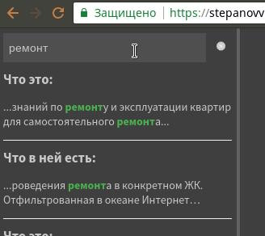
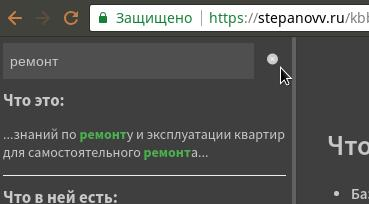
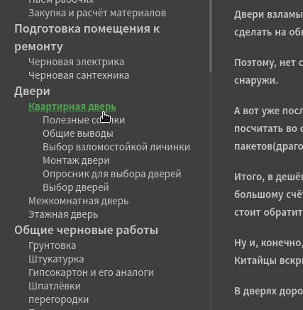
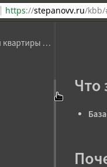

## Что это:
 * База знаний по ремонту и эксплуатации квартир для самостоятельного ремонта

## Как пользоваться
 | описание | скрин |
 | --- | --- |
 | слева вверху строка для поиска. Пишем текст, появляется выпадающее меню с результатами |  |
 | Чтобы убрать результаты поиска жмём на маленький крестик справа от поля ввода строки |  |
 | слева сквозное оглавление. Тыкаем на пункты, подпункты появляются автоматически. |  |
 | Полоса прокрутки вверх/вниз для оглавления появляется при наведении курсора. |  |
 | На изображения можно кликать для увеличения. Повторный клик уменьшит изображение обратно. Не надо кликать на возврат в браузере. Если требуется - кликайте обновить страницу. |  |
 |  |  |  |

## Почему она потребовалась:
 * нет всей необходимой информации в Интернет на одном сайте(в одном оглавлении)
 * требуется хранить данную полезную информацию онлайн. Чтобы было "под рукой".
 * жалко "закапывать" огромный объём человеко-часов поиска, обдумывания и сортировки информации

## Чего тут нет:
 * гарантий успеха, т.к. они стоят серьёзных денег
 * ответов на все вопросы

## Что в ней есть:
 * Полезные для мастеров-самоучек советы.
 * Критерии выбора инженерных решений и материалов.
 * Реальный опыт проведения ремонта в конкретном ЖК.
 * Отфильтрованная в океане Интернет информация со ссылками.

## Что в ней ещё может появиться(над чем работаю):
 * более чёткая структура содержания
 * новые статьи по интересубщим меня темам
 * мои собственные калькуляторы для расчётов в виде онлайн-сервисов
 * Подписка на RSS

## Как помочь
 * [Передать свои знания или попросить меня более подробно описать тему](https://stepanovv.ru/portfolio/portfolio.html#id-contacts)

## Новости

 * 01.05.2018 Процесс миграции продолжается, информация перенесена, осталось сконвертировать ссылки
 * 22.04.2018 Начат тяжёлый процесс миграции с dokuwiki на docsify для унификации моих баз знаний
 * 08.04.2017 Починил поиск по базе. Поле справа вверху с надписью "Search!".
 * 23.04.2017 добавил страничку для помощи деньгами
