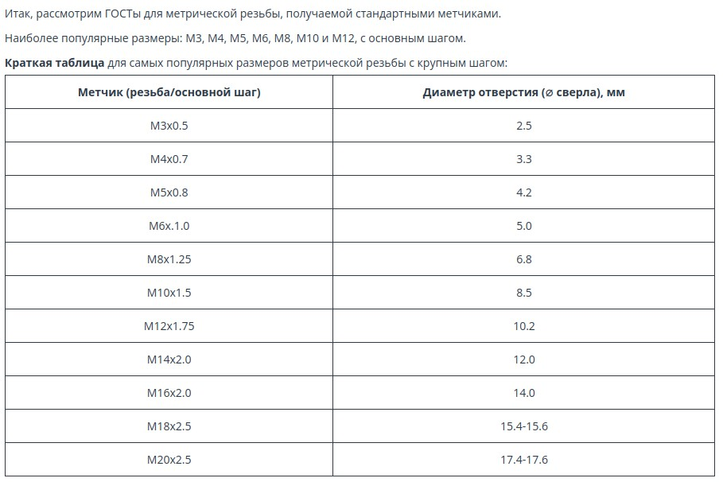

# Инструмент

 * Выбор щётки для очистки ржавчины
 * [Диаметр предварительного отверстия для метрических метчиков](https://cncmagazine.ru/polezno-znat/kak-pravilno-podobrat-sverlo-pod-rezbu-dlya-metchikov-tablicy-diametrov-i-rekomendacii/)
 * 