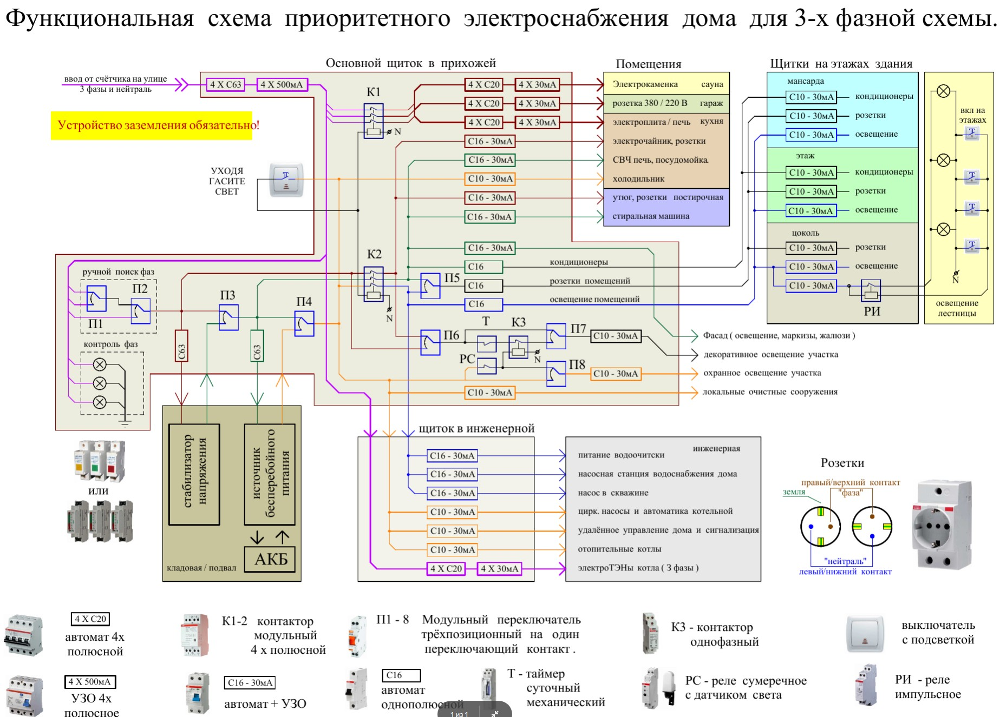
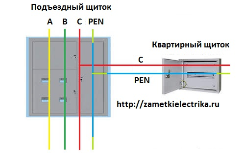
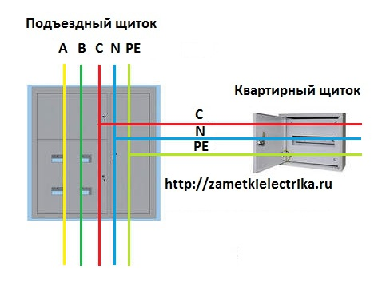
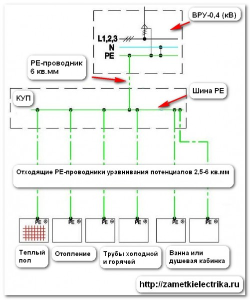
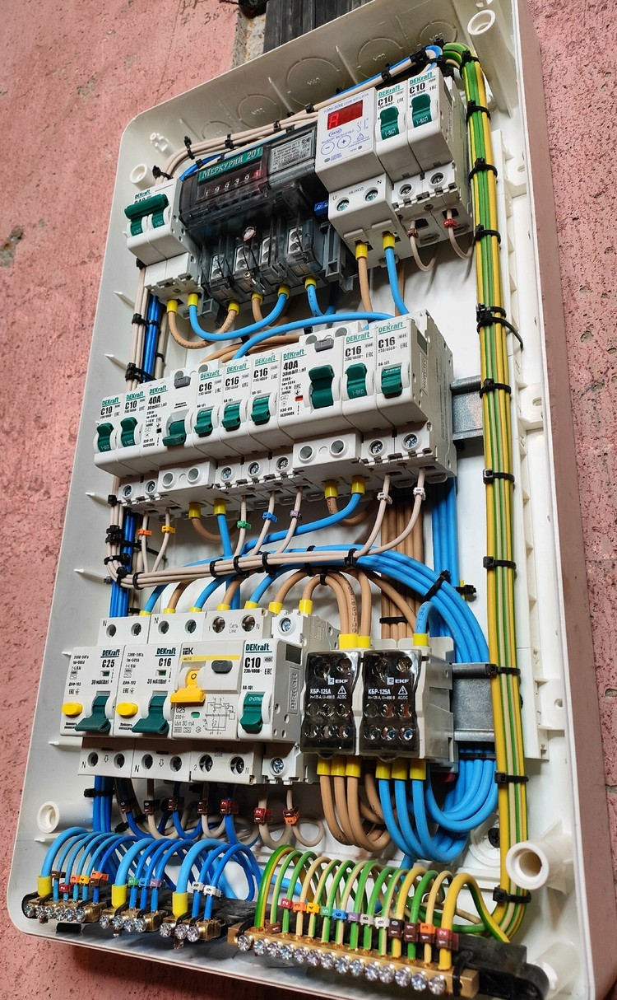
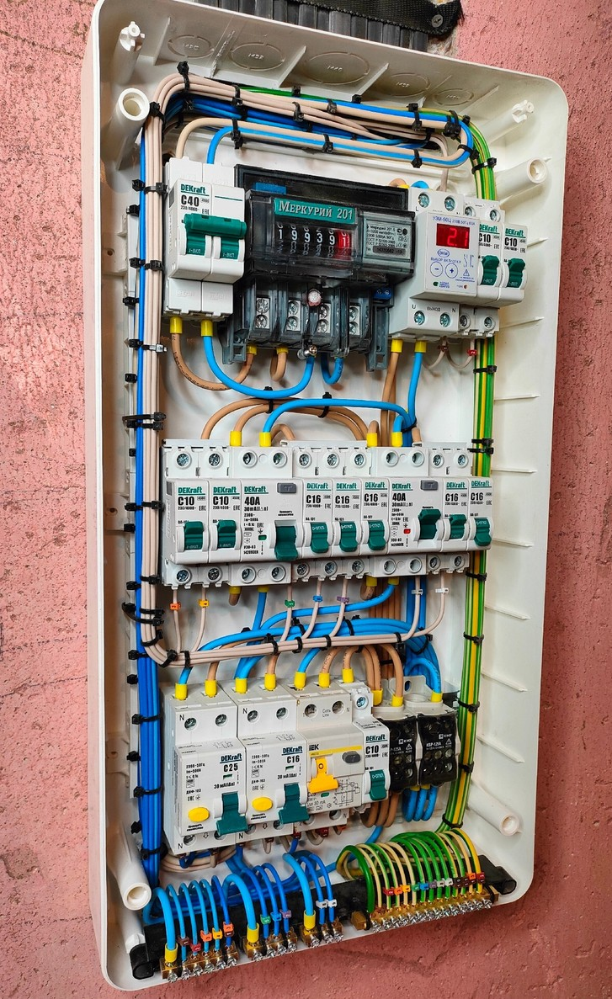
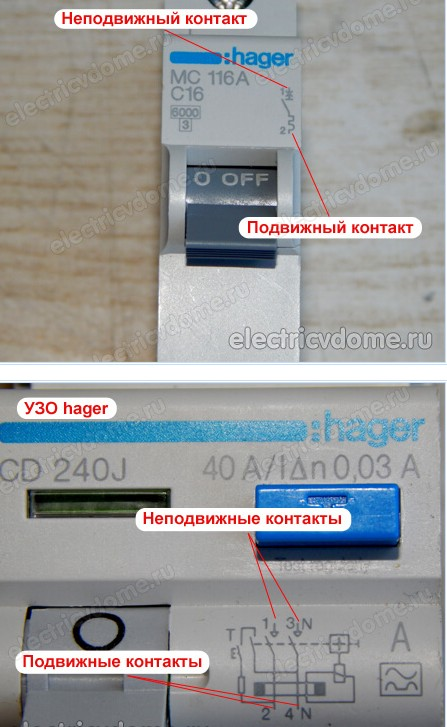

#  Электрика

## ссылки

 * 

 * ПУЭ http://www.elec.ru/library/direction/pue_7.pdf
 * http://remstd.ru/archives/vidyi-kabeley-provodov-i-shnurov/
 * http://www.a-kabel.ru/kalkulyator-secheniya

 * [с чего начать?](http://zametkielectrika.ru/elektroprovodka-v-kvartire/)
 * [типовые ошибки](http://zametkielectrika.ru/oshibki-gore-elektrika-ili-kak-ne-nuzhno-delat-elektromontazh/)

## магазины

 * http://www.elevel.ru/shop/nizkovoltnoe-oborudovanie/
 * [официальные партнёры ABB](http://new.abb.com/low-voltage/ru/gde-kupit/internet-magazini)
 * http://etm.ru
 * http://shop.feron.ru
 * [официальные партнёры Legrand](http://www.legrand.ru/where/internet-shops/Moscow/)
 * [интернет-магазин Legrand, ABB](http://shop220.ru/)

## газовый генератор

 * https://tagaev.com/gaz-generator/

## жизнестойкая схема электроснабжения

 * 
 * [Жизнестойкий дом с точки зрения электромонтажа Часть 2 Обсуждают @Андрей Курышев и Василий Зимин - 2021](https://www.youtube.com/watch?v=Z8AVeeMtyE8)

## сопротивление изоляции

 * проводится для контроля качества работ укладки кабеля, после оштукатуривания и навески потолков
 * [Сопротивление изоляции электропроводки в квартире и частном доме](https://elektrikdom.com/index/soprotivlenie_izoljacii_ehlektroprovodki_v_kvartire_i_chastnom_dome/0-423)
	* Пользоваться прибором необходимо в диэлектрических перчатках.
	* Установка зажимов мегаомметра должна производиться только на заземленный электрический проводник.
	* По завершении измерения требуется снять потенциал с проводов, посредством установки заземления.
	* Проверка сопротивления изоляции электропроводки в квартире и частном доме проводится между:
		— фазой и рабочим нулем;
		— фазой и фазой;
		— фазой и PE-проводником (заземляющий);
		— рабочим нулем и PE-проводником.
	* Сопротивление изоляции не должно быть менее 0,5 МегаОм. Идеальный вариант — прибор показывает «бесконечность».
 * [Мегаомметр (измеритель сопротивления изоляции) МЕГЕОН 131100](http://www.megeon-pribor.ru/katalog/megaommetry-izmeriteli-soprotivleniya-izolyatsii/megeon-131100)

## уравнивание потенциалов

 * для предотвращения электрохимической корозии, при разрыве проводимости через пластиковые трубы
 * можно уравнять потенциалы с трубой стояка, без отвода в щиток
 * [Уравнивание потенциалов](http://zametkielectrika.ru/cistema-uravnivaniya-potencialov/)
	* СУП запрещены в устаревшей системе заземления tn-c
	* 
 	* штатная система заземления tn-c-s
	* 
 	* 
 * [заземление полотенцесушителя](https://remdomkv.ru/electrics/kak-zazemlit-polotentsesushitel)
 * https://electricvdome.ru/zazemlenie/zazemlenie-polotencesushitelja.html

##  кабель

 * http://electro.narod.ru/tables/current.htm
 * http://ydoma.info/electricity-vybor-secheniya-provoda.html
 * 1,5 мм2 — 10 А — нагрузка до 2,2  кВт
 * 2,5 мм2 — 16  А — нагрузка до 3,5  кВт
 * 4,0 мм2 — 25  А — нагрузка до 5,5  кВт
 * 6,0 мм2 — 32  А — нагрузка до 7  кВт
 * 10 мм2 — 50 А — нагрузка до 11 кВт

 * НЕЛЬЗЯ соединять медь и алюминий. Только через стальные клеммы. Они окисляются, греются, горят при длительном соприкосновении.
 * Кабели. Круглые легче тянуть в гофру, плоские проще очищать от изоляции. Основные типы - это ВВГнГ-LS(аналог - NYM) [ВВГнГ-LS 3*1,5](http://www.etm.ru/cat/nn/9729228/) под люстры и [ВВГнГ-LS 3*2,5](http://www.etm.ru/cat/nn/9729229/) под розетки. Также ещё потребуются провода [ВВГнГ LS 3*6](http://shop220.ru/product209.htm) под варочную панель. Это всё для стационарной проклатки по полу/стенам.
 * Кабели соединительные, многожильные, мягкие. Для подключения, например, варочной панели. [ПВС 3*6](http://shop220.ru/product388.htm). Для светильников точечных под потолком - [ПВС 2*1,5](http://shop220.ru/product149985.htm). Для маленьких светильников третий провод не нужен, т.к. заземлять там нечего, в отличие от металлических люстр.
 *  для плиты и [ПУВ 1*4](http://www.etm.ru/cat/nn/9783080/) для изоляции(СУП) в ванную/туалет. Первая цифра - это сечение в квадратах, вторая - количество проводов. Лучше брать ГОСТ, он же 0,660. Это про минимальный диаметр провода и количество меди, т.е. про гибкость/ломкость.
 * На ввод в квартиру идёт ВВГнГ 3*10(или 3 шт ПУВ), он может потребоваться, если захотите подвинуть щиток поближе внутрь квартиры. При этом, остаётся малый щиток 12П с общим УЗО и защитой от перенапряжения, а от него удлинняется второй с защитами по комнатам. Щиток лучше не ставить близко к спальням, но и тянуть вдоль коридора колбасу из десятков проводов вместо одного тоже не очень приятно.

### гофра

 * [гофры](http://zametkielectrika.ru/smenyaemost-elektroprovodki-v-gofre-mif-ili-realnost/)
 * [гофра проверка на горючесть](http://www.youtube.com/watch?v=4EXy3irUudY)
 * [гофра негорючая с протяжкой](http://www.etm.ru/cat/nn/87860000/). Бывает 20мм и 16 мм. Первый используют для протяжки 3*2,5мм кабеля, второй - для 3*1,5мм. В принципе, можно и для 3*2,5 использовать 20мм, но лучше самому проверить, т.к. на большой длинне трудновато тянуть. Также бывает и тонкая/толстая гофра. Первая - серая, вторая - чёрная/оранжевая для внутренних и внешних помещений соответственно. Если у вас работают дешёвые(тупорылые) рабочие - лучше брать потвёрже, т.к. полюбому растопчут. Самые твёрдые - это негнущиеся трубки ПНД по 2м. Ну или нанимать прораба, который будет их сильно физически воспитывать. Я вот не смог растоптать серую гофру, а вот рабочие умудрились.
 * Протяжка кабеля в гофру делается при помощи любого упора. Чаще всего проволока вяжется к батарее. Обратный конец - к кабелю. Кабель, при этом, очищается от внешней изоляции, зажимается петлёй с проволокой, обматывается изолентой. Далее гофра натягивается на кабель как чехол. По мере натягивания дальний конец проволоки-протяжки подматывается к стояку батареи.
 * [кабель-канал](http://www.etm.ru/cat/nn/9726718/) для прокладки кабелей от квартиры до щитка/домофона/тамбурной двери и т.д. Подбирается по сечению. Достаточно 20*10мм для одного-двух кабелей, но лучше брать с запасом 40*10мм. А то потом ТВ кабель подтянется, звонок и ещё что-то, а места уже нет.

### наконечники

 * [наконечник кабельный](http://www.etm.ru/cat/nn/9725653/)(клеммы) для многожильных кабелей ШВВП/ПВС. Подбираются по диаметру. Первая цифра - диаметр, вторая - длинна.

##  ограничитель перенапряжения

 * http://electric-tolk.ru/ogranichiteli-perenapryazhenij-zashhita-ot-molnii/
 * http://ceshka.ru/elektrika-dlya-doma/rn-113
 * http://electric-tolk.ru/rele-kontrolya-napryazheniya/
 * [обрыв нуля](https://www.youtube.com/watch?v=JPkfIUo4S-U)

##  варочная панель

 * http://jelektro.ru/vse-o-elektromontazhe/podkljuchenie-varochnoj-paneli.html
 * автомат 32 А, провод 6кв

## электроплита

 * [Электроплита](http://zametkielectrika.ru/podklyuchenie-elektroplity/)
 * автомат

##  Резервное питание, ИБП, батарейки, котлы

https://geektimes.ru/post/280986/

##  грозозащита

 * https://rexant.ru/catalog/?q=%D0%B3%D1%80%D0%BE%D0%B7%D0%BE%D0%B7%D0%B0%D1%89%D0%B8%D1%82%D0%B0
 * https://www.etm.ru/catalog?rows=12&page=1&city=77&searchValue=%D0%B3%D1%80%D0%BE%D0%B7%D0%BE%D0%B7%D0%B0%D1%89%D0%B8%D1%82%D0%B0
 * [ограничители импульсного перенапряжения](https://www.etm.ru/catalog/501030_ogranichiteli_impulsnogo_perenaprjazhenija?rows=12&page=1&city=77)
 * https://www.youtube.com/watch?v=jjmZo4GBV98
 * http://netprotectors.ru/shop/23/desc/i-pro-gigabit-poe-box
 * http://www.sds-group.ru/items_8767.htm
 * http://lanset.ru/category/instrumenty-dlja-montazha/grozozashity/

##  автоматизация учёта электричества
 * https://geektimes.ru/post/280002/
 * http://incotex-counter.blogspot.ru/

## Расходники

 * Главное - побольше волшебной изоленты!!! :) Можно взять [белую](http://www.etm.ru/cat/nn/9784735/) для фазы, [синюю](http://www.etm.ru/cat/nn/9784744/) для нейтрали, [жёлто-зелёную](http://www.etm.ru/cat/nn/9813604/) для земли и [чёрную](http://www.etm.ru/cat/nn/9784745/) для починки внешней изоляции.
 * [клеммы WAGO](http://www.etm.ru/cat/products.html#!class-code=206010). "золотые", блин, изделия. Берутся чаще всего тройные. Они будут в каждой проходной розетке и выключателе по 2шт на землю и нейтраль. С рычагом удобнее, но вставные мельче. Наличие пасты не принципиально. Есть видео, где мужик по 50шт соединял и замерял температуру, сопротивление и т.д.. Пайка, конечно, немного круче, т.к. по физике сопротивление обратно пропорционально площади контакта. Но для бытовых условий важнее удобство монтажа. Таскать с собой горелку, припой и кембрики(термоусадку) неудобно.

## Инструмент

 * [нож для очистки изоляции](http://www.vseinstrumenti.ru/ruchnoy_instrument/elektromontazhnyj/dlya_snyatiya_izolyacii/stayer/semnik_izolyatsii_kabeley._8-28mm_stayer_2-45301/). Крайне желательно, т.к. серьёзно упрощает работу. Выдвижное лезвие необходимо подгонять под каждый тип провода, чтобы он не резал внутреннюю изоляцию. А если порезал - необходимо использовать изоленту или перекладывать, если небольшая длинна. Это нож для круглого провода, а для плоского есть свой [убер-съёмник](http://www.vseinstrumenti.ru/ruchnoy_instrument/elektromontazhnyj/dlya_snyatiya_izolyacii/nozhi-monterskie/kvt/izolirovannyj_nozh_kvt_nmi-01_58596/).
 * тонкогубцы для работы внутри установочных коробок
 * тонкая отвёртка с плоским шлицом и изоляцией жала ph1 для работы в щитке с шинами.
 * [обжимник](http://www.vseinstrumenti.ru/ruchnoy_instrument/elektromontazhnyj/ruchnye_press-kleschi/kvt/press_kleschi_kvt_pkvk-10_61674/) для клемм(пресс-клещи). Используется для многожильных кабелей, чтобы не ломать их в винтовых клеммах. Некоторые электрики рекомендуют вешать клеммы на одножильный кабель. Я в этом смысла не вижу. Подбирается по типу клемм и минимальному-максимальному диаметру клемм. У нас это изолированные наконечники и 0,5-6мм
 * [как пользоваться пресс-клещами](http://zametkielectrika.ru/press-kleshhi-dlya-opressovki-izolirovannyx-nakonechnikov/)

## Электрощиток

 * рекомендую ставить щиток [ABB Mistral](http://zametkielectrika.ru/obzor-novoj-serii-vstraivaemyx-shhitov-mistral-41f-ot-abb/) минимум на 24 для квартиры однушки, и 36 для двушки.
 * количество постов/полюсов считается по общей ширине автоматических выключателей(нам нужны бывают 1 и 2 полюсовые), плюс полезно на каждую линейку(она обычно по 12 постов) 2 поста зарезервировать для [1-постовых шин под DIN рейку](http://www.etm.ru/cat/nn/9819675/)
 * сначала считаем общее количество проводов, подбираем 2 шины PE и N под это количество
 * располагаем 2 мелкие шины 3-4П N и L на ввод щитка
 * разбиваем потребителей по линиям(DIN рейкам) 12-10 шт на рейку в зависимости от наличия свободного места на DIN рейке после установки шин и укладки жгутов PE и N
 * на каждую линию ставим одно УЗО. Стандарт - отдельное УЗО на розеток в ванной и туалете.
 * УЗО на каждой линии позволит точнее определить где утечка, т.к. УЗО выбивает зачастую без видимых причин. Это могут быть повреждения проводов, выкипевшее молоко на плите, ошибки выравнивания потенциалов или неисправный ТЭН в стиралке.
 * если в щитке есть свободная DIN рейка, то делаем линию под освещение со своим УЗО, там тоже могут быть утечки в заземление люстр. Так что, если будет срабатывание УЗО розеток, освещение останется включённым.
 * на каждую линию УЗО подбираем отдельные шины N
 * располагаем шины, протягиваем к ним провода PE и N, собираем стяжками
 * добавляем для кухни 2П выключатель 32А под варочную панель и 1П 25А под духовку
 * добавляем вводной 2П выключатель 40-63А и ограничитель напряжения с амперметром и вольтметром, это ещё 2П.
 * Для загородного дома добавляем грозозащиту, 2-3 штуки каскадом на разный ток
 * Для 3-фазной сети необходимо развести фазы по мощности и частоте включения потребителей, чтобы не было перекоса фаз.
 * на оставшиеся места набиваем 10А выключатели под свет и 16А под розетки
 * главное - вывесить на отдельные автоматы повышенной мощности и провода сечением больше 2,5кв потребителей больше 3,5 КВт. Каждому - отдельный. Ну и общий 2П автомат на всю квартиру и УЗО. Минимум ещё один автомат на розетки и освещение.
 * когда собрали автоматы на рейках, подтягиваем к ним провода L.
 * По-хорошему, щиток собирается и проектируется до монтажа, включая внутренние соединения УЗО и шины PE с вводными шинами
 * 
 * 

## Автоматические выключатели и УЗО

 * [УЗО(дифференциальный выключатель)](http://zametkielectrika.ru/sxemy-podklyucheniya-uzo-vybor-uzo-po-nominalnomu-i-differencialnomu-toku-toku-utechki/)
 * [Как подключить УЗО — наиболее распостраненные схемы](https://hmelectro.ru/poleznye_statyi/kak-podklyuchit-uzo-naibolee-raspostranennye-shemy)
 * [отличия УЗО от диффавтомата](http://zametkielectrika.ru/otlichie-differencialnogo-avtomata-ot-uzo/)
 * [что выбрать - УЗО/Диффавтомат](http://zametkielectrika.ru/uzo-ili-difavtomat-chto-vybrat/)
 * [электронные(А) и электромеханические(АС) УЗО](http://elektrik-sam.info/kak-proverit-tip-uzo/)
 * [токовые характеристики автоматов (A/B/C/D)](http://elektrik-sam.info/tokovye-harakteristiki-avtomaticheskih-vyklyuchateley/)
 * [время-токовые характеристики автоматов(B/C/D)](http://zametkielectrika.ru/vremya-tokovye-xarakteristiki-avtomaticheskix-vyklyuchatelej/)

 * Более дешёвый вариант - IEK, более дорогой - ABB/Schneuder/Legrand
 * в каждой комнате по 1 выключателю однопостовому [на свет(10А)](http://www.etm.ru/cat/nn/9747481/) и [на розетки(16А)](http://www.etm.ru/cat/nn/9748367/).
 * максимальный ток(срабатывания) УЗО выбирается равным или на одну ступень более максимального тока вводного автомата. Автомат стоит после УЗО, и срабатывает на нагрев через некоторое время. Поэтому, УЗО должно надёжно выдерживать этот ток, пока автомат не нагреется и сработает.
 * Если у Вас вводной автоматический выключатель имеет номинальный ток до 40 (А) включительно, то вводное УЗО можно устанавливать с током утечки 30 (мА). Если же номинал вводного автомата больше 50 (А), то скорее всего УЗО придется устанавливать с током утечки 100 (мА).
 * 1 УЗО 2поста/полюса [63А 30мА 6кА тип AC(электромеханический)](http://www.etm.ru/cat/nn/9747048/) на всю квартиру(а ещё есть УЗО на этажном щите 100мА от застройщика),
 * дополнительно можно поставить 1 УЗО 2поста/полюса 40-63А 30мА  6кА тип AC на ванную+туалет. У меня туда зашёл 40А IEK тип А от застройщика.
 * 1 выключатель 40А 2 полюса 6кА тип В на всю квартиру [ABB](http://www.etm.ru/cat/nn/9790400/) Shneider. Считается от максимально разрешённой мощности. У нас 8КВт. Фактическое ограничение, по законам физики и особенностям работы выключателей - это сечение и тип провода. У нас оно 50А максимум. Я использовал 40А, как установил застройщик в квартиру(8,8кВт).
 * 1 выключатель [32А 2 полюса 6кА тип В](http://shop220.ru/product149296.htm) на варочную панель. [Типовая варка](http://www.holodilnik.ru/built-in/electrical_cooktops/hotpoint_ariston/7hkrm_641_d_x_ru_ha/) потребляет 6,5-7 кВт, исходя из таблички выше это провод 6 квадратов и автомат на 32А.
 * УЗО(дифференциальный выключатель) лучше брать электромеханическое. Оно не требует электричества для работы. Т.е. работает даже при обрыве.
 * автоматические выключатели лучше брать с характеристикой B. Их реально хватает даже на сварочные аппараты. Обычно ставят C, которые намного медленнее срабатывают. Тип А ставят в домах с ветхой проводкой, я их не испытывал на реальных бытовых приборах. У меня отлично работают тип В.
 * УЗО/выключатели лучше брать номинальной отключающей способностью 6кА, а не 4,5кА. В Европах 4,5 уже ставить нельзя. Это запас по току короткого замыкания.
 * Защита от перенапряжения. Проще говоря, от дурака, который отключит нулевой провод. При этом, вся техника получает живительные 380В вместо 220В. Состоит из [реле](http://www.etm.ru/cat/nn/388646/) и [контактора](http://www.etm.ru/cat/nn/1851040/) для повышения мощности срабатывания до более 7кВт(у нас - 8).

### направление подключения автоматов

 * https://electricvdome.ru/avtomaticheskie-vikluchateli/kak-podklyuchit-avtomat-v-shhitke.html
 * в правилах сказано, что питающий провод при подключении автоматов в щитке должен присоединяться, как правило, к неподвижным контактам
 * Такое правило утверждено в целях общего порядка. Любой образованный электрик знает, что при выполнении работ необходимо снять напряжение с оборудования, на котором будет работать. «Залазя» в щиток человек интуитивно предполагает наличие фазы сверху на автоматах. Отключив АВ в щитке, он знает, что напряжения на нижних клеммах и все что от них отходит, нет.
 * 

## Розетки

 * Обычно берут [legrand valena](http://shop220.ru/cat589.htm) белые.
 * Необходимо брать подрозетники(электроустанговочные коробки) [блочного типа](http://www.etm.ru/cat/nn/9763779/) с "ушами". Если не лень долбить лишние пару сантиметров вглубь, лучше взять [поглубже, на 60мм](http://www.etm.ru/cat/nn/9790862/).
 * Диаметр(первая цифра) установочных розеток особой роли не играет, т.к. болты под крепления расположены стандартно. Обычно берут 68мм(диаметр)*42мм(глубина)
 * По типу также различают коробки под [полые стены(гипсокартон)](http://www.etm.ru/cat/nn/9763782/) - они с ушками. Желательно брать с металлическими лапками.
 * полезно взять несколько [заглушек](http://www.etm.ru/cat/nn/9764006/) для установочных коробок
 * из экзотики есть специальные розетки для работы через ИБП, с защитой от втыкания чайников. И к ним секретный аксесуар, который теряется - [заглушка с ключом](http://www.etm.ru/cat/nn/9677755/).
 * убер-вещь - это [двойная розетка](http://www.etm.ru/cat/nn/9709557/) для одного подрозетника.
 * покупать или нет для плиты отдельную [розетку](http://shop220.ru/product37148.htm) можно решить заглянув в комплектацию конкретной варочной панели. Если розетка там есть - значит вам счастье. Если нет - смотрите на вилку. Обычная вилка подключается к обычной розетке с автоматом на 16А. На ней обычно так и написано -  16А. Если голые провода - читайте инструкцию. Но там, скорее всего, будет написаны коварные 6,5-7 кВт потребляемой мощности. А это значит сильно больше 16А.
 * Стоят такие розетки как чугунный мост. Поэтому, лучше соединять на пайке  или на соответствующих суровых винтовых клеммах под 32А. Для этого потребуется кабель типа

## Автоматизация

 * поскольку у нас входные двери открываются с блокированием друг друга, я решил заморочиться датчиками открытия соседской двери. Для этого основной компонент - [датчик](http://www.etm.ru/cat/nn/838138/). Лучше нормальноразомкнутый. Тогда останется только электричество подвести и батарейку вставить. Открыл сосед дверь - лампочка загорелась. Погасла - можно выходить.
 * [датчик движения](http://zametkielectrika.ru/datchik-dvizheniya-dlya-osveshheniya/)
 * [датчик движения](http://www.etm.ru/cat/nn/9813497/) на потолок. Хорошо идёт в коридор без окон, на потолок возле лампы, но китайцы щёлкают.
 * можно заморочиться датчиками закрытия окон. Тут тоже достаточно [магнитного датчика](http://www.etm.ru/cat/nn/4686687/) и главное - подведённого заранее провода до щитка. Я проводил для этого дополнительные UTP. Они и для Интернета годятся, и для датчиков.

## ванна мокрые зоны и электрика

http://zametkielectrika.ru/rozetka-v-vannoj/

[коробка/система уравнивания потенциалов](http://zametkielectrika.ru/cistema-uravnivaniya-potencialov/) объединяет:
 *     отопление
 *     холодный водопровод
 *     горячий водопровод
 *     ванна или душевая кабина
 *     розетки

Рекомендую брать [сразу с шиной](http://www.etm.ru/cat/nn/9465400/) в комплекте.

## Интернет

 * обратить внимание на калибр кабеля - 22AWG - толстый, под него надо подбирать коннекторы, 24AWG - это 0,51мм для внешней прокладки средней толщины. 22AWG - обычный. Коннекторы обычно под 22-24 awg.
 * лучше брать фольгированный ftp