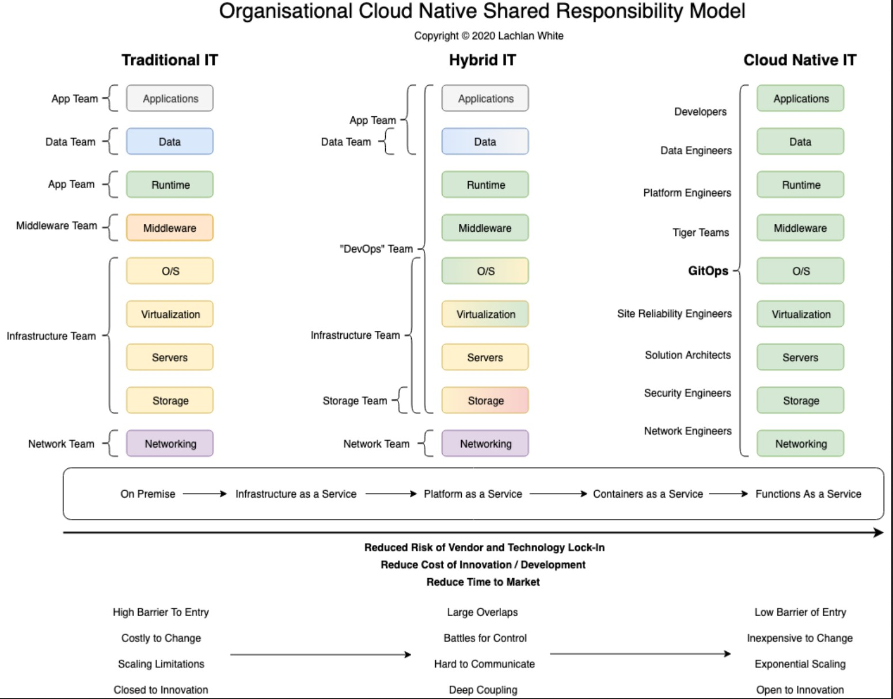

#  devops

 * https://www.redhat.com/sysadmin/
 * [утилиты документирования](https://github.com/documentationjs)
 * [SRE site reliability engineering](https://sre.google/books/)
* где посмотреть ограничения технологий, их предельную нагрузку? ноды, события, потоки
* для мониторинга облаков и биллинга - prometeus+grafana
* kubernetes или docker compose - иерархия микросервисов

* `Cowell C., Lotz N., Timberlake C. Коуэлл К., Лотц Н., Тимберлейк К. - Automating DevOps with GitLab CI CD Pipelines Автоматиза`
* `Gopalakrishnan Shivakumar Гопалакришнан Шивакумар - Kubernetes for Jobseekers DevOps and Kubernetes interview questions and ans`
* `Krief Mikael Криф Микаэль - Learning DevOps A comprehensive guide to accelerating DevOps culture adoption with Terraform, Azure`
* `Levan M. - 50 Kubernetes Concepts Every DevOps Engineer Should Know [2023, EPUB, ENG]`
* `[LiveLessons Pearson O'Reilly Media] Practical Python for DevOps Engineers LiveLessons by Chris Jackson [2021, ENG + Sub]`
* `Oggl Bernd, Kofler Michael Оггл Бернд, Кофлер Майкл - Docker Practical Guide for Developers and Devops Teams Docker Практиче`
* `[Packt Publishing O'Reilly Media] Ansible for the Absolute Beginner - Hands-On - DevOps by Mumshad Mannambeth [2020, ENG + Sub]`
* `[Pluralsight] Integrating HashiCorp Vault in DevOps Workflows [2021, ENG]`
* `[Rahul Miglani] Webinar DevOps Observability at Scale [2022, ENG]`
* `Sandilands D. - Puppet 8 for DevOps Engineers [2023, EPUB, ENG]`
* `Smith Bradley Смит Брэдли - DevOps for the Desperate A Hands-On Survival Guide DevOps для отчаявшихся практическое руководст`
* `[ZeroToMastery]DevOps Bootcamp Terraform[2022, ENG]`
* `Бестселлеры O'Reilly - Gift N,, Behrman K., Deza A. Гифт Н., Берман К., Деза А., Георгиу Г. - Python for DevOps Learn Ruthlessl`

## блоги

 * https://www.jedi.be/blog/

## курсы

 * https://devops-factory.com/
 * `[Skillbox] DevOps-инженер. Часть 1. Основы [2022-2023, RUS]`
 * `[Skillbox] DevOps-инженер. Часть 2. Advanced [2022-2023, RUS]`
 * `[Skillbox] DevOps-инженер. Часть 3. Docker [2022-2023, RUS]`
 * `[Skillbox] Старт в DevOps системное администрирование для начинающих [2022-2023, RUS]`
 * `[Udemy] GitLab CI Pipelines, CI CD and DevOps for Beginners [2022, ENG]`
 * `[Udemy] Practical Devops Kubernetes & Istio with Google Cloud [2023, ENG]`
 * `[Udemy] Prometheus MasterClass DevOps Infra Monitoring & Alerting [2023, ENG]`
 * `[PacktPub] DevOps Complete Course [Video] [2022, ENG]`
 * `[PacktPub] DevOps Project - 2022 CI CD with Jenkins Ansible Kubernetes [Video][2022, ENG]`
 * `[Packt Publishing O'Reilly Media] DevOps Complete Course by Valaxy Technologies [2022, ENG + Sub]`

## собесы

 * [Пришёл Intern - оказался JUNIOR Strong / Интервью на позицию DevOps Engineer / Мок собес / 1 - Александр Донской | DevOps фабрика ](https://www.youtube.com/watch?v=pLU3zrUq87Y)

## собесник

 * типичные вопросы собесов
	*
The 7 Cs of DevOps are Continuous:
    * Integration: Regularly merging code changes into a shared repository.
	* Testing: Automatically running tests to ensure code quality.
	* Delivery: Ensuring code is always in a deployable state.
	* Deployment: Automatically deploying code to production.
	* Monitoring: Tracking system performance and issues in real-time.
	* Feedback: Gathering and responding to user and system feedback.
	* Operations: Maintaining system stability and uptime through automated processes.
* zero-downtime deployments, strategies like canary releases and rolling updates are used. Blue/Green Deployment is a method where you maintain two identical production environments, with only one active at a time. Updates are deployed to the inactive “blue” environment, then traffic is switched to it, ensuring seamless transitions and mitigating downtime.
* Immutable infrastructure is a paradigm where servers and components are never modified after deployment, but instead replaced with updated versions. Benefits include easier deployment, improved scalability, and better fault tolerance. Drawbacks may include initial setup complexity and challenges in managing stateful applications.
* проблема - контекст - решение
* UI
	* grafana
		* умеет в математику
* log management
	* elasticsearch - источник данных для kibana про логи, посмотреть для чего его вкрячивают
	* logstash
	* loki
* event management
	* prometheus
		* node exporter - alert manager
		* источник данных(agentless node exporter) для kibana про события
	* victoria metrics - аналог prometeus
* OS/infra management
	* [ansible](./ansible)
		* хранит в себе конфиги, оркестратор, 100-200 строк в файле
		* есть гуй tower(500 хостов платный), avx - бесплатный гуй
		* role, playbook, collection
* cloud management
	* terraform(go) - оркестратор виртуалок/сетей в облаках, у провайдера должен быть коннектор
* CICD
	* jenkins
	* gitlab
* artifact management
	* artifactory
	* docker registry
	* harbor
* function/microservice management
	* kubernetes
	* docker swarm
* функции
	* горизонтальное/вертикальное масштабирование
	* резервирование
	* источники сложности и их митигация
	* мониторинг
	* разработка
	* бэкап/восстановление
		* многопоточный
		* сжатие
		* инкремент
* СУБД
	* host vars

## Performance

 * http://techblog.netflix.com/2015/08/netflix-at-velocity-2015-linux.html
 * http://habrahabr.ru/company/odnoklassniki/blog/266005/
 * http://nickcraver.com/blog/2016/02/17/stack-overflow-the-architecture-2016-edition/
 * [tarantool in-memory nosql db](https://habrahabr.ru/company/oleg-bunin/blog/310690/)
 * [Разбираемся в DevOps и Js на примере Dillinger.io](https://habrahabr.ru/post/280968/)

 * утилита nice
	* -20 (наивысший приоритет) до +19 (низший приоритет)
	* только root может указать отрицательное смещение
	* Приоритет nice и приоритет планировщика процессов ядра ОС — разные числа.
	* Планировщик может стремиться назначить процессу приоритет, близкий к nice, но это не всегда возможно, так как в системе может выполняться множество процессов с разными приоритетами.

## monorepo монорепа

 * [nrwl/NX](https://nx.dev/)
	* https://github.com/nrwl/nx

## Yandex Cloud

 * [ЦОД](https://yandex.cloud/ru/docs/troubleshooting/legal/how-to/data-centers-physical-addresses)
	* МО Ивантеевка
    * В городе Мытищи — г. Мытищи, ул. Силикатная 19 - 2010
    * Владимирская область — г. Владимир, мкр. Энергетик, ул. Поисковая 1 к. 2
    * Рязанская область — г. Сасово, ул. Пушкина 21
    * Калужская область — г. Калуга, 1-й Автомобильный пр-д 8, индустриальный парк «Грабцево» - 2024
 * [Сервисы Yandex Cloud](https://yandex.cloud/ru/docs/overview/concepts/services)
 * [Правила тарификации для Compute Cloud](https://yandex.cloud/ru/docs/compute/pricing#prices-storage)
 	* [Квоты и лимиты для сервисов Yandex Cloud](https://cloud.yandex.ru/ru/docs/overview/concepts/quotas-limits)
	* [Операции чтения и записи](https://cloud.yandex.ru/ru/docs/compute/concepts/storage-read-write)
	* 
 * https://yandex.cloud/ru/docs/overview/
 * https://practicum.yandex.ru/trainer/ycloud-deploy/lesson/f6d509ce-5fa7-4b83-a342-eb4149de65e6/

```bash
	yc config profile activate <profile>

	yc vpc security-group create --name yc-security-group --network-name default \
		--rule 'direction=ingress,port=443,protocol=tcp,v4-cidrs=0.0.0.0/0' \
		--rule 'direction=ingress,port=80,protocol=tcp,v4-cidrs=0.0.0.0/0' \
		--rule 'direction=ingress,from-port=0,to-port=65535,protocol=any,predefined=self_security_group' \
		--rule 'direction=ingress,from-port=0,to-port=65535,protocol=any,v4-cidrs=[10.96.0.0/16,10.112.0.0/16]' \
		--rule 'direction=ingress,from-port=0,to-port=65535,protocol=tcp,v4-cidrs=[198.18.235.0/24,198.18.248.0/24]' \
		--rule 'direction=egress,from-port=0,to-port=65535,protocol=any,v4-cidrs=0.0.0.0/0' \
		--rule 'direction=ingress,protocol=icmp,v4-cidrs=[10.0.0.0/8,192.168.0.0/16,172.16.0.0/12]'

	export SG_ID=$(yc vpc security-group get --name yc-security-group | head -1 | awk '{print $2}')

```
 * common
	* https://yandex.cloud/ru/docs/managed-kubernetes/operations/connect/security-groups
 * gitlab
	* https://yandex.cloud/ru/docs/managed-gitlab/operations/configure-security-group
 * terraform
	* https://yandex.cloud/ru/blog/posts/2023/05/terraform-modules-yandex-cloud
	* https://yandex.cloud/ru/docs/tutorials/infrastructure-management/terraform-quickstart
 * kubernetes
	* https://yandex.cloud/ru/blog/posts/2023/03/kubernetes-get-started
	* https://yandex.cloud/ru/blog/posts/2021/12/marketplace-kubernetes
 * Packer
	* [Packer: мультисборка, пост-процессоры и пользовательские плагины - otus - 2024](https://habr.com/ru/companies/otus/articles/796135/)
	* https://developer.hashicorp.com/packer/docs/intro

## Load balancing

 * [Введение в современную сетевую балансировку и проксирование - 2018](https://habrahabr.ru/company/mailru/blog/347026/)
 * [«Щадящая» балансировка между несколькими провайдерами на офисном шлюзе - 2016](https://habrahabr.ru/post/279777/)
 * haproxy
 * nginx
 * dns
 * ipvs
 * https://www.serverwatch.com/guides/load-balancing-software/
	* 

## Chat чат

 * https://rocket.chat/
 * google hangouts
 * slack
 * mattermost
 * https://matrix.org/clients/
 * https://teams.vk.com/
 * https://calls.mail.ru/
 * «МТС Линк», SberJazz, Яндекс.Телемост, «Труконф» trueconf, «VK Звонки»

##  инфраструктура

 * [https://habrahabr.ru/post/319582/](https://habrahabr.ru/post/319582/)
 * https://lachlanwhite.com/posts/medium/21-01-20-visualising-a-cloud-native-operating-model/21-1-20-visualising-a-cloud-native-operating-model-for-enterprise-adoption/
 * 

##  автоматизация

 * [Пересмотренное руководство по Grunt для начинающих - 2014](https://habrahabr.ru/post/244721/)
 * https://medium.com/@ericsimons/introducing-turbo-5x-faster-than-yarn-npm-and-runs-natively-in-browser-cc2c39715403
 * https://parceljs.org/

## оркестраторы ОС

### ansible

* [](./ansible.md)

### terraform

* нужен файл состояния
* облака AWS, Y, M, S

## kubernetes

 * [kubernetes](./kubernetes.md)

## gitlab ce

 * https://about.gitlab.com/install/
 * https://docs.gitlab.com/ee/install/docker.html
 * https://hub.docker.com/r/gitlab/gitlab-ce/tags/
 * иерархия конфигов
 	* stages
	* needs
	* dependencies
	* artifacts
	* trigger
	* dynamic pipelines
	* rollout&rollback
	* parallel exec

```bash

#version: '3.6'
services:
  gitlab:
    image: gitlab/gitlab-ce
    container_name: gitlab
    restart: unless-stopped
    hostname: 'gitlab'
    #user: gitlab
    environment:
      #- GITLAB_OMNIBUS_CONFIG='https://gitlab'
      - GITLAB_HOME='/home/gitlab/data'
    ports:
      - '180:80'
      - '1443:443'
      - '122:22'
    volumes:
      - '$GITLAB_HOME/config:/etc/gitlab'
      - '$GITLAB_HOME/logs:/var/log/gitlab'
      - '$GITLAB_HOME/data:/var/opt/gitlab'
    shm_size: '256m'
    logging:
      driver: json-file
      options:
        max-size: "1m"
        max-file: "3"
        labels: "TEST"
        mode: "non-blocking"
        tag: "{{.ImageName}}/{{.Name}}/{{.ID}}"


docker-compose run -u $(id gitlab -u):$(id gitlab -g) gitlab
docker-compose up -d

docker logs -f gitlab|less
docker exec -it gitlab grep 'Password:' /etc/gitlab/initial_root_password
# http://gitlab:180
# root@pass
docker exec -it gitlab /bin/bash
docker exec -it gitlab editor /etc/gitlab/gitlab.rb
#gitlab_rails['gitlab_shell_ssh_port'] = 122
#letsencrypt['enable'] = false
mkdir -p /etc/gitlab/ssl
chmod 755 /etc/gitlab/ssl
openssl req -x509 -newkey rsa:4096 -sha256 -days 3650 -nodes -keyout gitlab.key -out gitlab.crt -subj "/CN=gitlab"
cp gitlab.key gitlab.crt /etc/gitlab/ssl/
docker exec -it gitlab gitlab-ctl reconfigure
docker restart gitlab

exec -t gitlab gitlab-backup create
g clone ssh://git@gitlab:122/group1/frontend.git

```

 * https://docs.gitlab.com/omnibus/settings/ssl/index.html#configure-https-manually
 * https://docs.gitlab.com/omnibus/settings/configuration.html#configuring-the-external-url-for-gitlab

## ssl ca

 * https://letsencrypt.org/docs/rate-limits/
 * https://zerossl.com/documentation/acme/
 * https://www.buypass.com/products/tls-ssl-certificates/go-ssl
 * https://www.ssl.com/guide/ssl-tls-certificate-issuance-and-revocation-with-acme/
 * https://smallstep.com/docs/step-ca/index.html

## docker

 * [docker](./docker.md)

```bash
	docker container commit -m "Add node" base-container node-base
	docker image history node-base
	docker run -d -p HOST_PORT:CONTAINER_PORT nginx

```

## databases

### mysql

```bash
	# connect

	# create db
	# create user
	# create table
	# create index
	# change isolation level
	# backup/restore
		mysqldump
	# tune cache
		mysql -e "SHOW ENGINE
		INNODB STATUS"
		#https://dev.mysql.com/doc/refman/8.4/en/innodb-buffer-pool.html
	# data path
	# config path
		dpkg --listfiles mysql-server
		rpm -q --list mysql-server
		mysql -e "SHOW VARIABLES LIKE 'datadir';"
		#+---------------+-----------------+
		#| Variable_name | Value           |
		#+---------------+-----------------+
		#| datadir       | /var/lib/mysql/ |
		strace mysql ";" 2>&1  | grep cnf
		#newfstatat(AT_FDCWD, "/etc/my.cnf", 0x7ffea7b0bc80, 0) = -1 ENOENT (No such file or directory)
		#newfstatat(AT_FDCWD, "/etc/mysql/my.cnf", {st_mode=S_IFREG|0644, st_size=682, ...}, 0) = 0
		#openat(AT_FDCWD, "/etc/mysql/my.cnf", O_RDONLY) = 3
		#newfstatat(AT_FDCWD, "/etc/mysql/conf.d/mysql.cnf", {st_mode=S_IFREG|0644, st_size=8, ...}, 0) = 0
		#openat(AT_FDCWD, "/etc/mysql/conf.d/mysql.cnf", O_RDONLY) = 4
		#newfstatat(AT_FDCWD, "/etc/mysql/conf.d/mysqldump.cnf", {st_mode=S_IFREG|0644, st_size=55, ...}, 0) = 0
		#openat(AT_FDCWD, "/etc/mysql/conf.d/mysqldump.cnf", O_RDONLY) = 4
		#newfstatat(AT_FDCWD, "/etc/mysql/mysql.conf.d/mysql.cnf", {st_mode=S_IFREG|0644, st_size=132, ...}, 0) = 0
		#openat(AT_FDCWD, "/etc/mysql/mysql.conf.d/mysql.cnf", O_RDONLY) = 4
		#newfstatat(AT_FDCWD, "/etc/mysql/mysql.conf.d/mysqld.cnf", {st_mode=S_IFREG|0644, st_size=2220, ...}, 0) = 0
		#openat(AT_FDCWD, "/etc/mysql/mysql.conf.d/mysqld.cnf", O_RDONLY) = 4
		#newfstatat(AT_FDCWD, "/root/.my.cnf", 0x7ffea7b0bc80, 0) = -1 ENOENT (No such file or directory)
		#newfstatat(AT_FDCWD, "/root/.mylogin.cnf", 0x7ffea7b0bc80, 0) = -1 ENOENT (No such file or directory)
		#openat(AT_FDCWD, "/usr/lib/ssl/openssl.cnf", O_RDONLY) = 3
		update-alternatives --config my.cnf
		#Есть 2 варианта для альтернативы my.cnf (предоставляет /etc/mysql/my.cnf).
		#Выбор   Путь                    Приор Состояние
		#------------------------------------------------------------
		#* 0            /etc/mysql/mysql.cnf         200       автоматический режим
		#1            /etc/mysql/my.cnf.fallback   100       ручной режим
		#2            /etc/mysql/mysql.cnf         200       ручной режим


	# deadlock

```


### postgresql

```bash
	# connect
		su - postgres -c "psql -U mo_user mo_db"
	# create db
		su - postgres -c "createdb --encoding=UNICODE --owner=mo_user mo_db"
	# create user
		su - postgres -c "createuser --pwprompt --encrypted --no-adduser --no-createdb --no-createrole --no-inherit mo_user"
	# create table
	# create index
	# change isolation level
	# backup/restore
		sudo -U postgres -c "pg_dump $DBNAME | qzip > /distr/backup/$DBNAME_dump_`date`.gz"
		pg_restore
		#https://www.dbvis.com/thetable/a-complete-guide-to-pg_dump-with-examples-tips-and-tricks/
	# tune cache
		shared_buffers = 128MB                  # min 128kB
		#huge_pages = try                       # on, off, or try
		#huge_page_size = 0                     # zero for system default
		#temp_buffers = 8MB                     # min 800kB
		#max_prepared_transactions = 0          # zero disables the feature
		#work_mem = 4MB                         # min 64kB
		#hash_mem_multiplier = 2.0              # 1-1000.0 multiplier on hash table work_mem
		#maintenance_work_mem = 64MB            # min 1MB
		#autovacuum_work_mem = -1               # min 1MB, or -1 to use maintenance_work_mem
		#logical_decoding_work_mem = 64MB       # min 64kB
		#max_stack_depth = 2MB                  # min 100kB
	# data path
	# config path
		#https://www.postgresql.org/docs/current/runtime-config-file-locations.html
		sudo -u postgres psql -c 'SHOW config_file'
		#               config_file
		#-----------------------------------------
		# /etc/postgresql/16/main/postgresql.conf
	# deadlock

```

 *  schema
	* Включает в себя таблицы, операторы, функции. Изолирует пространство имён.


## gitlab ci/cd


## ubuntu

```bash
	snap services
	snap stop --disable docker
	systemctl list-units --type=service

```

## monitoring

```bash
ss -lptn 'sport = :53' #socket

```

## datetime

### ntpd

```bash
	ntpdate -d ru.pool.ntp.org
	ntpdate ntp1.stratum1.ru
	mcedit /etc/ntp.conf
	#logfile /var/log/ntp.log
	#server ntp1.stratum1.ru iburst burst prefer
	#server ntp1.stratum2.ru iburst burst
	#server ntp2.stratum2.ru iburst burst
	#server ntp4.stratum2.ru iburst burst
	#server ntp1.vniiftri.ru iburst burst
	#server ntp2.vniiftri.ru iburst burst
	#server ntp3.vniiftri.ru iburst burst
	#server ntp4.vniiftri.ru iburst burst


	#Создаем симлинк для нужного часового пояса в /etc/localtime:
	cp -sf /usr/share/zoneinfo/Europe/Moscow /etc/localtime

	#Далее выставляем время в BIOS равное времени в UTC (время по Гринвичу):

	hwclock --systohc --utc

	#Для того, чтобы время системы не устанавливалось равным времени в BIOS, а правильно показывало в соответствии с часовым поясом редактируем файл

	mcedit /etc/sysconfig/clock
	#ZONE="Europe/Moscow"
	#UTC=true
	#ARC=false

	chkconfig --level 2345 ntpd on

	#проверка демона:
	ntpq -p
		remote           refid      st t when poll reach   delay   offset  jitter
	==============================================================================
	ns.davydkovo.ne 89.109.251.21    2 u    1   64    1    3.784  -65.046   0.000
```

### tzdata

перевод часов

```bash
	zdump -v Europe/Moscow |grep 2014
	#Europe/Moscow  Sat Oct 25 21:59:59 2014 UT = Sun Oct 26 01:59:59 2014 MSK isdst=0 gmtoff=14400
	#Europe/Moscow  Sat Oct 25 22:00:00 2014 UT = Sun Oct 26 01:00:00 2014 MSK isdst=0 gmtoff=10800
	strings /etc/localtime | grep MSK
	#MSK-3

```

### chrony

*https://stackoverflow.com/questions/49730407/how-to-do-one-shot-time-sync-using-chrony

```bash
chronyd -q 'pool pool.ntp.org iburst'

keyfile /etc/chrony.keys
chronyc -a makestep
```


## security

 * https://losst.pro/bezopasnost-servera-linux
 * [devsecops](https://swordfish-security.ru/)
 * SELinux
	* [](https://redos.red-soft.ru/base/manual/safe-redos/selinux/)
	* audit2allow audit2why secon
	* предоставляет в дополнение к дискреционной модели ролевую и мандатную
	* дискреционная модель доступа - разграничение по пользователям и группам
		* ACL - getfacl setfacl
		* chown chgroup
		* chmod suid sgid sticky
	* ролевая - разграничение по типу операций
	* мандатная - введение политик от обратного - "всё что явно не разрешено, то запрещено", т.е. увеличение кода политик доступа, группировка по типам ресурсов: ОС/сеть/процессы/файлы
	* SELinux чуть сложнее, AppArmor чуть проще
	* https://www.techrepublic.com/article/how-to-use-semanage-and-avoid-disabling-selinux/

	```bash
		cat /etc/selinux/config

		policycoreutils-python-utils
		semanage port -l | grep ssh
		semanage port -a -t ssh_port_t -p tcp 33000
		firewall-cmd --add-port=33000/tcp --permanent
		firewall-cmd --reload

		selinuxenabled
		getenforce

		setenforce 0

		mcedit /etc/selinux/config
		SELINUX=disabled

	```
 *  PAM предоставляют гибкую модульную архитектуру для управления:
    * аутентификацией - проверяет, существует ли пользователь, под которым пытаются зайти.
    * учётными записями - проверяет, что пароль пользователя не истёк или имеет ли пользователь право обращаться к определённому сервису.
    * сеансами - выполняет определённые задачи во время входа или выхода пользователя из системы (аудит, монтирование файловых систем и так далее).
    * паролями - предлагает интерфейс для сброса пароля и тому подобное.

## terraform - оркестратор ОС в облаке

* [Terraform. Часть 1. Введение](https://www.youtube.com/watch?v=VS9wxyNkP6c&ab_channel=Unixway)
* [Terraform. Часть 2. Модули](https://www.youtube.com/watch?v=v8WkEZemQos&ab_channel=Unixway)


## Linux

 * https://www.geeksforgeeks.org/
 * https://learning.lpi.org/en/learning-materials/101-500/
 * https://learning.lpi.org/en/learning-materials/102-500/
 *
 * [Run Levels in Linux](https://www.geeksforgeeks.org/run-levels-linux/)
	0 	System halt i.e., the system can be safely powered off with no activity.
	1 	Single user mode.
	2 	Multiple user mode with no NFS (network file system).
	3 	Multiple user modes under the command line interface and not under the graphical user interface.
	4 	User-definable.
	5 	Multiple user mode under GUI (graphical user interface) and this is the standard runlevel for most of the LINUX-based systems.
	6 	Reboot which is used to restart the system.

### сборщик bazel

 * технология google, со своей спецификой, запуск параллельно, аналог gulp, умеет кэшировать

###  webpack

 * [webpack v3 config](https://bitbucket.org/bskydive/bookstore-client/src/master/webpack/v3.vue/)
 * [webpack v4 config](https://bitbucket.org/bskydive/bookstore-client/src/master/webpack.config.js)
 * [ускорение сборки кэшированием](https://github.com/mzgoddard/hard-source-webpack-plugin)
 * https://webpack.js.org/guides/typescript/
 * [анализ](https://medium.com/@joeclever/three-simple-ways-to-inspect-a-webpack-bundle-7f6a8fe7195d)
 * [три инструмента анализа](https://webpack.js.org/api/cli/#common-options)
 * [webpack 4 angular 7](https://medium.freecodecamp.org/how-to-configure-webpack-4-with-angular-7-a-complete-guide-9a23c879f471)
 * [webpack для статических сайтов](https://github.com/tr1s/tris-webpack-boilerplate)
 * [ Удаляем лишний код из рантайма CSS Modules при помощи webpack](https://www.youtube.com/watch?v=J1gHHmABk44) [код](https://github.com/kisenka/webpack-workshop)
 * [webpack boilerplate](https://github.com/tr1s/tris-webpack-boilerplate)

#### v3
 * [ускорение сборки webpack ](https://habrahabr.ru/company/skbkontur/blog/351080/)
 * http://frontender.info/packing-the-web-like-a-boss/

#### v4

 * [05.2018](https://tproger.ru/translations/configure-webpack4/)

#### 3-->4
 * https://thebrainfiles.wearebrain.com/moving-from-webpack-3-to-webpack-4-f8cdacd290f9
 * https://bluebottle.idv.tw/?p=12482
 * https://blog.johnnyreilly.com/2018/01/finding-webpack-4-use-map.html
 * https://medium.com/webpack/webpack-4-migration-guide-for-plugins-loaders-20a79b927202
 * https://gist.github.com/gricard/e8057f7de1029f9036a990af95c62ba8

 * https://github.com/zouhir/jarvis
 * https://slack.engineering/keep-webpack-fast-a-field-guide-for-better-build-performance-f56a5995e8f1
 * https://habrahabr.ru/company/devexpress/blog/319906/
 * https://medium.com/webmonkeys/an-introduction-to-webpacks-philosophy-78a02461c17f

#### webpack-angular

 * v3
	* https://github.com/gdi2290/angular-starter/wiki
	* https://medium.com/@MarkPieszak/using-pug-or-jade-templates-with-the-angular-cli-9e37334db5bc
	* https://github.com/gdi2290/angular-starter/wiki/How-to-add-.pug-support
 * v4
	* https://medium.com/javascript-tales/angular-4-pug-html-loader-uglify-992416d51f98
	* https://github.com/willyelm/angular-seed
 * v3-v4
	* https://bluebottle.idv.tw/?p=12482
	* https://gist.github.com/gricard/e8057f7de1029f9036a990af95c62ba8
	* https://thebrainfiles.wearebrain.com/moving-from-webpack-3-to-webpack-4-f8cdacd290f9
	* https://github.com/webpack/webpack-dev-server/issues/1324

###  browserify

 * https://habrahabr.ru/post/224825/
 * [gulp+browserify](http://frontender.info/gulp-browserify-starter-faq/)
 * https://www.viget.com/articles/gulp-browserify-starter-faq
 * https://github.com/gulpjs/gulp/blob/master/docs/getting-started.md
 * http://www.sitepoint.com/introduction-gulp-js/
