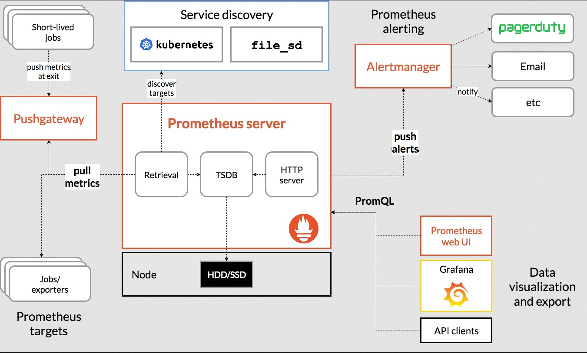

# prometheus

 * https://prometheus.io/download/
 * https://prometheus.io/docs/alerting/latest/overview/
 * 
 *
 * Prometheus is an open-source systems monitoring and alerting toolkit originally built at SoundCloud. 2012
 * функции
    * multi-dimensional data model with time series data identified by metric name and key/value pairs
    * PromQL, a flexible query language to leverage this dimensionality
    * no reliance on distributed storage; single server nodes are autonomous
    * time series collection happens via a pull model over HTTP
    * pushing time series is supported via an intermediary gateway
    * targets are discovered via service discovery or static configuration
    * multiple modes of graphing and dashboarding support
 * компоненты
    * the main server which scrapes and stores time series data
    * client libraries for instrumenting application code
    * a push gateway for supporting short-lived jobs
    * exporters for services like HAProxy, StatsD, Graphite, etc.
    * alertmanager to handle alerts
    * various support tools
 * недостатки
	* не подходит для точных составных метрик, простые числа с датами, которые надо
	соединять запросами
	* ненадёжная БД

## install

 * https://www.youtube.com/watch?v=OxZmn4svOyA
 * To build Prometheus from source code:
    * Go version 1.17 or greater.
    * NodeJS version 16 or greater.
    * npm version 7 or greater.

```bash
git clone https://github.com/prometheus/prometheus.git
cd prometheus
GO111MODULE=on go install github.com/prometheus/prometheus/cmd/...
make build
prometheus --config.file=./prometheus/config.yml
```

## агенты

 * https://prometheus.io/docs/instrumenting/clientlibs/
 *
 *

## конфиг

```yaml
global:
  scrape_interval:     15s # частота обхода агентов exporters
  evaluation_interval: 15s # частота запуска rules для alerting

rule_files:
  # - "first.rules"
  # - "second.rules"

scrape_configs:
  - job_name: prometheus
    static_configs:
      - targets: ['localhost:9090']

```

## использование

 * https://demo.promlabs.com/targets?search=
 * https://www.youtube.com/@PromLabs