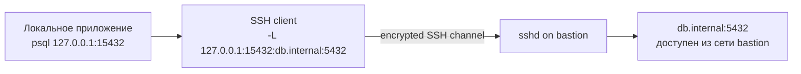
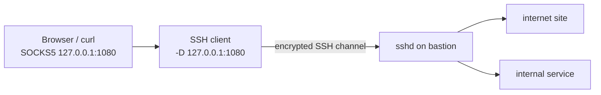
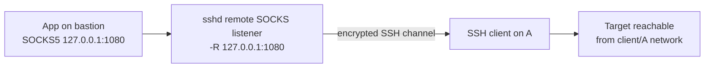
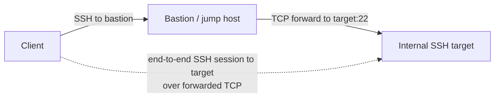
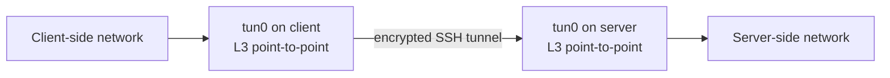

# ssh

 * [https://habr.com/ru/company/vdsina/blog/472746/](Терминальный сервер для админа; Ни единого SSH-разрыва)
 * [Магия SSH](https://habr.com/post/331348/)

```bash
ssh-keygen -b 2048 -t rsa -f /distr/mykey.priv
#засылай в редмайн /distr/mykey.priv.pub
#заходи от ПОЛЬЗОВАТЕЛЯ:
ssh -p0000 user@11.12.11.12 -i /distr/mykey.priv

ssh-copy-id -i ~/.ssh/id_rsa.pub user@0.0.0.0

```

## SSH tunneling

**Версия:** 2026-06-20
**Основа:** статья Хабра «Памятка пользователям ssh» от 2012 года: SOCKS `-D`, локальный и удалённый проброс `-L`/`-R`, вложенные туннели, reverse SOCKS, L2/L3 tunneling, X11 forwarding, agent forwarding и `ProxyCommand -W`.[^habr]
**Источник истины по синтаксису:** актуальные manual pages OpenSSH `ssh(1)`, `ssh_config(5)`, `sshd_config(5)`.[^ssh][^ssh-config][^sshd-config]

### 1. Ментальная модель

SSH-соединение — это зашифрованный транспорт, внутри которого OpenSSH может мультиплексировать разные каналы: shell/session, TCP forwarding, StreamLocal/Unix sockets, X11, agent и TUN/TAP.[^ssh] Главный вопрос для любого туннеля: **где открывается listening socket** и **с какой стороны достигается целевой сервис**.

Базовые роли:

- **Client / A** — машина, где запускается `ssh`.
- **SSH server / B** — `sshd`, обычно bastion/jump host.
- **Target / C** — сервис, к которому нужен доступ.

### 2. Быстрый выбор режима

| Режим | Ключ | Где слушает порт | Откуда достигается target | Типичный use case | Главный риск |
|---|---:|---|---|---|---|
| Local forward | `-L` | На client/A | С server/B | Доступ к внутреннему DB/web через bastion | Случайно открыть локальный listener наружу |
| Remote forward | `-R` | На server/B | С client/A | Показать локальный dev-сервис через публичный bastion | Backdoor / публичная экспозиция через `GatewayPorts` |
| Dynamic SOCKS | `-D` | На client/A | С server/B, destination выбирает SOCKS-клиент | Приложенческий proxy/VPN-like для браузера/curl | DNS leak, лишний egress через bastion |
| Remote dynamic SOCKS | `-R <port>` без destination | На server/B | С client/A, destination выбирает удалённый SOCKS-клиент | «Reverse SOCKS» современным OpenSSH | Удалённая сторона получает egress из сети client/A |
| Jump host / stdio pipe | `-J`, `ProxyJump`, `-W` | Обычно без отдельного listener | TCP к конечному SSH target через bastion | SSH через bastion без копирования ключей | Неправильное применение agent forwarding |
| TUN/TAP | `-w`, `Tunnel` | TUN/TAP device | IP/L2 routing через SSH | Мини-VPN / L3 point-to-point / L2 bridge | Очень широкий сетевой доступ |
| X11 forwarding | `-X`, `-Y` | X11 proxy channel | GUI app на server рисует на client | Разовый запуск GUI over SSH | Доступ к X display, возможный keylogging |
| Agent forwarding | `-A`, `ForwardAgent` | Agent socket на remote | Remote может просить local agent подписывать auth | Переход дальше без копирования private key | Remote root может использовать agent пока сессия жива |

## 3. Режимы работы

#### 3.1 LocalForward: `ssh -L`

**Смысл:** локальное приложение подключается к `client:A:<local_port>`, а `sshd` на стороне B подключается к `target:C:<target_port>`.

```bash
ssh -N -T -o ExitOnForwardFailure=yes \
  -L 127.0.0.1:15432:db.internal:5432 \
  ops@bastion.example
```



**Практики:**

- Явно указывай bind address `127.0.0.1` или `[::1]`. Пустой bind или `*` делает listener доступным на всех интерфейсах; это почти никогда не нужно для обычного local forward.[^ssh]
- Для tunnel-only сценариев используй `-N -T` или в `~/.ssh/config`: `SessionType none`.[^ssh-config]
- Добавляй `ExitOnForwardFailure yes`, чтобы команда завершалась ошибкой, если порт не удалось открыть.[^ssh-config]
- На сервере ограничивай направление и destination: `AllowTcpForwarding local` + `PermitOpen db.internal:5432`.[^sshd-config]

Пример `~/.ssh/config`:

```sshconfig
Host bastion-db
    HostName bastion.example
    User ops
    LocalForward 127.0.0.1:15432 db.internal:5432
    SessionType none
    ExitOnForwardFailure yes
    ServerAliveInterval 30
    ServerAliveCountMax 3
```

#### 3.2 RemoteForward: `ssh -R`

**Смысл:** порт открывается на server/B, а входящие соединения уходят назад через SSH и подключаются к сервису со стороны client/A.

```bash
ssh -N -T -o ExitOnForwardFailure=yes \
  -R 127.0.0.1:8080:127.0.0.1:3000 \
  ops@public-bastion.example
```


**Практики:**

- По умолчанию remote forward слушает только loopback на server/B. Это хорошо. Не включай `GatewayPorts yes` без отдельного approval: на публичном сервере это может открыть порт всему интернету.[^sshd-config][^ssh-com]
- Если действительно нужно слушать не только loopback, предпочитай `GatewayPorts clientspecified`, конкретный bind address, firewall allowlist и `PermitListen`, а не wildcard.[^sshd-config]
- Remote forwarding часто используется как «обратная дверь» в закрытую сеть, поэтому его нужно логировать, ограничивать по пользователям/ключам и отключать там, где он не нужен.[^ssh-com]

Server-side пример для строго loopback-публикации:

```sshconfig
# /etc/ssh/sshd_config
Match User tunnel_publish
    AllowTcpForwarding remote
    GatewayPorts no
    PermitListen localhost:8080
    X11Forwarding no
    AllowAgentForwarding no
    PermitTTY no
    ForceCommand /bin/false
```

> Важно: `PermitListen localhost:8080`, `127.0.0.1:8080` и `[::1]:8080` могут различаться, потому что OpenSSH отдельно трактует hostname `localhost` и явные loopback-адреса.[^sshd-config]

#### 3.3 DynamicForward: `ssh -D` как SOCKS proxy

**Смысл:** SSH client поднимает локальный SOCKS4/5 proxy. Приложение само сообщает destination через SOCKS, а соединение к destination выполняется со стороны server/B.[^ssh]

```bash
ssh -N -T -D 127.0.0.1:1080 ops@bastion.example

# Для curl важно socks5h://, чтобы hostname резолвился через proxy, а не локально.
curl -x socks5h://127.0.0.1:1080 https://example.com/
```



**Практики:**

- Используй `127.0.0.1:1080`, не `0.0.0.0:1080`, если proxy нужен только локальной машине.[^ssh]
- Для приватности DNS выбирай SOCKS5 remote DNS: в `curl` это `socks5h://` или `--socks5-hostname`; обычный `socks5://` резолвит hostname локально.[^curl-socks]
- `Compression yes` не стоит включать по умолчанию. OpenSSH прямо предупреждает, что compression может приводить к утечкам, если в одном SSH-соединении смешивается доверенный и недоверенный трафик.[^ssh-config]

#### 3.4 Remote dynamic SOCKS: современный «reverse SOCKS»

В исходной статье reverse SOCKS строится через цепочку `-D` + `-R` + вложенный `ssh`.[^habr] В современном OpenSSH проще: `RemoteForward` без destination превращает удалённый порт в SOCKS4/5 proxy. То есть `sshd` слушает порт на server/B, а egress к destination идёт со стороны client/A.[^ssh][^ssh-config]

```bash
# Запускается на client/A
ssh -N -T -R 127.0.0.1:1080 ops@bastion.example

# На bastion/B
curl -x socks5h://127.0.0.1:1080 https://service-reachable-from-client.example/
```



**Практики:**

- Считай этот режим высокорисковым: remote side получает возможность ходить к arbitrary destinations из сети client/A.
- Ограничивай listener через `PermitListen` на `sshd` и destination через client-side `PermitRemoteOpen` для `RemoteForward` SOCKS.[^ssh-config][^sshd-config]
- Не используй этот режим для обхода корпоративных egress-policy; лучше заводить управляемый bastion/VPN с логированием.

#### 3.5 Вложенные SSH-соединения: `ProxyJump`, `ProxyCommand`, `-W`

В статье показан `ProxyCommand ssh -W %h:%p user@bastion` как способ пройти через недоверенный промежуточный сервер без копирования ключа и без agent forwarding.[^habr] Сейчас для обычного случая удобнее `ProxyJump` / `-J` — это shortcut, который сначала подключается к jump host, а затем делает TCP forwarding до конечного host.[^ssh][^ssh-config]

```bash
ssh -J ops@bastion.example app01.internal
```

```sshconfig
Host bastion
    HostName bastion.example
    User ops

Host *.internal
    User ops
    ProxyJump bastion
```



**Практики:**

- Предпочитай `ProxyJump`/`-W` вместо `ForwardAgent`, если цель — пройти через bastion на следующий SSH host.[^ssh]
- Не копируй private key на bastion.
- Если agent forwarding всё же нужен, включай его только для доверенных host и добавляй ключи с ограничениями: `ssh-add -c -t 1h` или destination constraints `ssh-add -h ...` там, где поддерживается OpenSSH 8.9+.[^ssh-add]

#### 3.6 TUN/TAP: `ssh -w`, `Tunnel point-to-point|ethernet`

**Смысл:** SSH создаёт TUN/TAP device и переносит IP/L2 packets, а не отдельный TCP port. Это уже похоже на VPN, но без полноценной модели управления VPN.[^ssh][^ssh-config]

```bash
# Пример только как скелет: после него нужны ip addr / route / firewall.
sudo ssh -w 0:0 -o Tunnel=point-to-point ops@gw.example
```



**Практики:**

- На сервере `PermitTunnel` по умолчанию `no`; включай только точечно, лучше в `Match User`.[^sshd-config]
- Предпочитай `point-to-point` вместо `ethernet`, если не нужен L2. Ethernet mode может тащить ARP/DHCP/broadcast и резко расширяет blast radius.
- Явно настраивай маршруты, firewall и ownership туннеля. Для постоянной production-сети чаще безопаснее специализированный VPN, а SSH TUN использовать как временный admin-инструмент.

#### 3.7 X11 forwarding и agent forwarding — полезно, но осторожно

X11 forwarding (`-X`, `-Y`) и agent forwarding (`-A`) технически тоже идут по SSH-каналу, но это не обычный port forward.

- `-X` включает X11 forwarding, `-Y` включает trusted X11 forwarding. OpenSSH предупреждает, что X11 forwarding может дать удалённой стороне доступ к локальному display и даже к наблюдению ввода, особенно при trusted forwarding.[^ssh] На сервере `X11Forwarding` по умолчанию `no`.[^sshd-config]
- `-A` пробрасывает agent socket. Private key не копируется, но удалённая сторона, имеющая доступ к socket, может выполнять операции подписи от имени загруженных identities, пока forwarding активен.[^ssh]

### 4. Общие best practices

1. **Всегда указывай bind address.** Для личного доступа почти всегда `127.0.0.1` или `[::1]`. `*`, пустой bind и `0.0.0.0` — только после осознанного решения опубликовать порт.
2. **Для tunnel-only команд используй `-N -T`, `ExitOnForwardFailure yes`, `ServerAliveInterval` и `ServerAliveCountMax`.** Это снижает риск «тихо не поднявшегося» туннеля и помогает быстрее обнаруживать мёртвые соединения.[^ssh-config]
3. **Не отключай host key checking.** `StrictHostKeyChecking no` удобен, но ухудшает защиту от MITM; лучше управлять `known_hosts` централизованно или заранее.[^ssh-config]
4. **Ограничивай forwarding на сервере.** Используй `Match User/Group`, `AllowTcpForwarding local|remote`, `PermitOpen`, `PermitListen`, `AllowAgentForwarding no`, `X11Forwarding no`. Если forwarding вообще не нужен — `DisableForwarding yes`.[^sshd-config]
5. **Для выделенных ключей используй `authorized_keys` restrictions.** Например:

```text
restrict,port-forwarding,permitopen="db.internal:5432",command="/bin/false" ssh-ed25519 AAAA... tunnel-db-key
restrict,port-forwarding,permitlisten="localhost:8080",command="/bin/false" ssh-ed25519 AAAA... tunnel-publish-key
```

`restrict` выключает PTY, X11, agent и forwarding, а затем `port-forwarding`, `permitopen`/`permitlisten` включают только нужный минимум. Для tunnel-only ключей добавляй forced `command="/bin/false"`, потому что `restrict` сам по себе не запрещает non-interactive command execution.[^sshd]

6. **Не полагайся только на `AllowTcpForwarding no`, если у пользователя есть shell.** OpenSSH прямо отмечает, что запрет TCP forwarding сам по себе не улучшает безопасность, если пользователь может запускать свои forwarders через shell.[^sshd-config]
7. **Мониторь listeners и ownership.** На Linux: `ss -tulpn | grep ssh`, `lsof -iTCP -sTCP:LISTEN -nP`. Для production-туннелей фиксируй owner, purpose, срок жизни, target и approved exposure.
8. **С compression аккуратно.** `-C` может помочь на медленных каналах, как отмечалось в старой статье, но в современных best practices его не включают по умолчанию для смешанного доверенного/недоверенного трафика.[^ssh-config]

### 5. Что обновилось относительно статьи 2012 года

- `ProxyJump` / `-J` стал стандартным коротким способом выразить jump host; `ProxyCommand ssh -W %h:%p ...` всё ещё полезен для нестандартных случаев.[^ssh][^ssh-config]
- `RemoteForward` без destination теперь documented как remote SOCKS proxy; старый «reverse SOCKS» через вложенную цепочку обычно не нужен.[^ssh][^ssh-config]
- OpenSSH явно документирует риски compression, X11 forwarding и agent forwarding; эти режимы стоит включать точечно, а не в `Host *`.[^ssh][^ssh-config]
- Для ограничения туннелей теперь удобно сочетать server-side `PermitOpen`/`PermitListen` и key-level `restrict`, `permitopen`, `permitlisten`.[^sshd-config][^sshd]
- Для agent forwarding появились destination-constrained keys через `ssh-add -h`; они требуют поддержки OpenSSH 8.9+ на пути, но лучше старого «безусловного» forwarding.[^ssh-add]

### Источники

[^habr]: Habr, «Памятка пользователям ssh», 2012 — https://habr.com/ru/articles/122445/
[^ssh]: OpenSSH `ssh(1)` manual — https://man.openbsd.org/ssh
[^ssh-config]: OpenSSH `ssh_config(5)` manual — https://man.openbsd.org/ssh_config
[^sshd-config]: OpenSSH `sshd_config(5)` manual — https://man.openbsd.org/sshd_config
[^sshd]: OpenSSH `sshd(8)` manual, `AUTHORIZED_KEYS FILE FORMAT` — https://man.openbsd.org/sshd
[^ssh-add]: OpenSSH `ssh-add(1)` manual — https://man.openbsd.org/ssh-add
[^ssh-com]: SSH.com Academy, SSH tunneling examples and server-side configuration — https://www.ssh.com/academy/ssh/tunneling-example
[^curl-socks]: everything curl, SOCKS proxy and `socks5h://` — https://everything.curl.dev/usingcurl/proxies/socks.html


## ssh git

* [](../frontend/git.md)

## ssh welcome

 * [disable ssh welcome screen](https://linuxconfig.org/disable-dynamic-motd-and-news-on-ubuntu-20-04-focal-fossa-linux)
 * https://superuser.com/questions/1840229/how-to-disable-motd-from-debian-12

```bash
/etc/default/motd-news
#ENABLED=0

chmod -x /etc/update-motd.d/90-updates-available
chmod -x /etc/update-motd.d/*

/etc/ssh/sshd_config
#PrintMotd no

/etc/pam.d/sshd
# # session    optional     pam_motd.so  motd=/run/motd.dynamic
# # session    optional     pam_motd.so noupdate

grep -ril motd /etc/zsh /etc/bash.bashrc /etc/profile /etc/profile.d

```


## SSHD

```bash
useradd -m user-ssh
passwd user-ssh
passwd
vi /etc/ssh/sshd_config

hostnamectl set-hostname vpn-gw-ru
hostnamectl status --static
hostname
cat /etc/hostname


Port 0000
AllowUsers user-ssh
PermitRootLogin no
PubkeyAuthentication yes
AuthorizedKeysFile      .ssh/authorized_keys

sestatus
getenforce
setenforce 0

firewall-cmd --zone=public --add-port=0000/tcp
firewall-cmd --runtime-to-permanent
firewall-cmd --zone=public --list-ports
firewall-cmd --list-all-zones
firewall-cmd --reload

firewall-cmd --remove-service ssh
firewall-cmd --zone=trusted --remove-service ssh
firewall-cmd --runtime-to-permanent
firewall-cmd --zone=public --list-ports

service ssh reload
service ssh restart

mkdir /home/user-ssh/.ssh
cat >> /home/user-ssh/.ssh/authorized_keys
chown -R user-ssh:user-ssh /home/user-ssh
chmod 700 /home/user-ssh/.ssh

```

## X11Forwarding


```bash
linux-it9h:~ # ssh user@192.168.0.203 -X
Password:
Last login: Wed Nov  5 21:43:15 2014 from 192.168.0.207
Have a lot of fun...
ifconfig: command not found
user@linux-rbo1:~> xclock
user@linux-rbo1:~> echo $DISPLAY
linux-rbo1.site:10.0
user@linux-rbo1:~> xhost
access control enabled, only authorized clients can connect
INET:192.168.0.203
user@linux-rbo1:~>
linux-rbo1:~ # ps axjf|grep X
  931   989   989   989 tty7       989 Ss+      0   0:22  \_ /usr/bin/X -background none :0 vt07 -nolisten tcp
  931  1189  1189  1189 ?           -1 Ssl   1000   0:00  \_ /usr/bin/lxsession -s LXDE -e LXDE
    1  1379  1189  1189 ?           -1 S     1000   0:00 /usr/bin/dbus-launch --sh-syntax --exit-with-session /etc/X11/xinit/xinitrc

linux-it9h:~ # grep -i x11 /etc/ssh/sshd_config
X11Forwarding yes
#X11DisplayOffset 10
X11UseLocalhost no
#       X11Forwarding no
linux-it9h:~ # grep -i x11 /etc/ssh/ssh_config
#   ForwardX11 no
# should not forward X11 connections to your local X11-display for
# keystrokes as you type, just like any other X11 client could do.
# file if you want to have the remote X11 authentification data to
ForwardX11Trusted yes
linux-it9h:~ #

#xauth
xauth list
xauth +localhost
xauth -

```


