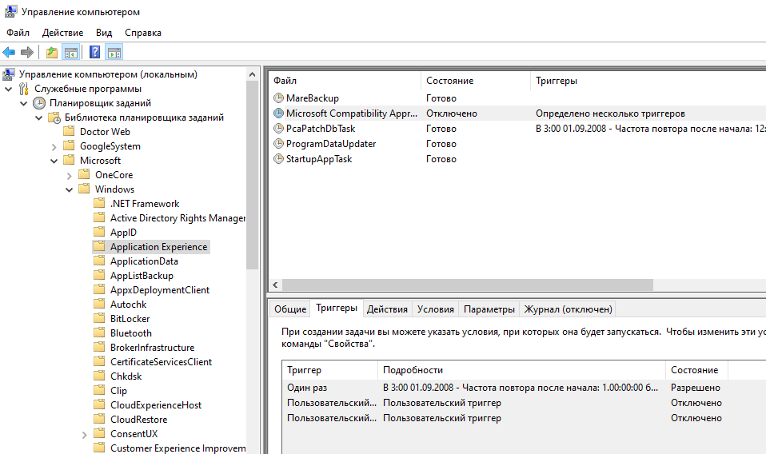
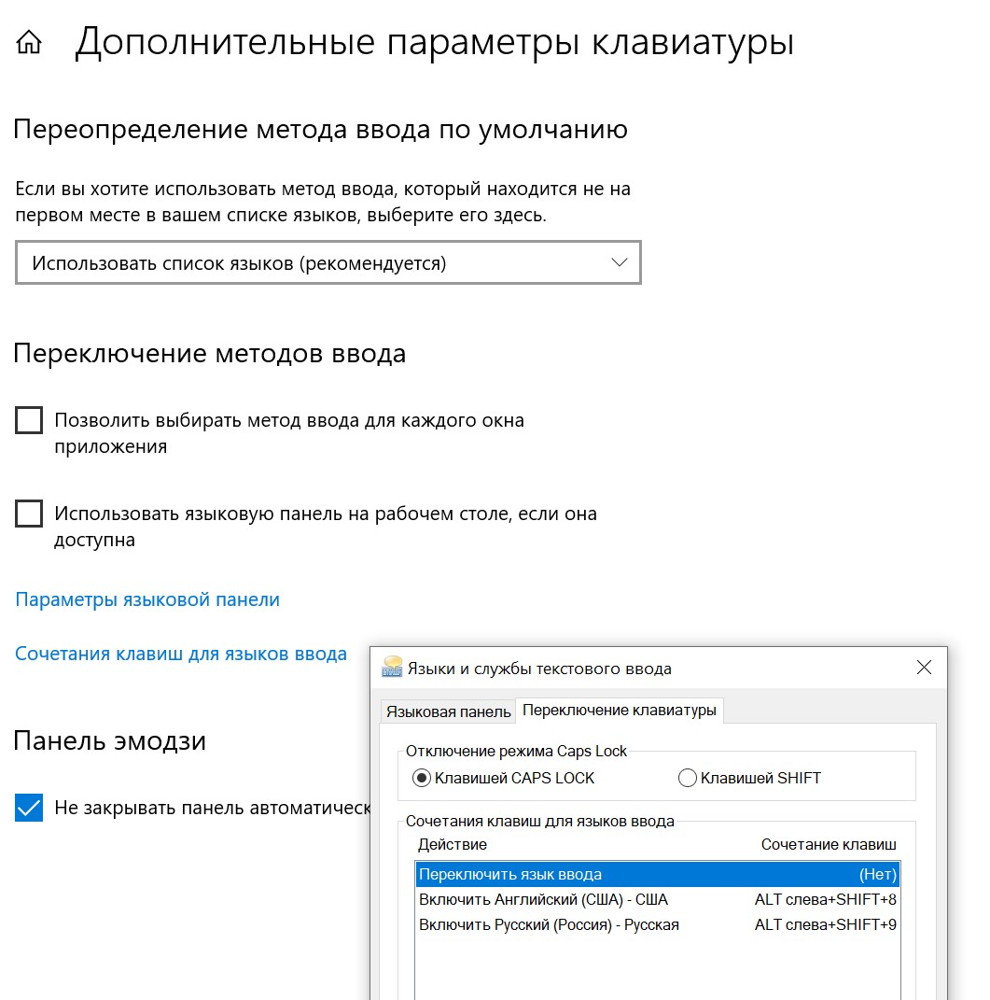

# Windows

## статьи

 * [Полезные мелочи Windows администратора, поиск компьютеров пользователей и не только](https://habr.com/ru/post/579114/)

## WSL windows susbsytem for linux

 * https://zellwk.com/blog/windows-wsl/

## skype ads


```
127.0.0.1     rad.msn.com
127.0.0.1     rad.msn.com
127.0.0.1     g.msn.com
127.0.0.1     live.rads.msn.com
127.0.0.1     ads1.msn.com
127.0.0.1     static.2mdn.net
127.0.0.1     ads2.msads.net
127.0.0.1     a.ads2.msads.net
127.0.0.1     b.ads2.msads.net
127.0.0.1     ad.doubleclick.net
127.0.0.1     ac3.msn.com
127.0.0.1     ec.atdmt.com
127.0.0.1     msntest.serving-sys.com
127.0.0.1     sO.2mdn.net
127.0.0.1     aka-cdn-ns.adtech.de
127.0.0.1     secure.flashtalking.com
127.0.0.1     cdn.atdmt.com
127.0.0.1     apps.skype.com
```

## windows 8

https://support.office.com/en-us/article/Turn-off-or-uninstall-OneDrive-f32a17ce-3336-40fe-9c38-6efb09f944b0
удалить из "пункта управления" все мобильные приложения

## скрипты

 * завершение винды - время 0 `C:\WINDOWS\system32\shutdown.exe -s -f -t 0`

## WTF windows

 * [Permanently Disabling Windows Compatibility Telemetry](https://answers.microsoft.com/en-us/windows/forum/all/permanently-disabling-windows-compatibility/6bf71583-81b0-4a74-ae2e-8fd73305aad1)
	* 
	* C:\Windows\System32\CompatTelRunner.exe

## windows 10

 * http://www.intowindows.com/how-to-enable-windows-photo-viewer-in-windows-10/
 * [windows 10 file system image snapshot](https://support.microsoft.com/en-us/windows/backup-and-restore-in-windows-10-352091d2-bb9d-3ea3-ed18-52ef2b88cbef)
	* https://windows.gadgethacks.com/how-to/make-full-system-image-backup-windows-10-0162966/
 * [windows 10](https://www.microsoft.com/ru-ru/software-download/windows10ISO) install [usb from iso](https://docs.microsoft.com/en-us/windows-hardware/manufacture/desktop/install-windows-from-a-usb-flash-drive)

 ```txt
	Step 1 - Format the drive and set the primary partition as active
		Connect the USB flash drive to your technician PC.
		Open Disk Management: Right-click on Start and choose Disk Management.
		Format the partition: Right-click the USB drive partition and choose Format. Select the FAT32 file system to be able to boot either BIOS-based or UEFI-based PCs.
		Set the partition as active: Right-click the USB drive partition and click Mark Partition as Active.
		Note
		If Mark Partition as Active isn't available, you can instead use diskpart to select the partition and mark it active.

	Step 2 - Copy Windows Setup to the USB flash drive
		Use File Explorer to copy and paste the entire contents of the Windows product DVD or ISO to the USB flash drive.
		Optional: add an unattend file to automate the installation process. For more information, see Automate Windows Setup.

	Step 3 - Install Windows to the new PC
		Connect the USB flash drive to a new PC.
		Turn on the PC and press the key that opens the boot-device selection menu for the computer, such as the Esc/F10/F12 keys. Select the option that boots the PC from the USB flash drive.
		Windows Setup starts. Follow the instructions to install Windows.
		Remove the USB flash drive.

	Troubleshooting: file copy fails

	This can happen when the Windows image file is over the FAT32 file size limit of 4GB. When this happens:
		Copy everything except the Windows image file (sources\install.wim) to the USB drive (either drag and drop, or use this command, where D: is the mounted ISO and E: is the USB flash drive.)
		command
	robocopy D: E: /s /max:3800000000

	Split the Windows image file into smaller files, and put the smaller files onto the USB drive:
	command
	Dism /Split-Image /ImageFile:D:\sources\install.wim /SWMFile:E:\sources\install.swm /FileSize:3800

	Note, Windows Setup automatically installs from this file, so long as you name it install.swm.
 ```
 *

### переключение языка ввода

 * https://www.autohotkey.com/
 * http://flydom.ru/capslang/
 * https://www.autohotkey.com/docs/v2/misc/Languages.htm
 *
 * https://superuser.com/questions/429930/using-capslock-to-switch-the-keyboard-language-layout-on-windows-7

 * [переназначаем](https://www.digitalcitizen.life/keyboard-language-shortcut/) в винде комбинации, выключаем капс, и проксируем нажатия. Лучший способ.
 * 
	```
		#Requires AutoHotkey v2.0
		SetCapsLockState "AlwaysOff"

		;capslock - en
		CapsLock::Send "{Shift Down}{Alt Down}{8 Down}{Shift Up}{Alt Up}{8 Up}"

		;shift+capslock - ru
		+CapsLock::Send "{Shift Down}{Alt Down}{9 Down}{Shift Up}{Alt Up}{9 Up}"

		return
	```
 * опасный способ - меняем список(массив объектов) доступных раскладок. AHK может ещё не стартануть, а раскладка останется одна.
 * https://learn.microsoft.com/en-us/powershell/module/international/set-winuserlanguagelist?view=windowsserver2022-ps

	```
		Get-WinUserLanguageList


		LanguageTag     : ru
		Autonym         : русский
		EnglishName     : Russian
		LocalizedName   : Русский
		ScriptName      : Кириллица
		InputMethodTips : {0419:00000419}
		Spellchecking   : True
		Handwriting     : False

		LanguageTag     : en-US
		Autonym         : English (United States)
		EnglishName     : English
		LocalizedName   : Английский (США)
		ScriptName      : Латиница
		InputMethodTips : {0409:00000409}
		Spellchecking   : True
		Handwriting     : False

		Set-WinUserLanguageList('en-US')
		Set-WinUserLanguageList('ru-RU')
	```
 *
	```
		SetCapsLockState "AlwaysOff"
		+CapsLock::CapsLock

		$~CapsLock::SetDefaultKeyboard(0x0419) ; Russian
		$~CapsLock up::SetDefaultKeyboard(0x0409) ; english-US

		SetDefaultKeyboard(LocaleID){
			Global
			SPI_SETDEFAULTINPUTLANG := 0x005A
			SPIF_SENDWININICHANGE := 2
			Lan := DllCall("LoadKeyboardLayout", "Str", Format("{:08x}", LocaleID), "Int", 0)
			VarSetCapacity(Lan%LocaleID%, 4, 0)
			NumPut(LocaleID, Lan%LocaleID%)
			DllCall("SystemParametersInfo", "UInt", SPI_SETDEFAULTINPUTLANG, "UInt", 0, "UPtr", &Lan%LocaleID%, "UInt", SPIF_SENDWININICHANGE)
			WinGet, windows, List
			Loop %windows% {
				PostMessage 0x50, 0, %Lan%, , % "ahk_id " windows%A_Index%
			}
		}
		return
	```
 * https://www.autohotkey.com/boards/viewtopic.php?f=6&t=18519#
	```
		#NoEnv  ; Recommended for performance and compatibility with future AutoHotkey releases.
		#SingleInstance, Force;

		SetDefaultKeyboard(LocaleID){
			Static SPI_SETDEFAULTINPUTLANG := 0x005A, SPIF_SENDWININICHANGE := 2

			Lan := DllCall("LoadKeyboardLayout", "Str", Format("{:08x}", LocaleID), "UINT", 1)
			VarSetCapacity(binaryLocaleID, 4, 0)
			NumPut(LocaleID, binaryLocaleID)
			DllCall("SystemParametersInfo", "UInt", SPI_SETDEFAULTINPUTLANG, "UInt", 0, "UPtr", &binaryLocaleID, "UInt", SPIF_SENDWININICHANGE)

			WinGet, windows, List
			Loop % windows {
				PostMessage 0x50, 0, % Lan, , % "ahk_id " windows%A_Index%
			}
		}

		^1::SetDefaultKeyboard(0xa0000409) ; English
		^2::SetDefaultKeyboard(0xb0030419) ; Russian

	```
 * https://pastebin.com/RayAw1VP
 * [wOxxOm's Keyboard layout switcher](https://pastebin.com/ygm3f6sp)
	* http://www.autohotkey.com/board/topic/24666-keyboard-layout-switcher/
 * https://github.com/larionov/ahk-multiple-language-switcher/blob/master/AutoHotkey.ahk
 * https://github.com/flyinclouds/KBLAutoSwitch/blob/master/KBLAutoSwitch.ahk
	```
	PostMessage, 0x50, , %EN_Code%, , ahk_id %gl_Active_IMEwin_id%
	```
 * [powershell script](https://superuser.com/questions/949385/map-capslock-to-control-in-windows-10)
 * скан-коды клавиатуры [Переключения языка ввода в Windows с помощью CapsLock](https://habr.com/ru/articles/305658/)
 * punto switcher

### буфер обмена на мышке

 * https://superuser.com/questions/84550/select-to-copy-and-middle-click-to-paste-in-windows

	```
		cos_mousedrag_treshold := 20 ; pixels
		cos_copied_text := ""

		#IfWinNotActive ahk_class ConsoleWindowClass

		~lButton::
		MouseGetPos, cos_mousedrag_x, cos_mousedrag_y
		keywait lbutton
		mousegetpos, cos_mousedrag_x2, cos_mousedrag_y2
		if (abs(cos_mousedrag_x2 - cos_mousedrag_x) > cos_mousedrag_treshold
			or abs(cos_mousedrag_y2 - cos_mousedrag_y) > cos_mousedrag_treshold)
		{
			wingetclass cos_class, A
			if (cos_class == "Emacs")
			sendinput !w
			else {
			previous_clipboard := clipboard
			sendinput ^c
			sleep 50 ; wait for copied text to be stored in clipboard
			cos_copied_text := clipboard
			clipboard := previous_clipboard
			}
		}
		return

		~mbutton::
		WinGetClass cos_class, A
		if (cos_class == "Emacs")
			SendInput ^y
		else {
			previous_clipboard := clipboard
			clipboard := cos_copied_text ; copy stored text to clipboard
			SendInput ^v
			sleep 50 ; I'm not sure if this is necessary
			clipboard := previous_clipboard
		}
		return

		#IfWinNotActive

		;; clipx
		^mbutton::
		sendinput ^+{insert}
		return

	```

 * https://autoclipx.informer.com/download/


## ssh putty

 * putty home+end key
 * Edit /root/.bashrc
 * export TERM=linux
 * https://putty.org.ru/articles/putty-ssh-tunnels.html

## Центр оценки ПО

http://technet.microsoft.com/ru-RU/evalcenter/dn407368
там появится ссылка на скачивание

## ms picture manager

Microsoft SharePoint Designer 2010 (64-bit)
http://www.microsoft.com/ru-ru/download/details.aspx?id=24309

## win7 tips

 * http://lifehacker.ru/2014/07/16/vy-ne-znaete-windows-7/
 * запись экрана screencast recording https://www.theverge.com/2020/4/21/21222533/record-screen-pc-windows-laptop-xbox-game-bar-how-to

## obs studio
 * https://www.recmaster.net/how-to/fix-obs-black-screen
	* disable Game Mode if you have enabled it under Settings -> Gaming -> Game Mode.
	*  For Windows 10 1909 or later: Go to system Settings -> System -> Display, and click to open "Graphics settings", where you should select "Classic app", browse to where you have installed OBS (e.g D:\Program Files\obs-studio\bin\64bit\obs64.exe) and add the app into the list. After that, click "Options" of OBS Studio and alter the graphics preference of OBS Studio app form System default to "Power saving" or "High performance" manually. Power saving is recommended for display capture while High performance is for game capture or using NVENC encoder.

## OFFICE PROFESSIONAL PLUS 2010

Your Product Key is: W3TJ9-G7F74-BRDR8-Y892V-VKFTF

```

http://www.system-center.me/miscellaneous/sysprep-your-windows-os-for-more-then-3-times/

    HKEY_LOCAL_MACHINE\SYSTEM\Setup\Status\SysprepStatus\GeneralizationState\

    CleanupState:2
    HKEY_LOCAL_MACHINE\SYSTEM\Setup\Status\SysprepStatus\GeneralizationState\

    GeneralizationState:7

After done with the registry, do the following :

    Start -> Run : msdtc -uninstall (wait few seconds)
    Start -> Run : msdtc -install (wait few seconds)
    Restart the machine
    Check the registry for the right registry keys values
    sysprep with the new XML answerfile.
<settings pass="generalize">
        <component name="Microsoft-Windows-Security-Licensing-SLC" processorArchitecture="x86" publicKeyToken="31bf3856ad364e35" language="neutral" versionScope="nonSxS" xmlns:wcm="http://schemas.microsoft.com/WMIConfig/2002/State" xmlns:xsi="http://www.w3.org/2001/XMLSchema-instance">
            <SkipRearm>1</SkipRearm>
        </component>
    </settings>


slmgr -rearm
10 days

slmgr -dlv
инфа

powercfg /h off


```

## powershell backup 7-zip

http://habrahabr.ru/post/246743/

```
##################################################################################################
# Скрипт резервного копирования данных v0.9b
# 25-12-2014
# Accel
##################################################################################################
#
#Поддерживаются полные и дифференциальные копии (на основе архивного атрибута файлов)
#
#Системные требования:
#	Windows 7+, 2008+
#	Установленный архиватор 7-Zip (тестировалось на версии 9.30b)
#
#За один запуск скрипта возможно резервное копирование лишь с одного диска
#
#NTFS-полномочия на данный момент не сохраняются (определяется возможностями архиватора)
#
#Скрипт должен запускаться от пользователя, имеющего доступ к архивируемым файлам (с правами SYSTEM, Backup Operator и т.п.)

$ErrorActionPreference="SilentlyContinue"
Stop-Transcript | out-null
$ErrorActionPreference = "Continue"

##################################################################################################
#Начало блока переменных
##################################################################################################

#Название задания архивирования
#Используется в именовании архива и ссылки на теневую копию
#Должно отвечать правилам именования файлов, наличие пробелов не рекомендуется, т.к. не тестировалось
#Пример: $ArchiveTaskName="DiskE"
$ArchiveTaskName="DiskE"

#Путь до диска-источника резервного копирования
#Перечень целевых папок этого диска определяется отдельно
#Пример: $SrcDrivePath="D:\"
$SrcDrivePath="D:\"

#Путь до целевого диска
#Пример: $BackupDrivePath="E:\"
$BackupDrivePath="E:\"

#Полный путь до файла со списком папок для архивирования на диске-источнике
#Пример: $SubfoldersToBackupFile = "E:\Backup\src_dirs.txt"
#	* Каждая строка данного файла должна содержать одну папку, которую мы хотим включить в архив
#	* Путь д.б. относительным, т.е. не содержать буквы диска.
#	* Иными словами, если одна из папок резервного копирования у нас D:\Files\FilesToBackup, то в файле должна быть строка Files\FilesToBackup
#	* Кодировка - ANSI
$SubfoldersToBackupFile = "E:\Backup\src_dirs.txt"

#Путь до временного файла-списка файлов для архивации:
#Пример: $BackupFilesList = "E:\Backup\backup-filelist.txt"
$BackupFilesList = "E:\Backup\backup-filelist.txt"

#Путь до целевой папки с архивами (В ней не должно быть никаких других файлов, иначе rotation их может удалить! Также лучше не использовать корень диска, а создать хоть одну подпапку.)
#Пример: $ArchiveDstPath = $BackupDrivePath+"Backup\Script backup"
$ArchiveDstPath = $BackupDrivePath+"Backup\Script backup"

#Полный путь до файла журнала задания
#Пример: $ScriptLogFile = "E:\Backup\BackupFiles.log"
$ScriptLogFile = "E:\Backup\BackupFiles.log"

#Путь до исполняемого файла архиватора 7-Zip
#Пример: $SevenZipExecutablePath = "C:\Program files\7-Zip\7z.exe"
$SevenZipExecutablePath = "C:\Program files\7-Zip\7z.exe"

#Количество дней хранения архива (отсчет ведется с последнего полного бэкапа)
#Пример: $BackupRotationIntervalDays=22
$BackupRotationIntervalDays=22

##################################################################################################
#Конец блока переменных
##################################################################################################


$BackupFilesListTmp = $BackupFilesList+".tmp"
$backuptype=$args[0]
$VSCPath = $BackupDrivePath+"VSC_"+$ArchiveTaskName+"_$(Get-Date -format "yyyyMMdd")"

Start-Transcript -path $ScriptLogFile

$LogVars=1

if ($LogVars=1) {
    echo "================================================================="
    echo "ArchiveTaskName: $ArchiveTaskName"
    echo "SrcDrivePath: $SrcDrivePath"
    echo "BackupDrivePath: $BackupDrivePath"
    echo "SubfoldersToBackupFile: $SubfoldersToBackupFile"
    echo "BackupFilesList: $BackupFilesList"
    echo "ArchiveDstPath: $ArchiveDstPath"
    echo "ScriptLogFile: $ScriptLogFile"
    echo "SevenZipExecutablePath: $SevenZipExecutablePath"
    echo "VSCPath: $VSCPath"
    echo "BackupRotationIntervalDays: $BackupRotationIntervalDays"
    echo "================================================================="
    }

echo "Backup started at: $(Get-Date)"

function BackupFull {
    echo "Backup type: full"

    #Создаем теневую копию
    $s1 = (gwmi -List Win32_ShadowCopy).Create($SrcDrivePath, "ClientAccessible")
    $s2 = gwmi Win32_ShadowCopy | ? { $_.ID -eq $s1.ShadowID }
    $d  = $s2.DeviceObject + "\"

    #Создаем на нее ярлык (удалим предыдущий, если остался после прерванной архивации)
    CMD /C rmdir "$VSCPath"
    cmd /c mklink /d $VSCPath "$d"

    #Составляем список папок для архивации
    "" | Set-Content $BackupFilesList
    Get-Content $SubfoldersToBackupFile | Foreach-Object {CMD /C "echo $VSCPath\$_\* >> $BackupFilesList" }

    #Создаем массив параметров для 7-Zip
    $Arg1="a"
    $Arg2=$ArchiveDstPath+"\"+$ArchiveTaskName+"_$(Get-Date -format "yyyy-MM-dd")_`(Full`).zip"
    $Arg3="-i@"+$BackupFilesList
    $Arg4="-w"+$ArchiveDstPath
    $Arg5="-mx=3"
    $Arg6="-mmt=on"
    $Arg7="-ssw"
    $Arg8="-scsUTF-8"
    $Arg9="-spf"

    #Зипуем
    & $SevenZipExecutablePath ($Arg1,$Arg2,$Arg3,$Arg4,$Arg5,$Arg6,$Arg7,$Arg8,$Arg9)

    Remove-Item $BackupFilesList

    #Если теневые копии имеют необъяснимую тенденцию копиться, лучше удалим их все
    #CMD /C "vssadmin delete shadows /All /Quiet"

    #Или можно удалить только конкретную созданную в рамках данного бекапа
    "vssadmin delete shadows /Shadow=""$($s2.ID.ToLower())"" /Quiet" | iex

    #Удаляем ярлык
    CMD /C rmdir $VSCPath

    #Снимаем архивный бит
    Get-Content $SubfoldersToBackupFile | Foreach-Object {CMD /C "attrib -A -H -S $SrcDrivePath$_\* /S /L" }

    #делаем rotation
    echo "Rotating old files..."
    CMD /C "forfiles /D -$BackupRotationIntervalDays /S /P ""$ArchiveDstPath"" /C ""CMD /C del @file"""
    }

function BackupDiff {
    echo "Backup type: differential"

    #Создаем теневую копию
    $s1 = (gwmi -List Win32_ShadowCopy).Create($SrcDrivePath, "ClientAccessible")
    $s2 = gwmi Win32_ShadowCopy | ? { $_.ID -eq $s1.ShadowID }
    $d  = $s2.DeviceObject + "\"

    #Создаем на нее ярлык (удалим предыдущий, если остался после прерванной архивации)
    CMD /C rmdir $VSCPath
    cmd /c mklink /d $VSCPath "$d"

    #Включаем UTF-8
    CMD /C "chcp 65001 > nul"

    #Составляем список файлов, измененных с момента предыдущей архивации
    "" | Set-Content $BackupFilesList
    Get-Content $SubfoldersToBackupFile | Foreach-Object {CMD /C "dir $VSCPath\$_ /B /S /A:A >> $BackupFilesList" }

    CMD /C "chcp 866 > nul"

    $SearchPattern="^"+$BackupDrivePath.Substring(0,1)+"\:\\"

    #Отрезаем букву диска, иначе 7-zip при архивации по списочному файлу глючит, находя несуществующие дубли
    #(Get-Content $BackupFilesList) -replace $SearchPattern,'' > $BackupFilesListTmp
    Get-Content $BackupFilesList | ForEach-Object { $_ -replace $SearchPattern,"" } | Set-Content ($BackupFilesListTmp)

    Remove-Item $BackupFilesList
    Rename-Item $BackupFilesListTmp $BackupFilesList

    #Поскольку имя диска в путях удалили, нужно перейти в нужную директорию
    cd $BackupDrivePath

    #Создаем массив параметров для 7-Zip
    $Arg1="a"
    $Arg2=$ArchiveDstPath+"\"+$ArchiveTaskName+"_$(Get-Date -format "yyyy-MM-dd")_`(Diff`).zip"
    $Arg3="-i@"+$BackupFilesList
    $Arg4="-w"+$ArchiveDstPath
    $Arg5="-mx=3"
    $Arg6="-mmt=on"
    $Arg7="-ssw"
    $Arg8="-scsUTF-8"
    $Arg9="-spf"

    #Зипуем
    & $SevenZipExecutablePath ($Arg1,$Arg2,$Arg3,$Arg4,$Arg5,$Arg6,$Arg7,$Arg8,$Arg9)

    Remove-Item $BackupFilesList

    #Если теневые копии имеют необъяснимую тенденцию копиться, лучше удалим их все
    #CMD /C "vssadmin delete shadows /All /Quiet"

    #Или можно удалить только конкретную созданную в рамках данного бекапа
    "vssadmin delete shadows /Shadow=""$($s2.ID.ToLower())"" /Quiet" | iex

    #Удаляем ярлык
    CMD /C rmdir $VSCPath
    }

if ($backuptype -eq "diff") {
    BackupDiff | Out-Host
    }
elseif ($backuptype -eq "full") {
    BackupFull | Out-Host
    }
else {
    echo $backuptype
    echo "None backup type parameter passed! Usage: scriptname.ps1 [ full | diff ]"
    }

echo "Backup finished at: $(Get-Date)"

Stop-Transcript
```
