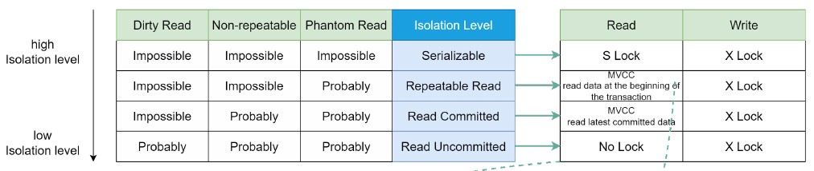

# SQL

 * https://bitbucket.org/bskydive/bookstore-server/src/master/bookStoreServer/sql/
 * [транзакционность DDL](https://wiki.postgresql.org/wiki/Transactional_DDL_in_PostgreSQL:_A_Competitive_Analysis)
 * [join](https://habrahabr.ru/post/278087/)
 * [Понимание джойнов сломано. Это точно не пересечение кругов, честно](https://habr.com/ru/post/448072/)
 * [про базы данных от динозавров](https://stackoverflow.com/users/484814/performancedba)
 * [Уровни изоляции транзакций с примерами на PostgreSQL](https://habr.com/ru/articles/317884)
 * [уровни изоляции транзакций postgrespro](https://postgrespro.ru/docs/postgrespro/16/transaction-iso)
 * [На пути к правильным SQL транзакциям (Часть 1) 2015](https://habr.com/ru/companies/infopulse/articles/261097/)

## Учебники

 * https://postgrespro.ru/docs/postgresql/9.6/sql-syntax-lexical.html#sql-syntax-identifiers
 * http://www.w3schools.com/sql/sql_func_count.asp
 * http://sql-ex.ru
 * https://www.codecademy.com/en/courses/learn-sql/
 * http://www.sql.ru/docs/sql/u_sql/index.shtml
 * http://scanlibs.com/oracle-pl-sql-dlya-professionalov-6-e-izdanie/

### шаблоны проектирования бд

 * https://www.slideshare.net/maieutic/ss-390247
 * [denis.beskov](http://database-design.livejournal.com/)
 * http://www.databaseanswers.org/data_models/

## СУБД

 * реляционные (MySQL, PostgreSQL)
 * документоориентированные (MongoDB)
 * key-value (Redis, Memcache)
 * колоночные (Clickhouse) и wide-column (Cassandra, ScyllaDB)
 * NewSQL (CockroachDB, TiDB)
 * графовые (Neo4j, Dgraph)
 * полнотекстовые (Elasticsearch, Sphinx)
 * control-plane (ZooKeeper, Consul, Etcd)

## облачные калькуляторы

 * http://sqlfiddle.com

## Анализ sql

 * https://livesql.oracle.com/apex/livesql/file/index.html


## теория

### уровни изоляции транзакций

 * побочные эффекты:
	* Потерянное обновление (lost update) - изменения, сделанные одной транзакцией, затираются другой
	* «Грязное» чтение (dirty read) - считаны добавленные или изменённые данные из другой транзакции, которая впоследствии не подтвердится (откатится)
	* Неповторяющееся чтение (non-repeatable read) - при повторном чтении в рамках одной транзакции, ранее прочитанные данные, оказываются изменёнными
	* Фантомное чтение (phantom reads) - одни и те же выборки в первой транзакции дают разные множества строк, потому что их успевает менять вторая
 * 


## Задачи

 * [вложенные запросы с LATERAL](https://habr.com/ru/company/tensor/blog/574330/)
 * https://proglib.io/p/sql-questions/
 * https://habrahabr.ru/post/181033/

```sql
	create table department;
	create table employee;
	commit;


	Insert into DEPARTMENT
	(ID, NAME)
	Values
	(1, 'Руководство');
	Insert into DEPARTMENT
	(ID, NAME)
	Values
	(2, 'Секритариат');
	Insert into DEPARTMENT
	(ID, NAME)
	Values
	(3, 'IT');
	Insert into DEPARTMENT
	(ID, NAME)
	Values
	(4, 'Хоз.Отдел');
	COMMIT;

	Insert into EMPLOYEE
	(ID, DEPARTMENT_ID, NAME, CHIEF_ID, SALARY)
	Values
	(1, 1, 'Иванов И.И.', NULL, 100000);
	Insert into EMPLOYEE
	(ID, DEPARTMENT_ID, NAME, CHIEF_ID, SALARY)
	Values
	(2, 1, 'Петров П.И.', 1, 90000);
	Insert into EMPLOYEE
	(ID, DEPARTMENT_ID, NAME, CHIEF_ID, SALARY)
	Values
	(3, 1, 'Сидоров А.Л.', 1, 95000);
	Insert into EMPLOYEE
	(ID, DEPARTMENT_ID, NAME, CHIEF_ID, SALARY)
	Values
	(4, 2, 'Смирнова О.П.', 1, 20000);
	Insert into EMPLOYEE
	(ID, DEPARTMENT_ID, NAME, CHIEF_ID, SALARY)
	Values
	(5, 3, 'Константинов Л.И.', 2, 80000);
	Insert into EMPLOYEE
	(ID, DEPARTMENT_ID, NAME, CHIEF_ID, SALARY)
	Values
	(6, 3, 'Федоров С.И.', 5, 100000);
	Insert into EMPLOYEE
	(ID, DEPARTMENT_ID, NAME, CHIEF_ID, SALARY)
	Values
	(7, 3, 'Самойлов Н.И.', 5, 100000);
	Insert into EMPLOYEE
	(ID, DEPARTMENT_ID, NAME, CHIEF_ID, SALARY)
	Values
	(8, 3, 'Никифоров С.П.', 7, 20000);
	Insert into EMPLOYEE
	(ID, DEPARTMENT_ID, NAME, CHIEF_ID, SALARY)
	Values
	(9, 4, 'Митрофанова М.С.', 3, 10000);
	COMMIT;
```

## типичные ошибки sql

 * https://habrahabr.ru/post/208264/

## справочники команд sql

 * http://www.w3schools.com/sql/default.asp
 * http://wiki.mvtom.ru/index.php/Структурированный_язык_запросов_SQL/
