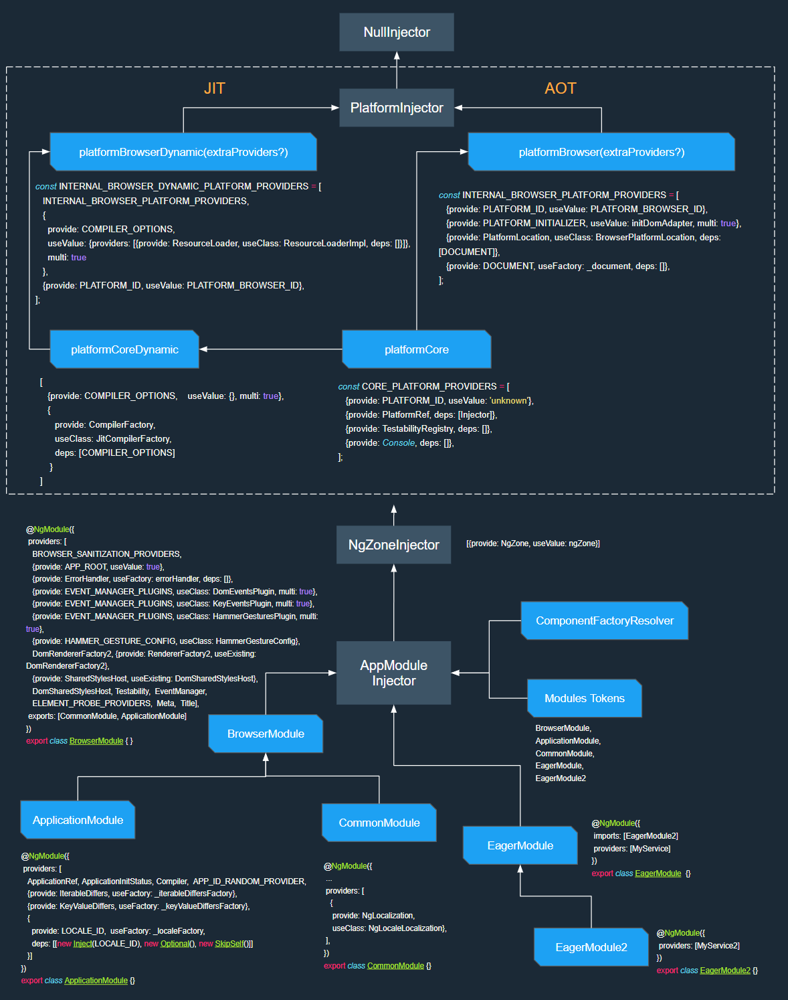
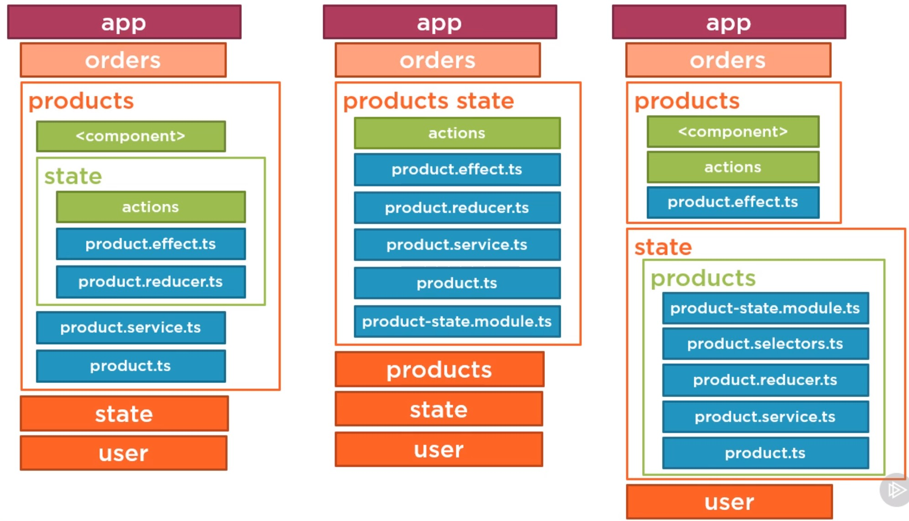
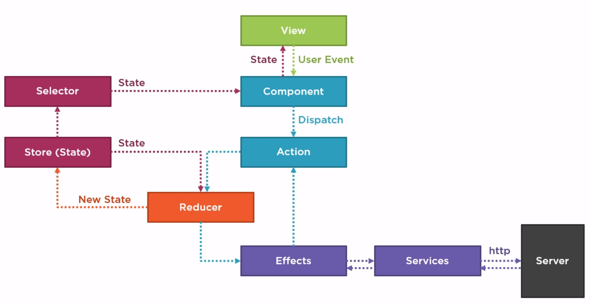

# NGRX

* курсы https://app.pluralsight.com/library/courses/angular-ngrx-getting-started
* нужен, когда:
	* есть свободная ёмкость команды
	* скорость команды выше удовлетворительной
	* команда хорошо умеет в ангуляр и RxJs
	* много связанных состояний, длинные цепочки состояний
	* постоянные проблемы с отладкой сервисов/состояний
	* постоянные проблемы со ссылками/изоляцией данных
	* большой объём кода в серисах
* предоставляет:
	* стандартный подход к архитектуре/файлам
	* выделение части кода из сервисов в отдельные модули/файлы
	* отладку цепочки состояний через события/действия
	* единое хранилище/дерево хранилищ
	* полностью взаимозаменямый подход для ленивой загрузки: DI—>modules—>services | DI—>modules—>ngrx.forFeature
	* строгую типизацию действий, редукторов, селекторов, эффектов
 * проблемы
	* много шаблонного кода
	* нужно писать микрофреймворк для генерации/типизации шаблонного кода
 * redux
	* единый источник правды в хранилище
	* состояние только для чтения и меняется отправкой сообщений/действий
	* данные изменяются чистыми функциями - редукторами
 * что нельзя хранить:
	* состояния форм, они часто мутируют, не сериализуемы, не поддерживают действия
	* данные только для одного компонента
	* не сериализуемые данные(роутер)
 * ReduxDevTools
	* дерево состояний
	* история состояний
	* проигрыватель истории состояний
 * reducer - feature slice - subslice - root store
 * https://github.com/DeborahK/Angular-NgRx-GettingStarted
 * https://github.com/DeborahK/Angular-RxJS
 * https://github.com/DeborahK/Angular-Async-Data

## примеры

* 
* 
* 
* редукторы
	* слушают события/действия
	* меняют состояние в хранилище путём создания нового объекта
	* принимают на вход начальное состояние, отдают новое
	* чистая функция без сторонних эффектов
* хранилище
* состояния, лучшие практики
	* null - не выбрано
	* 0 - новое
	* лучше оперировать id чем объектом
	* хорошо, immutable: map, find, concat, ...spread, filter
	* плохо, mutable: forEach, concat, shift, splice
	* https://doesitmutate.xyz/
	* https://stackoverflow.com/questions/54836118/how-to-remember-if-a-method-mutates-the-original-array/54836218#54836218
	* презентационный компонент: UI, HTML+CSS, без внешних зависимостей, данные только через @Input/@Output, может включать вложенные компоненты
		* включаем onPush для игнорирования XHR
	* контейнерный компонент: Без разметки/стилей, внешние зависимости, хранит состояние, привязан к корневым route, может включать вложенные компоненты
	* index.ts для реекспорта селекторов и интерфейсов
	* разделение `some-page.actions.ts` и `some-api.actions.ts`

### state types

```ts

	import * as AppState from '../../state/app.state';
	import { ProductState } from './product.reducer';

	// Extends the app state to include the product feature.
	// This is required because products are lazy loaded.
	// So the reference to ProductState cannot be added to app.state.ts directly.
	export interface State extends AppState.State {
		products: ProductState;
	}
```

### store

```ts
	@NgModule({
		imports: [
			StoreModule.forRoot({}), // ,RootStoreConfig),
			StoreDevtoolsModule.instrument({
				name: 'myDevTools', // for multiple apps debug
				maxAge: 25, // history length
				logOnly: environment.production
			}),
			EffectsModule.forRoot([])
		],
```

### feature store

```ts
	@NgModule({
		imports: [
			StoreModule.forFeature('productsSlice', productReducer),
			StoreModule.forFeature('usersSlice', {
				internalUser: internalUserReducer,
				externalUser: externalUserReducer
			}),
			EffectsModule.forFeature([ProductEffects])
		],
```

### selector

```ts

	const getProductFeatureState = createFeatureSelector<ProductState>('productsSlice');
	export const getProducts = createSelector(
		getProductFeatureState, // select slice
		state => state.products // return result
	);

	// combining selectors
	export const getCurrentProductId = createSelector(
		getProductFeatureState,
		state => state.currentProductId
	);

	export const getCurrentProduct = createSelector(
		getProductFeatureState, // first argument
		getCurrentProductId, // second argument
		(state, currentProductId) => { // processing arguments
			if (currentProductId === 0) {
				return {
					id: 0,
					productName: '',
					productCode: 'New',
					description: '',
					starRating: 0
				};
			} else {
				return currentProductId ? state.products.find(p => p.id === currentProductId) : null;
			}
		}
	);

	export const getError = createSelector(
		getProductFeatureState,
		state => state.error
	);
```

### reducer

```ts

	const initialState: ProductState = {
		showProductCode: true,
		currentProductId: null,
		products: [],
		error: '' // error handling
	};

	export const productReducer = createReducer<ProductState>(
		initialState,
		on(ProductPageActions.toggleProductCode, (state): ProductState => {
			return {
			...state,
			showProductCode: !state.showProductCode
			};
		}),
		on(ProductApiActions.loadProductsFailure, (state, action): ProductState => {
			return {
			...state,
			products: [],
			error: action.error
			};
		}),
		// ...on
	)
```

### actions

```ts

	export const loadProducts = createAction(
		'[Product Page] Load'
	);
```

### data

```ts
	products$: Observable<Product[]>;

	constructor(private store: Store<State>) { }

	ngOnInit(): void {
		// Do NOT subscribe here because it uses an async pipe
		// This gets the initial values until the load is complete.
		this.products$ = this.store.select(getProducts);
		this.store.dispatch(ProductPageActions.loadProducts());
	}
```
### effects

```ts


	constructor(private actions$: Actions, private productService: ProductService) { }

	loadProducts$ = createEffect(() => {
		return this.actions$
		.pipe(
			ofType(ProductPageActions.loadProducts),
			mergeMap(() => this.productService.getProducts()
				.pipe(
					map(products => ProductApiActions.loadProductsSuccess({ products })),
					catchError(error => of(ProductApiActions.loadProductsFailure({ error })))
				)
			)
		);
	});

	updateProduct$ = createEffect(() => {
		return this.actions$
		.pipe(
			ofType(ProductPageActions.updateProduct),
			concatMap(action =>
			this.productService.updateProduct(action.product)
				.pipe(
					map(product => ProductApiActions.updateProductSuccess({ product })),
					catchError(error => of(ProductApiActions.updateProductFailure({ error })))
				)
			)
		);
	});

	createProduct$ = createEffect(() => {
		return this.actions$
		.pipe(
			ofType(ProductPageActions.createProduct),
			concatMap(action =>
			this.productService.createProduct(action.product)
				.pipe(
					map(product => ProductApiActions.createProductSuccess({ product })),
					catchError(error => of(ProductApiActions.createProductFailure({ error })))
				)
			)
		);
	});

	deleteProduct$ = createEffect(() => {
		return this.actions$
		.pipe(
			ofType(ProductPageActions.deleteProduct),
			mergeMap(action =>
			this.productService.deleteProduct(action.productId).pipe(
				map(() => ProductApiActions.deleteProductSuccess({ productId: action.productId })),
				catchError(error => of(ProductApiActions.deleteProductFailure({ error })))
			)
			)
		);
	});
```

