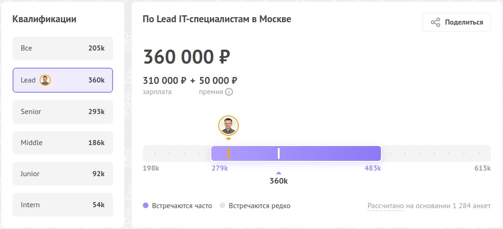

# Резюме

 * Степанов Валерий
 * [pdf ссылка раз](https://gitlab.com/stepanovv/kbo/-/blob/master/public/kbo/kb/карьера/инженер/resume.pdf)
 * [pdf ссылка два](./резюме.pdf)

## Обо мне

 * телеграм https://t.me/stepanovv_ru
 * доступен с 10 до 18 МСК
 * 6 лет пилил фронтенд в кровавом энтерпрайзе
 * За 20 лет работы в ИТ прошёл 4 вехи: менеджмент, инфраструктура, архитектура, фронтенд
 * Люблю автоматизировать, пишу открытый код, занимаюсь автоматизацей анализа техдолга и процессов больших UI проектов(200к+ строк кода)
 * Пишу статьи в блоге, хожу зрителем/комментатором на конференции, люблю обмениваться опытом

## Преимущества

 * помогаю коллегам
 * отдельный кабинет для удалённой работы
 * быстро усваиваю и хорошо структурирую информацию
 * более 5 лет опыта enterprise frontend Angular разработки
 * создаю и поддерживаю соглашения по коду, улучшаю процессы разработки
 * пишу человеко-понятный, модульный, структурированный, типизированный код
 * постоянно расширяю кругозор, пишу статьи и открытый код, веду базу знаний
 * энтузиаст, приятен в общении, серьёзный опыт экстремального спорта и активных увлечений
 * грамотная устная и письменная русская речь, upper-intermediate(B2) speaking english level

## Примеры кода

 * [Проверка качества кода](https://gitlab.com/stepanovv/code_quality_js/-/tree/master)
 * [Граф из webpack stats.json](https://gitlab.com/stepanovv/webpack-dep-graph/-/tree/master)
 * [Код-справочиник 100+ операторов RxJS](https://stackblitz.com/edit/rxjs-aj4vwd)
 * [Код-справочник асинхронного JS](https://stackblitz.com/edit/rxjs-pqnejm-async)

## Предпочтительные варианты направлений для роста

 * Фронт: React, Асинхронная многопоточная обработка данных, алгоритмы
 * Тыл: SSR, BFF, Python, NodeJS, Java
 * Инфраструктура: docker, openstack, openshift, kubernetes
 * Проектирование: архитектура распределённых веб-сервисов

## Пожелания/ожидания к новому проекту

### Обязательно

 1. рыночная зарплатная вилка:
 	* [текущая](https://career.habr.com/salaries?qualification=Lead&locations[]=c_678&is_group=true)
	* снимок от 18.09.2023
	* 
 1. [аккредитация в минцифры](https://www.gosuslugi.ru/itorgs)
 1. оформление по ТК РФ
 1. возможность работать не более 40 часов в неделю

### Будет плюсом, если есть

 1. можно работать удалённо под linux/mac(vpn, docker, облако)
 1. стабильный состав команд, отсутствие текучки кадров
 1. дружелюбная атмосфера, хорошее чувство юмора у коллег
 1. удовлетворённость качеством кода у опытных разработчиков
 1. возможность поддерживать разумные сроки выполнения задач, исходя из метрик в JIRA/ESLint/git
 1. инструменты(сервисы, виртуальные сервера) для командной работы: удобные и в достаточном количестве
 1. возможности и желание у руководства проекта:
	* контролировать состояние задач не поштучно/ежедневно, а за релиз/команду
	* реагировать на просьбы разработчиков конструктивно, без волокиты
	* прояснять, обсуждать, корректировать свои ожидания
 1. понятные и чёткие правила оплаты сверхурочной работы или компенсации выходными

## Обобщённые навыки

 * Ведущий фронтенд разработчик с профильным специальным образованием
 * Хорошо разбираюсь в: JS/TS, Angular9+, RxJS/NGRX, HTML/SASS, Linux, ESLint
 * Регулярно работаю с: VSCode, Gitlab, JIRA
 * Небольшой опыт работы с: Figma, Webpack, NodeJS, Java core, NX
 * Опыт работы в смежных должностях: проектирование, внедрение и эксплуатация распределённых программных систем промышленного класса, системное администрирование, менеджмент
 * Социальные навыки: лидерство, наставничество, командная работа, улучшение процессов

## Образование

 * Июль 1997—Июль 2002 (5 лет)
 * г. Орёл
 * Специальность: Автоматизированные системы обработки информации и управления. Код: 220200
 * Призёр олимпиады по программированию

## Обощённый опыт работы

### 6+ лет: Средний/Старший/Ведущий фронтенд разработчик

* Апрель 2016 — Сентябрь 2023
* Место работы: удалённо, г. Москва
* Стэк: Angular v4-v14
* Размер команд: 1-70+, включая несколько потоков команд в рамках SAFe AGILE framework
* Окружение:
	* VSCode IDE, IntelliJ IDEA/Webstorm IDE, Gitlab/Bitbucket CI, JIRA/Confluence/Redmine/Youtrack, Miro/TeamRetro, Figma, AWS/EKS, Swagger API
	* RxJS/NGRX, JS/TS, JQuery/Lodash, Jest/Spectator/Cypress, Karma/Jasmine, NX, NGX-translate
	* HTML/PUG, CSS/LESS/SCSS
* Предметные области:
    * Система управления производственными процессами производственного предприятия федерального уровня
    * Распознавание документов, система документооборота организации международного уровня
    * Система управления спортивными мероприятиями международного уровня
    * Электронная торговая площадка b2b федерального уровня
    * Система управления оборудованием датацентра федерального уровня
* Достижения:
	* 1 год общения на английском(B2): регулярные совещания команд, демонстрационные сессии, стендапы с заказчиком или командой
	* Разработал и внедрил методику анализа техдолга проекта: написал утилиту построения графа зависимостей
	* Разработал и внедрил новые подходы к архитектуре проекта: шаблоны, документация, примеры кода
	* Разработал UI библиотеку компонентов, включая соглашения, примеры кода и дизайн UI в figma
	* Внёс существенный вклад в развитие 2 сообществ удалёнщиков и разработчиков
	* Обновил документацию для облегчения адаптации новых коллег в проекте
	* Решил проблемы инфраструктуры(devops): сборка, логирование, CORS
	* Разработал соглашения по коду
	* Заслужил уважение коллег

### 2 года: Начинающий разработчик

* Май 2014 - Апрель 2016
* Стэк: Java SE 7, Android SDK 4.x,  JavaScript, jQuery, CSS, HTML5, Linux
* Место работы: в офисе/удалённо, г. Москва
* Окружение: ItelliJ IDEA IDE, Android studio IDE, JIRA, Confluence, Redmine, github
* Достижения: Самообучение Java/JS, подработка/фриланс, домашние проекты

### 3 года 10 месяцев: Системный архитектор программных решений промышленного уровня

* Июль 2010 — Апрель 2014
* Место работы: в офисе, г. Москва
* Основные вендоры/технологии:
	* SAP ERP/PI/SM/HANA, JDA D&F, QlikView, Oracle ETL/DB/EM,
	* TechnoAware, Dallmeier, Huawei, Juniper
	* SLES, VMWare, Bash, AWK
	* ITIL v3, ГОСТ 34
* Основные обязанности:
	* проектирование, развёртывание, сопровождение и оптимизация ИТ систем федерального уровня
	* интеграция, развёртывание и усовершенствование процессов сопровождения
	* координация работы вендоров, разработчиков, внешних подрядчиков, техподдержки, внутренних и международных команд
	* техническая предпродажная подготовка
* Основные достижения:
	* миграция на новое ПО и ОС Linux Бэк-офиса от 2 до 700 магазинов
	* Сопровождение и миграция ИТ инфраструктуры Amazon EC2, внедрение QlikView
	* техническая предпродажная подготовка и проектирование системы охранного видео наблюдения стадиона
	* Интеграция и проектирование архитектуры системы электронной коммерции
* Предметные области:
	* электронная коммерция(онлайн магазины)
	* ритейл(оффлайн магазины)
	* организация спортивных мероприятий

### 1 год 9 месяцев: Системный инженер

* Ноябрь 2008 — Июль 2010
* Место работы: в офисе, г. Москва
* Основные технологии: Z/OS, AIX, Linux, MySQL, PostgreSQL, DB2, Oracle, Jboss, Websphere, Xen, Bash, AWK.
* Основные обязанности:
	* Проектирование, разработка, развёртывание, сопровождение, оптимизация распределённых ИТ систем класса предприятия для федеральных ведомств
* Основные достижения:
	* проектирование, разработка, развёртывание, сопровождение системы мониторинга на 1000 филиалов
	* развёртывание системы управления жизненным циклом и усовершенствование процессов разработки ПО

### 6 лет: Начальник узла связи

* Июль 2002 - Июль 2008
* Обязательная отработка по условиям контракта на обучение в институте
* Место работы: Московская обл.
* Предметные области: Государственная компания, локальная радио и проводная связь
