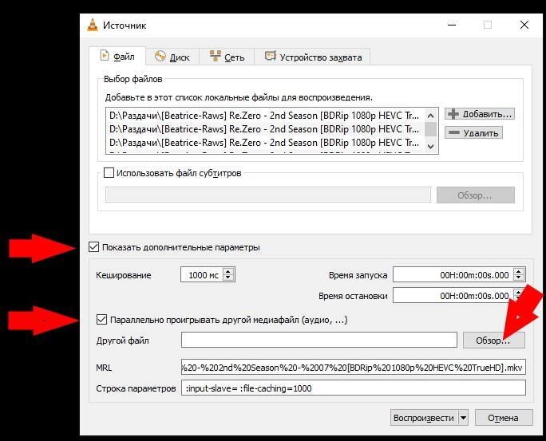
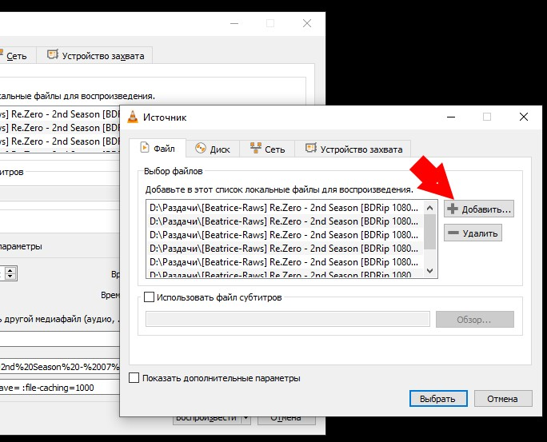
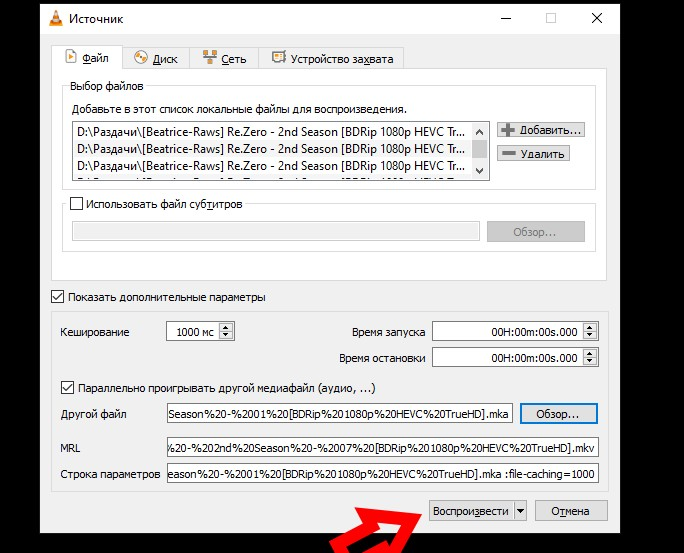
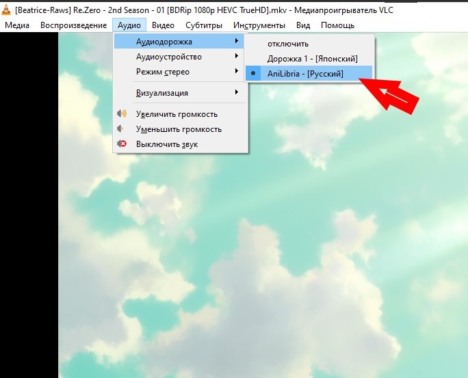
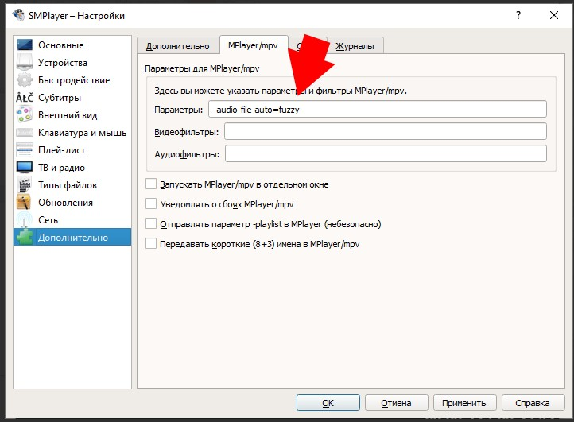
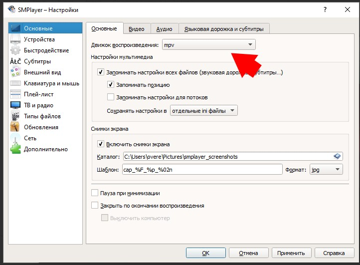
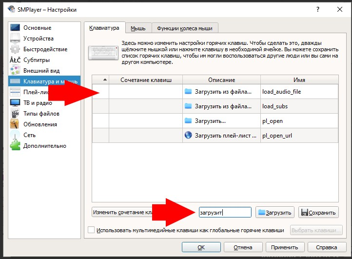

# про кино

## автоматическая загрузка субтитров

 * https://rutracker.org/forum/viewtopic.php?t=2403326
 * vlc
	* 
	* 
	* 
	* 
 * smplayer
	* 
	* 
	* 
 * https://sourceforge.net/projects/mpcbe/
 * [[FAQ] Быстрый способ вшить озвучку в видео во все серии для просмотра на телевизоре или приставке.](https://rutracker.org/forum/viewtopic.php?t=6355170)
	* https://mkvtoolnix.download/downloads.html#windows
	* [importing audio to video.bat](https://codeload.github.com/gist/b55cff08b9043709d06b7e44ae050c63/zip/10dcac943a063875a616a0f6351b7ee16aa445a9)
	* Устанавливаете MKVToolnix, скачать его можете здесь или здесь. (Если у вас Windows 7, то нужно установить старую версию MKVToolnix которая ещё имеет поддержку этой системы.)
		* Метод работает только на операционной системе Windows.
		* Программа должна быть не ниже 7.0.0 версии.
		* Программа должна быть установлена в папку по умолчанию что предложит установщик на системный диск.
		* Убедитесь что свободного места на жёстких дисках достаточно для сборки серий, при нехватке места соберётся несколько серий только.
	* Cкачиваете скрипт importing audio to video.bat здесь или здесь или здесь.
	* Помещаете нужную вам озвучку и скрипт в папку с видео. (имена озвучки и видео должны быть идентичными)
	* При необходимости, пакетно переименовать файлы можете программой Advanced Renamer.
		* Нажимаете слева вверху - "Добавить метод" и выбираете - "Новое имя"
		* Перетянув окно программы файлы озвучки и в поле имени слева ввести имя видео, а потом заменив номер серии на переменную <Inc Nr:1>
		* Примеры: `[S3rNx] Bocchi the Rock! - <Inc Nr:1> [BDRip 1080p x264 FLAC], [7ACG] Isekai Ojisan - <Inc Nr:1> [BDRip 1080p x265 FLAC]`
		* После этого нажимаете справу вверху - "Запустить"
	* Запускаете скрипт и он начинает обрабатывать серии как на скриншоте ниже, в папке Completed рядом с видео получаете видео со вшитой озвучкой.
	* Для тех кому не хочется копировать озвучку из папок к видео каждый раз при сборке
		Требует установки MKVToolnix
		1) Скачиваете данный скрипт [тут](https://s245vla.storage.yandex.net/rdisk/fc7a72d8a71a8cb9d56dd41bc461f356fc1f566edef324a88a45a18d505971d3/66a400b1/dEBo4n5Wk5T8lLONSrbE9qNH3lSaAJjE9KPJxH_vpKu5qJVwDn9_P54ZdHcpssNvjru623MaXzCFq34r2cpWqA==?uid=0&filename=importing%20audio%20to%20video%20folder%20v4.bat&disposition=attachment&hash=XSMgm5uYqZ/hcSTK9CWkiArY0tikyKokYgZvNElcYpOd9Eb7K9S76ZubLjMaUQ04q/J6bpmRyOJonT3VoXnDag%3D%3D&limit=0&content_type=text%2Fx-msdos-batch&owner_uid=1194717298&fsize=1151&hid=66fb4a28f51d5700d402558b709ca4a7&media_type=executable) или тут
		2) Помещаете его в папку с видео.
		3) Запускаете его и видите окно командной строки, первым делом нужно ввести расширение в котором находится озвучка, обычно озвучка в раздачах находится в расширении MKA, бывает также M4A, AC3. Вводите расширение и после этого нажимаете Enter
		4) Дальше нужно ввести название папки в которой находится озвучка, для примера это папка Sounds, вводите её и нажимаете Enter
		(если озвучка находится прямо в ней нажимаете Enter ещё 1 раз.)
		5) После этого нужно ввести название подпапки в которой находятся файлы озвучки, для примера это папка Onibaku Group, вводите название и опять нажимаете Enter.
 * [[FAQ] Сборка MPV плеера для удобного просмотра аниме с внешними дорожками в аниме разделах, а также просмотра Dolby Vision и HDR контента на SDR экранах.](https://rutracker.org/forum/viewtopic.php?t=6345652)