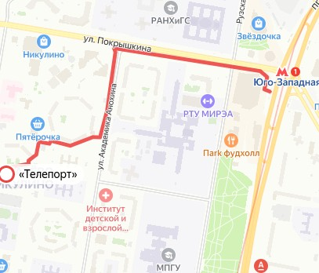
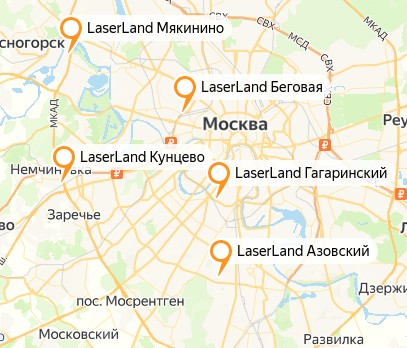
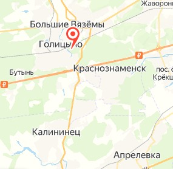
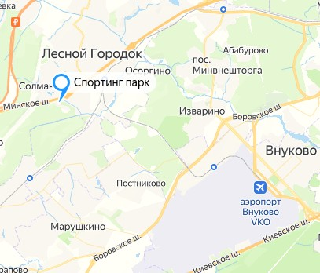
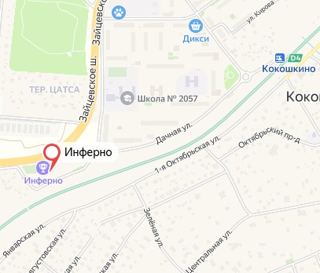
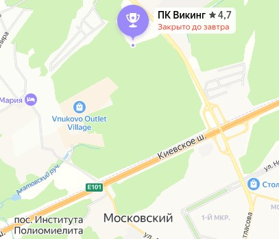

# Спорт


## Вело

 * [вело](../../kb/вещи/велосипед.md)

## Парашют

 * skycenter

## альпинизм

* skalodrom_aprelevka
* 8903 683 99 71
* 8925 371 78 25


## лазертаг/страйкбол/пейнтбол

 * [lasertag-arena](https://lt-arena.ru/club/lokaciya-teleport)
	* 
 * [laserland](https://inferno-paintball.ru/#contacts)
	* 
 * [медведь](https://lazertag.msk.ru/)
 * [Клуб Активного Отдыха "Wild-Games](https://www.clubwg.ru/)
	* 
 * [http://www.sppclub.ru/kontaks](http://www.sppclub.ru/kontaks)
	* 
 * [пейнтбол инферно](https://inferno-paintball.ru/#contacts)
	* 

 * [викинг](https://пейнтбол-в-москве.com/viking)
	* 
 *

## Сноуборд

 * https://snowpro.ru/
 * https://www.traektoria.ru/
 * https://ampshop.ru/
 * Курорты
	* красная поляна - очереди, узкие трассы, конские цены, мало подъёмников - долго ехать с пересадками, зачастую дождь, надо брать дневные скипасы
	* Хибины https://bigwood.ru/ - в кафешках нет мест, еда только на вынос

## Баскетбол

 * [kuroko](https://kurokonobasuke.fandom.com/ru/wiki/%D0%91%D0%B0%D1%81%D0%BA%D0%B5%D1%82%D0%B1%D0%BE%D0%BB)
 * [ahiru no sora](https://www.crunchyroll.com/ru/ahiru-no-sora/)

## бег

## атлетика

 * холистеника
 * воркаут
	* https://pumatrac.puma.com/
	* скакалка
	* отжимания
	* подтягивания
	* бёрпи
 * болдеринг https://www.crunchyroll.com/ru/iwakakeru-sport-climbing-girls-/

 * [спина](https://www.youtube.com/watch?v=Mol6gQ-qrhs)
 * [жыр](https://www.youtube.com/watch?v=vyKC8zPYfd0)
 * [груть](https://www.youtube.com/watch?v=yzi29BnrgWI)

## плавание

 * madwave.ru
	* https://www.madwave.ru/catalog/ochki-dlya-plavaniya/ochki-dlya-plavaniya-yuniorskie/junior-aqua?sku=10014861
	* https://www.madwave.ru/catalog/gidrokostyumy-fina/zhenskiy-startovyy-kostyum/forceshell-2017-women-full-back-racing-suit?sku=10030242
	* https://www.madwave.ru/catalog/gidrokostyumy-fina/zhenskiy-startovyy-kostyum/forceshell-women-full-back?sku=10017834
	* https://www.madwave.ru/catalog/gidrokostyumy-fina/zhenskiy-startovyy-kostyum/forceshell-x?sku=10026623
	* https://www.madwave.ru/catalog/triathlon-wetsuits/women-wetsuit-rapid?sku=10023172
	* https://www.madwave.ru/catalog/aksessuary/ochki/aksessuary-dlya-ochkov/streamline-kit?sku=10021575
	* https://www.madwave.ru/catalog/ochki-dlya-plavaniya/aksessuary-dlya-ochkov/aksessuar-dlya-ochkov/smennyy-remeshok-dlya-0?sku=10014870
 *
 * Вопросы про карьеру:
	* как часто и как надо подтверждать звания КМС/МС
	* через сколько лет в среднем можно получить звание КМС/МС при не самых высоких результатах
	* наши цели:
		* многолетний упорный труд с очевидными успехами
		* навыки спортсмена для построения карьеры тренера
		* звания и награды для облегчения условий поступления в ВУЗ и на работу тренером
	* в каком классе/возрасте обычно уходят из спортивной секции девочки?
	* какие причины ухода из спортивной секции девочек
	* как смягчить возможные предпосылки ухода из спортивной секции?
	*

### памятка на спортивный выезд

на спортивный выезд:
кофта и футболка на каждый день, не менее 2
секундомер
пенка
туалетная бумага
зарядники


### диспансеризация

ПОДОЛЬСКИЙ ВРАЧЕБНО-ФИЗКУЛЬТУРНЫЙ ДИСПАНСЕР
с 8.30 до 16.30 с понедельника по пятницу
адрес Подольск ул.Ленинградская д.9.
после прохождения диспансеризации копию справки необходимо предоставить в школу, оригинал справки храним у себя

* регистратура: +7 (958) 500-28-01
* почта: mz_poddetgorbol@mosreg.ru
* сайт: https://lpu.zdrav.mosreg.ru/gbuz_mo_podolskaya_detskaya_bolnitsa/o_nas/clinics/centr-sportivnoj-mediciny-dlya-detej-i-yunoshestva

в Апрелевской поликлинике делаем ЭКГ без нагрузки, кровь и мочу.
ЭКГ действительно год, анализ мочи и крови 1 месяц

Если запись в Подольске открыта только к спортивному врачу, то проходим по месту жительства(Кардиолог, Невролог, офтальмолог, лор, хирург или ортопед), и в Подольск едем со всеми анализами и справками от врачей.

Там проходим кабинет общего осмотра и спортврача, со справкой едем к местному педиатру за выпиской.

### короткая версия новые требования к диспансеризации

Для спортсменов с III, II или I спортивным разрядом, предусмотрены ежегодные обследования

Врачи: терапевт/педиатр, травматолог-ортопед, хирург/детский хирург, невролог, ЛОР, офтальмолог, кардиолог/детский кардиолог, врач по спортивной медицине и другие специалисты по показаниям.

Лабораторные и функциональные исследования: клинический и биохимический анализ крови, анализ мочи, ЭКГ, ЭхоКГ, спирография, нагрузочное тестирование и другие исследования по показаниям.

Для спортсменов с разрядом КМС периодичность уже каждые 6 месяцев, а объём обследований шире, добавляются:

Медицинский психолог/психотерапевт, расширенные гормональные и инфекционные исследования, нагрузочные тесты с субмаксимальной или максимальной нагрузкой, газоанализ и другие исследования по показаниям.

Минимальный набор для календарного старта по плаванию:
1. Медицинское заключение по форме приложения № 2 к приказу № 484н.
1. В заключении указано: допущена к участию в спортивных соревнованиях.
1. Вид спорта: плавание.
1. В заявке напротив фамилии стоит "Допущен до ___", не просрочен
1. Заявка подписана врачом по спортивной медицине или уполномоченным лицом.
1. Узнать, кто ставит отметку в заявке: диспансер, врач секции, спортивная школа.
1. Для выполнения разряда отдельно проверить положение соревнования и условия фиксации результата

### новые требования к диспансеризации


Для спортивного трека к разрядам лучше заранее уточнять: соревнования входят в календарный план или нет, какая форма допуска нужна, кто должен подписать заявку.

спортивные организации и организаторы стартов должны обновить внутренние регламенты, шаблоны отчётов, журналы, перечни оснащения, договоры с медорганизациями и порядок взаимодействия с врачом/скорой.

диспансер/секция начнут оформлять документы по новым формам приказа № 484н
новый порядок прямо включает в систематический контроль не только УМО, но и этапные/периодические обследования, обследования после заболеваний, текущие медицинские обследования и наблюдение врача по спортивной медицине совместно с тренером начиная с этапа совершенствования спортивного мастерства.

Самое важное перед осенними стартами:
1. Получить/проверить медицинское заключение по новой форме № 484н.
2. Убедиться, что в заключении есть допуск именно к спортивным соревнованиям.
3. Проверить срок: "допущен до ____".
4. Узнать, кто ставит отметку в заявке: диспансер, врач секции, спортивная школа.
5. Проверить, входит ли старт в ЕКП/календарный план Москвы, МО или муниципалитета.
6. Для выполнения разряда отдельно проверить положение соревнования и условия фиксации результат


Чеклист к 1 сентября 2026 года
* Уточнить в спортивной школе/секции, какие формы медзаключений они будут принимать после 1 сентября 2026 года.
* Уточнить нужна ли справка от спортивного врача после болезни.
* Проверить, есть ли у ребёнка актуальная группа здоровья и медицинская группа для физкультуры.
* Сохранить карту профилактического медосмотра несовершеннолетнего или сведения о результатах обследований.
* Для разрядных соревнований по плаванию заранее выяснять: входит ли старт в календарный план, нужна ли подпись врача спортивной медицины в заявке.
* Перед приёмом лекарств, особенно перед стартами, проверять антидопинговый статус препаратов; при необходимости обсуждать с врачом спортивной медицины терапевтическое использование.
* При движении к КМС заранее планировать УМО и нагрузочные тесты как обязательную часть спортивного календаря, а не как внезапную справку перед стартом.


Кто допускает к занятиям после болезни?
Для мероприятий из календарного плана, если программа включает виды спорта с повышенными нагрузками и рисками для здоровья, участники с первой/второй группой здоровья направляются к врачу по спортивной медицине для осмотра и дополнительных обследований. Для несовершеннолетних дополнительно представляется карта профилактического медосмотра или сведения о заболеваниях/обследованиях/лечении.


### температура в бассейне

7-14 лет 29
14+ лет 26
оздоровительный 27
https://docs.cntd.ru/document/1200177260/titles/7DE0K6

### функции, которая напрямую переводит hh:mm:ss:ms в секунды и миллисекунды

* Формула для Google Sheets
	Допустим, в ячейке A1: 01:23:45:678 (1 час, 23 минуты, 45 секунд, 678 миллисекунд).
	a) Время в секундах.миллисекундах:
	=LEFT(A1,2)*3600 + MID(A1,4,2)*60 + MID(A1,7,2) + MID(A1,10,3)/1000
	01:23:45:67
	123456789
	=ПСТР(E14;4;2)*60*100 + ПСТР(E14;7;2)*100 + ПСТР(E14;10;2)*100
	=MID(E16;4;2)*60*100 + MID(E16;7;2)*100 + MID(E16;10;2)
	b) Время в миллисекундах:
	=(LEFT(A1,2)*3600 + MID(A1,4,2)*60 + MID(A1,7,2))*1000 + MID(A1,10,3)

* Макрос для Google Sheets (Google Apps Script)

	=CONVERTTIME(A1)
	```basic
	function convertTimeFormat(input) {
	// Ожидает формат hh:mm:ss:ms
	var parts = input.split(':');
	if (parts.length !== 4) return 'Неверный формат';
	var hours = parseInt(parts[0], 10);
	var minutes = parseInt(parts[1], 10);
	var seconds = parseInt(parts[2], 10);
	var milliseconds = parseInt(parts[3], 10);
	var totalSeconds = hours * 3600 + minutes * 60 + seconds + milliseconds / 1000;
	var totalMilliseconds = hours * 3600 * 1000 + minutes * 60 * 1000 + seconds * 1000 + milliseconds;
	return [totalSeconds, totalMilliseconds];
	}

	/**
	* Пользовательская функция для Google Sheets:
	* =CONVERTTIME(A1)
	*/
	function CONVERTTIME(input) {
	var result = convertTimeFormat(input);
	if (typeof result === 'string') return result;
	return result; // Вернёт две колонки: [секунды.миллисекунды, миллисекунды]
	}
	```

* Макрос для LibreOffice Calc (Basic)

	=ConvertTimeFormatLO(A1)
	```basic
	Function ConvertTimeFormatLO(input As String) As Variant
		Dim parts() As String
		parts = Split(input, ":")
		If UBound(parts) <> 3 Then
			ConvertTimeFormatLO = "Неверный формат"
			Exit Function
		End If
		Dim hours As Integer, minutes As Integer, seconds As Integer, milliseconds As Integer
		hours = CInt(parts(0))
		minutes = CInt(parts(1))
		seconds = CInt(parts(2))
		milliseconds = CInt(parts(3))
		Dim totalSeconds As Double
		Dim totalMilliseconds As Long
		totalSeconds = hours * 3600 + minutes * 60 + seconds + milliseconds / 1000
		totalMilliseconds = hours * 3600 * 1000 + minutes * 60 * 1000 + seconds * 1000 + milliseconds
		ConvertTimeFormatLO = Array(totalSeconds, totalMilliseconds)
	End Function
	```
* получить строку вида mm:ss:ms, например, 02:03:456.

=TEXT(INT(L16/60000),"00") & ":" & TEXT(INT(MOD(L16,60000)/1000),"00") & ":" & TEXT(MOD(L16,1000),"000")
=TEXT(INT(L16/6000);"00") & ":" & TEXT(INT(MOD(L16;6000)/100);"00") & ":" & TEXT(MOD(L16;100);"00")

Пояснения:
- INT(L16/60000) - минуты
- MOD(L16,60000)/1000 - секунды
- MOD(L16,1000) - миллисекунды
- Функция TEXT(...,"00") и TEXT(...,"000") добавляет ведущие нули

Пример:
- L16 = 123456
- Результат: 02:03:456
## практическая стрельба

 * ACTION AIR
 * охота
	 * http://hunfis.ru/hunting-articles/49351/
	 * https://pravonasilu.ru/ohota/osnovy/ohotminimum.html
	* https://voin.guru/ohota/kak-poluchit-ohotnichiy-bilet-v-pervyy-raz/
	* https://ru-biss.ru/drugoe_oruzhie/poluchit_ohotnichij_bilet.html
	* https://ru-biss.ru/drugoe_oruzhie/ohotnichij_minimum.html
	* [Выдача охотбилетов единого федерального образца](https://www.gosuslugi.ru/10084/1}

 * федерации
	 * https://ipsc.ru/forum/
	 * https://vk.com/ipscru
	 * [матчи](https://www.makeready.ru/)

 * клубы
	 * http://tir-impulse.ru/services/ipsc/
	 * https://www.theobject.ru/
	 * https://www.youtube.com/watch?v=zZM1urffjhc
	 * https://vk.com/scobject
	 * https://cska-strelba.ru/
	 * https://mgssk.ru/obuchenie-grazhdan-rf/

 * оружие
	 * http://podpricelom.com/ognestrelnoe-oruzhie/gladkostvolnoe/vepr-12-vpo-205.html#more-8326
	 * https://www.mos.ru/otvet-dokumenti/kak-priobresti-oruzhie/
	 * [Выдача лицензии на приобретение оружия](https://www.gosuslugi.ru/127020/2/info)
	 * https://www.gosuslugi.ru/situation/oruzhie_i_lichnaya_bezopasnost/kto_mozhet_kupit_oruzhie
 * дальномеры
	* https://rangeday.ru/opticheskie-pritsely-i-aksessuary/dalnomery/
